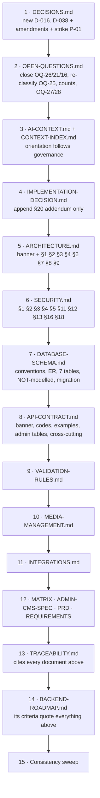

# DOCUMENTATION-CORRECTIONS.md

> **The verified-corrections plan produced by the 20 September 2026 implementation investigation.**
> Companion to [`MASTER-IMPLEMENTATION-PLAN.md`](./MASTER-IMPLEMENTATION-PLAN.md).

## Status — what has and has not been applied

**Applied to the doc set on 20 Sep 2026:**

- `DECISIONS.md` — appended **D-016 … D-038** (23 technical decisions); struck through **P-01** (Fastify + Prisma), superseded by D-015.
- `OPEN-QUESTIONS.md` — **OQ-26 closed** with the official-documentation quotations; summary count corrected **25 → 26**; the OQ-5 double-classification recorded.
- `AI-CONTEXT.md` — status table updated; new **§11b** carrying the five findings that change what gets built.
- `ARCHITECTURE.md` — 🔴 correction banner (the document still prescribes the **rejected** Fastify + Prisma stack below the banner).
- `SECURITY.md` — 🟠 correction banner (argon2id, rate limiting, session records).
- `CONTEXT-INDEX.md` — the three new documents indexed.

**NOT applied — deliberately left for owner review:**

The remaining **FIX entries below** rewrite body content across `API-CONTRACT.md`, `DATABASE-SCHEMA.md`, `VALIDATION-RULES.md`, `MEDIA-MANAGEMENT.md`, `INTEGRATIONS.md`, `CONTENT-MANAGEMENT-MATRIX.md`, `ADMIN-CMS-SPEC.md`, `PRD.md`, `REQUIREMENTS.md`, `TRACEABILITY.md` and `BACKEND-ROADMAP.md`. They were not applied automatically for two reasons:

1. **Some embed a position on a still-open business question** — for example the post-publish slug lock (OQ-9) and the phone-digit threshold (OQ-19). Applying those would record a business decision nobody made. Those are isolated in the final section.
2. **The rest are substantial body rewrites of authoritative specifications.** An investigation task should surface them for review, not silently restate 14 documents. Every one is written below as an exact find-and-replace with its evidence, so applying them is mechanical once approved.

**Apply them in the order given in the final section** — it is dependency-ordered so no intermediate state leaves the doc set self-contradictory. Step 0 is `git init` in `svbackend/`, which is the one step that cannot be done afterwards.

---

## 23. Documentation Correction Plan

This section tells the implementer exactly which sentences in `c:/progromming/SV DEVELOPERS/svbackend/docs/` are false, what to replace them with, and in what order. It is the only part of this plan that authorises edits to the existing 18 specification documents.

### 23.1 The governing rule

> **Update documentation ONLY where the investigation has established a verified correction. Do not rewrite history.**

Three operational consequences, applied throughout:

1. **A correction is "verified" only if the statement in the document is demonstrably false** against one of exactly three authorities — the official Payload 3 documentation bundle (`payload-llms-full.txt`, quoted verbatim), `svfrontend` source at a cited `file:line`, or arithmetic/enumeration that can be re-checked in seconds. Everything else goes to §23.6 **NEEDS OWNER RULING**.
2. **Nothing is erased.** Decisions are corrected *forward*: a dated amendment block is appended beneath the original entry, or the row is struck through using the convention `DECISIONS.md` already uses for `~~P-13~~`. The original wording stays legible. `IMPLEMENTATION-DECISION.md`'s analysis is never rewritten — it receives an appended addendum (FIX-13).
3. **A resolved open question moves `OPEN-QUESTIONS.md` → `DECISIONS.md` as a new entry.** It is never silently deleted. This is `DECISIONS.md`'s own stated rule (line 5) and `CONTEXT-INDEX.md`'s maintenance rule (line 62).

**Scope of this section.** 52 verified corrections (FIX-01 … FIX-52), 23 proposed new decision entries (D-016 … D-038), 17 items reserved for the owner, and one edit order. Source: `C2-conflict-audit.md` (92 findings, of which 76 are classed verified), cross-checked against `C1`, `C3`, `C4` and the current text of every file named below, which was read in full before this section was written.

**Consistency.** Every env var name, collection slug, file path and command in this section matches §12–§22 of this plan. Where §12–§22 already specify something, this section cites the section number rather than restating it.

### 23.2 Fix inventory

| FIX | Document | Section | Source finding | Type |
|---|---|---|---|---|
| FIX-01 | `DECISIONS.md` | P-table, P-01 | CONF-37 | conflict resolution |
| FIX-02 | `DECISIONS.md` | D-015 Consequences | CONF-60 | factual correction |
| FIX-03 | `DECISIONS.md` | D-015 Validation gate | CONF-73 | conflict resolution |
| FIX-04 | `DECISIONS.md` | D-015 Rationale item 6 | CONF-08 | factual correction |
| FIX-05 | `DECISIONS.md` | D-001 | CONF-41, CONF-63 | factual correction |
| FIX-06 | `DECISIONS.md` | D-002 | CONF-58, CONF-12 | factual correction |
| FIX-07 | `DECISIONS.md` | D-003 | CONF-69, CONF-05 | conflict resolution |
| FIX-08 | `DECISIONS.md` | D-004 | CONF-13, CONF-12 | new decision to log |
| FIX-09 | `DECISIONS.md` | D-005 | CONF-07, CONF-11 | factual correction |
| FIX-10 | `DECISIONS.md` | D-006 | CONF-32 | factual correction |
| FIX-11 | `DECISIONS.md` | D-007 | CONF-72 | factual correction |
| FIX-12 | `DECISIONS.md` | D-008 | CONF-17, CONF-34, CONF-66 | factual correction |
| FIX-13 | `IMPLEMENTATION-DECISION.md` | new §20 addendum | CONF-11, 14, 33, 52, 58, 73 | factual correction |
| FIX-14 | `OPEN-QUESTIONS.md` | Summary table | CONF-65 | factual correction |
| FIX-15 | `OPEN-QUESTIONS.md` | OQ-5 | CONF-65 | conflict resolution |
| FIX-16 | `OPEN-QUESTIONS.md` | OQ-1 "Affects" | CONF-65 | factual correction |
| FIX-17 | `OPEN-QUESTIONS.md` | OQ-25 | CONF-30 | conflict resolution |
| FIX-18 | `OPEN-QUESTIONS.md` | OQ-26 | CONF-13 | new decision to log |
| FIX-19 | `OPEN-QUESTIONS.md` | OQ-12 + new id | CONF-91 | conflict resolution |
| FIX-20 | `OPEN-QUESTIONS.md` | new OQ-27 photography | CONF-77 | conflict resolution |
| FIX-21 | `AI-CONTEXT.md` | §2, §2b, §6, §7, §10, §11 | CONF-08, 54, 58, 69, 03 | factual correction + status update |
| FIX-22 | `CONTEXT-INDEX.md` | header, doc set, rules | CONF-54, CONF-68 | status update |
| FIX-23 | `ARCHITECTURE.md` | banner | CONF-49 | factual correction |
| FIX-24 | `ARCHITECTURE.md` | §1 | CONF-05, CONF-69 | factual correction |
| FIX-25 | `ARCHITECTURE.md` | §2 | CONF-49, CONF-08 | factual correction |
| FIX-26 | `ARCHITECTURE.md` | §3 | CONF-15, CONF-04, CONF-52 | factual correction |
| FIX-27 | `ARCHITECTURE.md` | §4 | CONF-58 | factual correction |
| FIX-28 | `ARCHITECTURE.md` | §6 | CONF-12, CONF-13 | factual correction |
| FIX-29 | `ARCHITECTURE.md` | §7 | CONF-67 | factual correction |
| FIX-30 | `ARCHITECTURE.md` | §8, §9 | CONF-52, CONF-28, CONF-24 | factual correction |
| FIX-31 | `SECURITY.md` | §1 | CONF-03 | factual correction |
| FIX-32 | `SECURITY.md` | §2 | CONF-12, CONF-13 | factual correction |
| FIX-33 | `SECURITY.md` | §3 | CONF-35, CONF-36, CONF-69 | factual correction |
| FIX-34 | `SECURITY.md` | §4 | CONF-34 | factual correction |
| FIX-35 | `SECURITY.md` | §5, §11 | CONF-52, CONF-04 | factual correction |
| FIX-36 | `SECURITY.md` | §12 | CONF-67 | factual correction |
| FIX-37 | `SECURITY.md` | §13 | CONF-14, CONF-38, CONF-57 | factual correction |
| FIX-38 | `SECURITY.md` | §16 | CONF-61 | factual correction |
| FIX-39 | `SECURITY.md` | §18 | CONF-55, 22, 78, 67 | factual correction |
| FIX-40 | `API-CONTRACT.md` | banner + §Base | CONF-06, CONF-24, CONF-69 | factual correction |
| FIX-41 | `API-CONTRACT.md` | error codes | CONF-20 | conflict resolution |
| FIX-42 | `API-CONTRACT.md` | `GET /projects` + `/projects/{slug}` examples and omit rule | CONF-17, 34, 66 | factual correction |
| FIX-43 | `API-CONTRACT.md` | admin Projects + Project media tables | CONF-07, 11, 18, 19 | factual correction |
| FIX-44 | `API-CONTRACT.md` | site-settings + healthz + cross-cutting | CONF-62, 24, 04, 76 | factual correction |
| FIX-45 | `DATABASE-SCHEMA.md` | conventions, ER, Tables 2/3/7/8/9/13/14/15, NOT-modelled, migration | CONF-02, 07, 11, 12, 19, 21, 28, 38, 39, 50, 51, 71, 30 | factual correction |
| FIX-46 | `MEDIA-MANAGEMENT.md` | §3, §4, §9, §11 | CONF-16, 19, 21, 33, 56, 75 | factual correction |
| FIX-47 | `VALIDATION-RULES.md` | §2, §3, §3.1, §4, §5, §7, §8, §9 | CONF-07, 17, 22, 29, 31, 43, 48, 72, 76, 79, 80, 81, 82, 83 | factual correction |
| FIX-48 | `INTEGRATIONS.md` | banner, §2, §4, §7, §9, §10 | CONF-28, 40, 67, 70, 81, 92 | conflict resolution |
| FIX-49 | `TRACEABILITY.md` | banner, §1, §2, §3, §4, §5, §6, §8 | CONF-03, 12, 23, 28, 42, 60, 74 | factual correction |
| FIX-50 | `PRD.md` | §4, §5, §10 | CONF-58, 87, 88 | factual correction |
| FIX-51 | `REQUIREMENTS.md` | FR-AUTH-04, FR-AUTH-08, FR-LEAD-07, FR-MEDIA-10, NFR-11, CONTENT title | CONF-03, 04, 21, 49, 89 | factual correction |
| FIX-52 | `CONTENT-MANAGEMENT-MATRIX.md` + `ADMIN-CMS-SPEC.md` | Matrix §1/§2/§3/§5/§6; Spec §4/§4-A/§4-C/§7/§10 | CONF-62, 78, 81, 82, 83, 84, 85, 87, 88, 90, 91 | factual correction |

---

### 23.3 The corrections

#### FIX-01 — `DECISIONS.md` P-01 still recommends Fastify + Prisma

- **File:** `c:/progromming/SV DEVELOPERS/svbackend/docs/DECISIONS.md`
- **Location:** "Pending — recommendations awaiting sign-off" table, first row. Exact current text:
  > `| P-01 | Node + TypeScript + Fastify + Prisma + PostgreSQL | — |`
- **Correction:** replace the row, using the identical strikethrough form already used one row below for `~~P-13~~`:
  > `| ~~P-01~~ | ~~Node + TypeScript + Fastify + Prisma + PostgreSQL~~ — **SUPERSEDED by D-015**: Payload CMS 3 on Next.js; the data layer is Drizzle via `@payloadcms/db-postgres`. **No Fastify, no Prisma.** Only **PostgreSQL 15+** and **TypeScript** survive from this row. | — |`

  And in the closing note under the table, add P-01 to the existing list. Current text:
  > `> **Still-open recommendations that D-015 touches:**`

  Insert as the first bullet of that list:
  > `> - **P-01** (stack recommendation) — **dead**. D-015 selected Payload CMS 3 + Drizzle. Struck above so it cannot be re-derived from its surviving half.`
- **Evidence:** `IMPLEMENTATION-DECISION.md` §3 rejects the Fastify option in terms (*"Technically perfect and economically poor"*) and §17 selects *"PostgreSQL 15+ via Payload's Postgres adapter (Drizzle)"*. The P-table's own framing — *"These are **PROPOSED defaults**, not decisions… none may be treated as settled"* — is precisely what makes an un-struck P-01 dangerous: it invites a reader to treat it as live. `~~P-13~~` in the same table proves the convention exists and was simply not applied here.
- **Type:** conflict resolution
- **Preserves history?:** Yes. Strikethrough, not deletion — the original recommendation stays readable, annotated with what superseded it and when. This is the log's own existing convention.

#### FIX-02 — D-015 declares `TRACEABILITY.md` "unaffected"; it is not

- **File:** `DECISIONS.md`
- **Location:** D-015 › Consequences, final ✅ bullet. Exact current text:
  > `- ✅ \`CONTENT-MANAGEMENT-MATRIX.md\`, \`VALIDATION-RULES.md\`, \`SECURITY.md\`, \`MEDIA-MANAGEMENT.md\`, \`TRACEABILITY.md\` are unaffected.`
- **Correction:** replace with two bullets:
  > `- ✅ \`CONTENT-MANAGEMENT-MATRIX.md\` and \`VALIDATION-RULES.md\` are unaffected in substance.`
  > `- 🟡 **\`TRACEABILITY.md\`, \`SECURITY.md\` and \`MEDIA-MANAGEMENT.md\` ARE affected** (corrected 20 Sep 2026). `TRACEABILITY.md`'s requirement → evidence → consumer columns stand; its **API-path cells are descriptive**, its **physical table/column cells are Payload's and are not contractual**, its `CHECK` cells survive only where a Payload `select` produces a Postgres enum, and its `admin_sessions` and `argon2id` cells are **void** (D-029, D-019..D-023). `SECURITY.md` §1, §2, §3, §5, §11, §13 and §16 and `MEDIA-MANAGEMENT.md` §4, §9 and §11 each contain at least one statement Payload does not deliver — see the Documentation Correction Plan, FIX-31..FIX-39 and FIX-46.`
- **Evidence:** `TRACEABILITY.md` §5 row 2 names `argon2id` as the test for FR-AUTH-04, and row 1 names `admin_sessions` as the DB artefact for FR-AUTH-01..03. Official Payload docs (*Authentication › Overview*, verbatim in `payload-llms-full.txt`): *"The `hash` field stores a **PBKDF2-SHA256** derived key prefixed with the scheme it was created with, for example `pbkdf2-sha256-v1:<derived-key>`."* There is no configuration option for the hashing algorithm anywhere in the 13-option `auth` table. And when `auth.useSessions` is enabled Payload adds a **`sessions` field on the user document** — there is no separate sessions collection, so `admin_sessions` will not exist. Both cells are therefore false, in the one document whose stated job is *"prevent unjustified functionality"*.
- **Type:** factual correction
- **Preserves history?:** Yes. The bullet is corrected in place with an explicit "(corrected 20 Sep 2026)" marker, and the reason is stated rather than the claim silently dropped. The rest of D-015's body is untouched.

#### FIX-03 — The Directus fallback trigger covers only exit criteria 1–3

- **File:** `DECISIONS.md`
- **Location:** D-015 › Validation gate. Exact current text:
  > `**This decision is provisional until Phase 1's exit criteria pass** — specifically that Payload's PostgreSQL adapter can express the full \`Project\` model, that \`description\` round-trips as \`string[]\`, and that absent optional fields are **absent** from the JSON. If those fail, the decision is void and **Directus is the designated fallback**.`
- **Correction:**
  > `**This decision is provisional until Phase 1's exit criteria pass.** D-015 is **void if any of Phase 1 exit criteria 1, 2, 3 or 4 fails**: (1) every `Project` field expressible in Payload's Postgres adapter; (2) `description` round-trips as `string[]`, not `[{id, text}]`; (3) absent optional fields are absent from the JSON; (4) **the contract test passes against the real `Project` type** — concretely, `GET /api/v1/projects/siri-vanam-gummadavelli` returns exactly the ten-key set in `BACKEND-ROADMAP.md` Phase 1 exit #3. Criteria 5–7 are quality gates: failing them blocks Phase 1 from closing but does not by itself void the architecture decision. **The trigger is evaluated at the end of Phase 1 and never deferred into Phase 2** — Directus was chosen as the fallback because *"it would accept `DATABASE-SCHEMA.md` literally"*, and that ceases to be true the moment Phase 3 migrations exist. If the gate fails, the decision is void and **Directus is the designated fallback**.`
- **Evidence:** Official Payload docs (*Query › Select*): *"A selected-but-empty field still returns as `null`"* and *"the `id` field is always included in the result, regardless of your select query."* `select` therefore controls which fields are *queried*, not which keys are *emitted* — so D-008 is 100 % hand-written and criterion #3 can be satisfied by one lucky field while the contract as a whole fails. Criterion #4 is the assertion that actually tests the architecture. `svfrontend/src/content/projects.ts` (`projects[2]`, `siri-vanam-gummadavelli`) is the only record that exercises it: it populates the 8 required fields plus `tagline` and nothing else.
- **Type:** conflict resolution
- **Preserves history?:** Yes. The gate is *widened*, not weakened, and the original three criteria are preserved verbatim inside the new list. The identical wording must be propagated to `IMPLEMENTATION-DECISION.md` §16 and §19 via FIX-13, and to `BACKEND-ROADMAP.md` Phase 1 — three places currently state it three times.

#### FIX-04 — D-015 rationale item 6 asserts a Node version match that does not exist

- **File:** `DECISIONS.md`
- **Location:** D-015 › Rationale, item 6. Exact current text:
  > `6. **Stack continuity.** TypeScript and Next.js throughout; Node 20 matches the frontend's documented engine range.`
- **Correction:**
  > `6. **Stack continuity.** TypeScript and Next.js throughout. ⚠️ **Corrected 20 Sep 2026:** the two apps do **not** share a Node or Next.js range and must not be made to. Payload requires Node ≥20.9.0 with **no upper bound** (its own production Dockerfile uses `node:24-alpine`), while `svfrontend` pins `engines.node ">=20.9.0 <23"`. Payload 3 supports Next.js `15.2.9–15.2.x`, `15.3.9–15.3.x`, `15.4.11–15.4.x` and `16.2.6`+ — and `svfrontend` runs **15.5.25, which is outside every supported range.** See D-016 and D-017.`
- **Evidence:** Official Payload docs (*Getting Started › Installation*), verbatim: *"Next.js (one of the following version ranges): `15.2.9` - `15.2.x` · `15.3.9` - `15.3.x` · `15.4.11` - `15.4.x` · `16.2.6`+"* and *"**Not all Next.js 15/16 releases are compatible** — make sure you're using one of the supported version ranges listed above."* Node requirement: *"Node.js version 20.9.0+"*, no upper bound; `payload@3.90.1` `engines` is `"node": "^18.20.2 || >=20.9.0"`. Measured: `svfrontend/package.json` → `next: 15.5.25`, `engines.node ">=20.9.0 <23"`; local runtime Node v24.11.0.
- **Type:** factual correction
- **Preserves history?:** Yes. The original sentence stays; a dated correction is appended inside the same item. This matters because item 6 is the only place the corpus asserts version continuity, and D-016/D-017 depend on it being known false.

#### FIX-05 — D-001's supersession list is incomplete and its provenance date is wrong

- **File:** `DECISIONS.md`
- **Location:** D-001. Exact current text (three lines):
  > `**Consequence.** Scope grows from 1 endpoint / 1 table to ~50 endpoints / 14 tables. Admin authentication moves from "explicitly not required" to **core**.`
  > `**Supersedes:** \`BACKEND-REQUIREMENTS.md\` §0, §6, §7, §15 (scope conclusions).`

  and, in the Context paragraph:
  > `\`../../BACKEND-REQUIREMENTS.md\` (17 Sep) concluded the frontend required exactly **one** endpoint`
- **Correction:** append a dated amendment block beneath D-001's existing "Note for future sessions" blockquote. Do not edit the three lines above.
  > `> **Amendment — 20 September 2026 (documentation audit).** Three corrections to this entry, recorded here rather than by editing it:`
  > `> 1. **Provenance date.** The audit's own header reads *18 September 2026*; the "(17 Sep)" above is wrong.`
  > `> 2. **The supersession list is incomplete.** The scope conclusions are also embedded in `BACKEND-REQUIREMENTS.md` **§3's `BE?` column** (which marks 16 of 19 features as needing no backend and is still cited as evidence by `TRACEABILITY.md` and `CONTENT-MANAGEMENT-MATRIX.md`), **§5.2's framing**, **§9's "Backend need" column for storage**, **§10 rows 1/2/17 priorities**, **§12's table list** (*"Tables now: `leads`"*), **§14's file-storage scope**, **§16 items 11–12**, and **§17 entirely** (*"Admin panel + auth + RBAC — Speculative"*, now core P0). Read the supersession as: **§0, §6, §7, §15 in full, plus those nine.** An incomplete supersession list is worse than none, because it licenses a reader to treat the un-named sections as binding.`
  > `> 3. **Scope arithmetic.** "~50 endpoints / 14 tables" was the estimate at the time. The current figures are **60 endpoints / 15 logical entities / 9 admin screens / 100 requirements** (D-015 Context; `IMPLEMENTATION-DECISION.md` §2). Under D-015 the *logical* entity count is further revised — see `DATABASE-SCHEMA.md`, which is now the single place that count is stated.`
  > `> 4. **One reconciliation, recorded so two live specifications do not read as disagreeing:** `svfrontend/docs/PRD-redesign.md` §4.4 places *"Backend, CMS, lead capture persistence, analytics, multilingual"* **out of scope, flag for phase 2**. D-001 supersedes that, on owner instruction.`
  > `> 5. **One unrecorded consequence:** the CORS rule widened from *"exactly the production domain"* to **two origins** as a direct result of this decision. A security control widened without its own decision record; logged here.`
- **Evidence:** `BACKEND-REQUIREMENTS.md` header reads "18 September 2026" (verified in `A6-backend-requirements-audit.md`, which reproduces it). `IMPLEMENTATION-DECISION.md` §2 gives public **8** + admin **~52** = **60** endpoints, 15 core tables, 9 screens; D-015's own Context says *"100 requirements across ~60 endpoints, 15 tables and 9 admin screens"* — so D-001's figure is the outlier by recency, established by the corpus itself.
- **Type:** factual correction
- **Preserves history?:** Yes — this is the canonical example. D-001 is a signed owner decision; its body is not touched. Everything is added as a dated amendment beneath it, which is how a decision log corrects forward.

#### FIX-06 — D-002 states "no `users` table" and "all 17 routes"

- **File:** `DECISIONS.md`
- **Location:** D-002. Exact current text:
  > `**Why.** The brief states it explicitly, and the frontend corroborates: no login UI, no session handling, no storage, no \`middleware.ts\`, no auth dependency. All 17 routes are public and static.`
  > `**Consequence.** No \`users\` table. \`/api/v1/admin/**\` is the sole authenticated surface. **Revisit only if frontend evidence for buyer accounts appears.**`
- **Correction:** append a dated amendment beneath D-002:
  > `> **Amendment — 20 September 2026.** The *decision* stands unchanged: no public accounts, ever. Two factual statements in it do not:`
  > `> - **"All 17 routes"** → the reproducible count is **15** addressable prerendered URLs (7 content pages + `/_not-found` + 5 project pages + `/robots.txt` + `/sitemap.xml`), read from the committed `.next/server/app-paths-manifest.json` (11 entries) and `.next/prerender-manifest.json` (5 project pages). `/blog` does not exist — `src/app/blog/` and `src/content/blog.ts` are both absent (D-013, OQ-14). The sitemap emits **12** URLs, a third distinct and correct count.`
  > `> - **"No `users` table"** → under D-015 there **is** a `users` collection: it is Payload's auth collection and holds the *admin* accounts (see plan §12.1 and §21.1). The guard this sentence expresses — **no public registration, no buyer accounts** — is unchanged and is enforced by `access.create: isAdmin` and the absence of any registration route (FR-AUTH-09).`
  > `> - **"`/api/v1/admin/**` is the sole authenticated surface"** → superseded by D-023. The authenticated surface is Payload's Admin Panel at `/admin` plus its REST routes under `routes.api`; `/api/v1/admin/**` will not exist.`
- **Evidence:** Build manifests as above (`A5-frontend-routes-components.md` §1.6 verifies them by directory listing). For `users`: official Payload docs (*Authentication › Overview*) — auth is enabled per collection via `auth: true`, and the framework adds `email`, `password`, `salt`, `hash`, `sessions` and the lockout fields to that collection. Plan §21.1 names the file `src/collections/Users.ts`.
- **Type:** factual correction
- **Preserves history?:** Yes. D-002 is an *active scope guard* (D-015's own ID note says so) — its decision text is untouched and its intent is restated explicitly so the amendment cannot be misread as weakening it.

#### FIX-07 — D-003's path-prefix security boundary does not exist under D-015

- **File:** `DECISIONS.md`
- **Location:** D-003, Decision line. Exact current text:
  > `**Decision.** Public at \`/api/v1/**\`; admin at \`/api/v1/admin/**\`, with one middleware guarding everything beneath the admin prefix.`
- **Correction:** append beneath D-003:
  > `> **Amendment — 20 September 2026 — superseded in mechanism by D-015, see D-023.** The public half stands: the public contract is served at **`/api/v1/**`**, as Next.js Route Handlers (plan §21.1, §21.2). The admin half does not. **There is no `/api/v1/admin/**` path family and no admin middleware.** Under Payload, `/admin` is the Admin Panel UI (`routes.admin`), the admin API is Payload's own generated REST surface under `routes.api` (default `/api`), and **authorisation lives in per-collection access-control functions, not in a path guard.** The rationale this decision gives — *"a prefix cannot be forgotten"* — is preserved by a different mechanism: **every collection and global declares an explicit `access` block, including `readVersions`**, and a config test asserts that none omits it (plan §15.1, D-025).`
- **Evidence:** Official Payload docs (*Configuration › Overview*, `routes`): the documented keys are `admin`, `api`, `graphQL`, `graphQLPlayground`; *"by default the admin panel lives at `/admin`"*. And (*REST API › Custom Endpoints*): *"Custom endpoints defined in your Payload Config are **always** mounted under your configured `routes.api` path (default: `/api`). To define a route that is not prefixed by this path, add a Next.js Route Handler at the desired location in your app directory."* There is no middleware layer in the documented request pipeline that a path prefix could hook.
- **Type:** conflict resolution
- **Preserves history?:** Yes. Appended amendment; the original decision and its rejected alternatives stay legible, and the *reason* the original chose a prefix is explicitly carried into the replacement mechanism rather than discarded.

#### FIX-08 — D-004's revocation question is answerable today, and the answer is yes

- **File:** `DECISIONS.md`
- **Location:** D-004, the status line and the warning blockquote. Exact current text:
  > `**Date:** 18 Sep 2026 · **Status:** **PROPOSED — needs amending after D-015**`
  > `> ⚠️ **Superseded in mechanism, not in intent.** Payload (D-015) uses httpOnly JWT cookies, not server-side session records. That satisfies this decision's XSS rationale (the credential is not readable by script) but **not** its revocation rationale. **Verify revocation-on-password-change and on-deactivation in Phase 2** (OQ-26), then amend this decision to match reality — or add a token-version field to force revocation.`
- **Correction:** change the status line to
  > `**Date:** 18 Sep 2026 · **Status:** **ACCEPTED as amended 20 Sep 2026** (was PROPOSED)`

  and append beneath the existing blockquote — leaving that blockquote in place:
  > `> **Amendment — 20 September 2026. OQ-26 is closed; both rationales are satisfied.** Official Payload documentation, verbatim: *"With sessions enabled, changing a user's password ends that user's other sessions, so tokens that were issued before the change stop working."* · *"Updating the password of the user making the request … keeps the session that the request was made with and ends the rest."* · *"**Updating a user's password on their behalf, such as an admin updating another user, ends all of that user's sessions.**"* · *"The `resetPassword` operation ends all existing sessions and returns a token for the new session that it creates."* · `logout` accepts `allSessions: true` — *"end all sessions for the user logging out."*`
  > `>`
  > `> **Therefore:** the mechanism is Payload's httpOnly JWT cookie with `auth.useSessions: true` (the default), which attaches server-side session records to the user document and surfaces them through the generated `sessions` field. **A token-version field is unnecessary — do not build one.**`
  > `>`
  > `> **Three binding consequences.** (a) **Never set `useSessions: false`** — the docs are explicit that stateless JWTs *"cannot be revoked, so they stay valid until `tokenExpiration` even after a password change."* (b) There is **no `admin_sessions` table**, no documented shape for the `sessions` field and **no admin API to enumerate sessions**, so the `ip`/`user_agent` per-session review in `ARCHITECTURE.md` §6 and `DATABASE-SCHEMA.md` §2 is **dropped** and rebuilt on the audit log instead (D-038). (c) The documented footgun must be written into the implementation notes: *"A Local API update that runs without an authenticated user has no session to keep, so it ends all of the user's sessions. Pass the `user` returned by `payload.auth` when the user making the request should stay logged in."* Sliding expiry and an absolute cap are replaced by `tokenExpiration`, `admin.autoRefresh` and `POST {routes.api}/users/refresh-token`. See D-029.`
- **Evidence:** All five quotations are verbatim from the official docs bundle (*Authentication › Cookies / Sessions* and *Authentication › Operations*), re-verified in `payload-llms-full.txt` after two research files disagreed (`B04` said "NOT VERIFIED"; `B10` said documented — `B10` is right). This is what makes OQ-26 answerable from documentation rather than from a Phase 2 experiment.
- **Type:** new decision to log (a resolved open question moving from `OPEN-QUESTIONS.md`, per FIX-18)
- **Preserves history?:** Yes. The original ⚠️ blockquote is left exactly as written — it records what was believed and why — and the amendment is appended beneath it with its own date and evidence. The status line changes from PROPOSED to "ACCEPTED as amended", which is a forward move the log's own vocabulary supports.

#### FIX-09 — D-005 names two mechanisms that do not exist under Payload

- **File:** `DECISIONS.md`
- **Location:** D-005. Exact current text:
  > `**Decision.** \`projects\` gains \`published_at\` and \`sort_order\`.`
  > `**Consequence.** Public queries must filter on \`published_at IS NOT NULL AND deleted_at IS NULL\`. Unpublished returns **404, not 403**.`
- **Correction:** append beneath D-005:
  > `> **Amendment — 20 September 2026 — mechanism corrected, intent unchanged.** Both capabilities are delivered natively and neither is the column named above.`
  > `> - **Publish state is `_status`, not a date.** Payload's drafts feature injects `_status` with values `'draft' | 'published'`; publishing is `data: { _status: 'published' }`. **There is no publish timestamp.** A separate `publishedAt` date field is added only because `sitemap.xml` needs `lastModified` — it is populated by a `beforeChange` hook on the `draft → published` transition and is **custom work, not free**. It is never emitted publicly: `types/content.ts` has no `publishedAt` on `Project`.`
  > `> - **Ordering is `orderable: true`, a fractional-index string, not an integer.** `sort_order`/`sortOrder` is deleted from the schema, the validation rules and the API contract (D-021). Hand-rolling an integer order would re-incur exactly the cost `IMPLEMENTATION-DECISION.md` §16 rejected Strapi for (*"collection ordering is not natively drag-and-drop, and D-005 makes ordering a first-class requirement"*). The fractional key is **never exposed publicly** — it is not in `types/content.ts`.`
  > `> - **The public filter becomes** `{ _status: { equals: 'published' } }` plus Trash exclusion (D-026), hard-coded in the shared `publicFind()` helper and not overridable by a caller. Unpublished still returns **404, not 403**.`
- **Evidence:** Official Payload docs (*Versions › Drafts*): *"the `draft` argument on its own will not restrict documents with `_status: 'draft'` from being returned from the API"*, and the draft document shape carries `_status`. (*Configuration › Collections*, `orderable`): *"If true, enables custom ordering for the collection, and documents can be reordered via drag and drop"* and *"When `orderable` is enabled, Payload uses **fractional indexing** to efficiently manage document order"*, with `generateKeyBetween` / `generateNKeysBetween` exported from `payload/shared`. ⚠️ **Unverified:** the *name* of the column `orderable` creates is not documented — it must be read off `npx payload generate:db-schema` in the Phase 1 spike before migration 001 (plan §16.3).
- **Type:** factual correction
- **Preserves history?:** Yes. Appended amendment; the decision's *intent* ("an admin needs to prepare a project without it appearing live, and to reorder without editing code") is quoted forward unchanged and only the mechanism is replaced.

#### FIX-10 — D-006's soft delete is a native Payload feature, and the option defaults to `false`

- **File:** `DECISIONS.md`
- **Location:** D-006. Exact current text:
  > `**Decision.** \`deleted_at\` rather than row removal.`
  > `**Exception:** \`admin_users\` are **deactivated, never deleted**, so audit attribution survives.`
- **Correction:** append beneath D-006:
  > `> **Amendment — 20 September 2026 — mechanism recorded.** Payload implements this natively as **Trash**: the collection option `trash: true` causes deleted documents to receive a **`deletedAt`** timestamp instead of being removed. Do **not** hand-roll a `deletedAt` field — two research files disagreed on whether this feature exists and the docs settle it (D-026).`
  > `> **Three consequences the original entry could not anticipate:** (a) `trash` **defaults to `false`**, so silence means hard delete — **every collection must state it explicitly** (the per-entity matrix is plan §12.1). (b) The admin list hides trashed rows via **`admin.baseFilter`** — note the option is `baseFilter`, **not** `baseListFilter`. (c) A trashed document *"can no longer have a version **restored** until it is first restored from trash"* — that caveat must appear beside `POST /admin/projects/{id}/restore` in `API-CONTRACT.md`. The exception above stands and becomes `trash: false` + `delete: () => false` on `users`; `audit-log` is also `trash: false`, being append-only.`
- **Evidence:** Official Payload docs (*Trash › Overview*), verbatim: *"**Trash** (also known as soft delete) allows documents to be marked as deleted without being permanently removed… deleted documents will receive a **`deletedAt`** timestamp"*; collection option `trash` — *"Boolean to enable soft deletes for this collection. **Defaults to false.**"* Re-verified in `payload-llms-full.txt` specifically because `B06` asserted the feature does not exist and `B02` asserted it does; `B02` is right.
- **Type:** factual correction
- **Preserves history?:** Yes. Appended amendment recording *how* the accepted decision is realised. Nothing in D-006 is contradicted — this is the rare case where the framework already does what the decision asked for.

#### FIX-11 — D-007 claims database enforcement that D-015 weakened and Payload delivers differently

- **File:** `DECISIONS.md`
- **Location:** D-007, heading and Decision line. Exact current text:
  > `## D-007 — \`icon\` is a closed enum enforced at API and database`
  > `**Decision.** Every \`icon\` must be one of the 41 names in \`ui/Icon.tsx:7-48\`, validated at the API boundary **and** as a DB CHECK. The admin UI offers a picker, never free text.`
- **Correction:** leave the heading and Decision line intact and append:
  > `> **Amendment — 20 September 2026 — enforcement mechanism, and it is stronger than planned.** Under D-015 the enum is enforced (a) in the Payload field config as a `select` with **`enumName: 'enum_icon_name'`** and the exact 41 values, which the Postgres adapter materialises as a **real Postgres enum type** — this *is* the database constraint, and it is stricter than a `CHECK`; and (b) at the API layer in `toPublicProject()`. **The custom `CHECK`-constraint migration that `DATABASE-SCHEMA.md` and `BACKEND-ROADMAP.md` Phase 3 plan for the icon enum is therefore unnecessary** (plan §16.5). Exactly **one** hand-written DB CHECK survives D-015: testimonial consent (D-011).`
  > `>`
  > `> **Two guards the silent-failure mode demands, neither currently required anywhere:** the serialiser **falls back to a known-safe icon (`'check'`) rather than passing an unknown string through** — an out-of-union name makes `shapes[name]` `undefined` and React renders *"a silent, invisible 24 px blank box. No error, no warning, no visual indication in logs"*; and a **CI job diffs the value list against `svfrontend/src/components/ui/Icon.tsx`**, because the union lives in the other repository and nothing else will catch that drift (D-034).`
  > `>`
  > `> **The count is 41**, enumerated name-by-name with per-line citations against `Icon.tsx:7-48` and cross-checked against the exhaustive `const shapes: Record<IconName, ReactNode>` at `Icon.tsx:50`. One research file said 40; that is a counting error. **Stop maintaining the number by hand** — it appears in five documents today (D-034).`
  > `>`
  > `> **All other enums** — `category`, lead status, media role, audit action — are enforced at the field/hook layer and as Postgres enum types via `enumName`; **no `CHECK` constraints are hand-written for them under D-015.**`
- **Evidence:** Official Payload docs (*Fields › Select*, Postgres adapter section): a `select` field on the Postgres adapter produces a Postgres enum type, and `enumName` controls its name — *"the generated enum name is derived unless `enumName` is set"*. `D-015` Consequences already concede the weakening (*"custom-migration CHECK constraints retained for the two highest-value cases"*), but D-007's own headline was never updated. Frontend: `svfrontend/src/components/ui/Icon.tsx:7-48` (the union) and `:50` (`Record<IconName, ReactNode>`, exhaustive).
- **Type:** factual correction
- **Preserves history?:** Yes. The heading and decision text stay; the amendment narrows the claim and — unusually — records that the delivered mechanism is *stronger* than the planned one, which is why nothing is being quietly dropped.

#### FIX-12 — D-008 permits `null` for scalars in one document and forbids it in another

- **File:** `DECISIONS.md`
- **Location:** D-008. Exact current text:
  > `**Decision.** Public API omits optional fields that have no value, rather than returning \`[]\` or \`""\`.`
  > `**Consequence.** Serialisers strip nulls/empties. Admin UI presents "leave blank" as a normal choice.`
- **Correction:** append beneath D-008:
  > `> **Amendment — 20 September 2026 — the rule is absolute and now covers scalars, system fields and placeholders.** D-008 is extended and given its operational form in **D-033**. Three clarifications:`
  > `> 1. **`null` is never emitted, for any type.** `svfrontend/tsconfig.json` runs `strict: true`; `types/content.ts:63` declares `status?: ProjectStatus` and `:68` declares `developer?: string`. `null` is **not assignable** to `T | undefined`, so a response emitting `"status": null` does not produce a bug report — it produces a **compile failure in the other repository**. `API-CONTRACT.md`'s parenthetical *"(or `null` for scalars)"* and its two worked examples are therefore wrong and are corrected by FIX-42. The only optional field always emitted is **`featured`**, because `false` is assignable to `boolean | undefined`.`
  > `> 2. **Exhaustive strip list.** `toPublicProject()` builds its output **key by key** and must never spread the Payload document. Excluded without exception: `_status`, `id`, `createdAt`, `updatedAt`, `publishedAt`, `deletedAt`, `_order` / any fractional order key, `createdBy`, `updatedBy`, **every array-row `id`**, `hasPlaceholders`, and — on images — everything except `{ src, alt, width, height }`. **`...doc` spread is banned in the public-API module by review rule.**`
  > `> 3. **Placeholder fidelity.** Any stored value matching `^\[.*\]$` is emitted **verbatim**. The serialiser never trims brackets, never substitutes a default, and never omits a field because its value looks like a placeholder. `svfrontend/src/lib/href.ts:5-7` renders a bracketed destination inert; strip the brackets and a **live-looking dead link ships**, which is the precise failure the frontend was built to prevent.`
- **Evidence:** `svfrontend/src/types/content.ts:63` and `:68` (optionality), `svfrontend/tsconfig.json` (`strict: true`), `svfrontend/src/lib/href.ts:5-7` (`return href.startsWith('[') && href.endsWith(']')`). Official Payload docs (*Query › Select*): *"A selected-but-empty field still returns as `null`"* and *"the `id` field is always included in the result"* — which is why every one of these rules is hand-written and none is a config option. `BACKEND-ROADMAP.md` Phase 1 exit #3 already states the correct rule (*"not `null`, not `[]`"*); `API-CONTRACT.md` is the outlier.
- **Type:** factual correction
- **Preserves history?:** Yes. D-008's body is untouched; the amendment points at D-033, which is the new entry carrying the full serialiser contract. Extending an accepted decision by appending, rather than rewriting it, keeps the original scope visible.

#### FIX-13 — `IMPLEMENTATION-DECISION.md` addendum (do NOT rewrite the analysis)

- **File:** `IMPLEMENTATION-DECISION.md`
- **Location:** append a new section **§20** at the end of the file, after §19's closing line `**Explicitly NOT in Phase 1:** leads, media upload, Tier-2 content, frontend integration, production deployment. **No frontend file is touched.**`. **No existing section is edited.** The 40-criteria analysis, the option comparison and the rejection rationales are the record of how the decision was reached and must remain exactly as written.
- **Correction:** append verbatim:

```markdown
## 20. Addendum — corrections established by the official-documentation research (20 September 2026)

**This addendum does not revisit the decision.** D-015 stands. It records nine statements in §§2, 7, 9, 10, 11, 15, 16 and 18 that the official Payload 3 documentation contradicts, so that a future reader trusts the analysis without inheriting its errors. Each is quoted from the section it corrects.

| § | Statement as written | Correction |
|---|---|---|
| §2 | *"Public API: **8** endpoints, 6 of them read-only"* | Correct, but state the denominator: **8 public routes = 6 read content endpoints + `POST /api/v1/leads` + `/healthz`**. `/healthz` is **not a Payload endpoint** — it is a root Next.js Route Handler (below). `BACKEND-ROADMAP.md` quotes 7 and 6 elsewhere on different denominators; all three are right and none names its denominator. |
| §7 | *"`published_at` \| ✅ **Native draft/publish**"* | 🟡, and the mechanism is **`_status`**, not a date. Payload's drafts inject `_status: 'draft' \| 'published'`; **no publish timestamp exists.** A `publishedAt` field, if wanted for `sitemap.xml` `lastModified`, is a custom `beforeChange` hook. |
| §7 | *"`deleted_at` soft delete \| 🟡 Field + access filter, or Payload trash"* | ✅ **Payload Trash is native**: `trash: true` → a generated `deletedAt` timestamp. It **defaults to `false`**, so every collection must declare it. |
| §7 / §10 | *"`audit_log` \| 🟡 **Hooks write entries; Payload's version history covers part of it**"* and *"Audit log \| 🟡 Hooks + Payload versions"* | 🟠 **Hooks write *every* entry.** A version document's documented properties are `_id`, `parent`, `autosave`, `version`, `createdAt`, `updatedAt` — **no actor, no IP, no action type, no auth events**, and `maxPerDoc` (default 100) discards history while `restoreVersion` mutates, both of which violate append-only. Versions contribute before/after reconstruction only. |
| §7 | *"**Partial unique indexes** \| 🟡 Custom migration or hook"* | For `project_media` the constraint **disappears entirely**: the entity is replaced by four named upload fields, where single-valuedness is a property of the field type. Separately, the constraint **as written in `DATABASE-SCHEMA.md` §8 is wrong** — see FIX-45. |
| §9 | *"Dimensions server-side (FR-MEDIA-03) \| ✅ Automatic"* | ✅ **confirmed, and the reason matters**: the official upload-fields table lists *"`filename`, `mimeType`, `filesize`, **`width`, `height`, `url`**, `thumbnailURL` — Added when: Uploads are enabled."* One research file escalated the opposite as HIGH/blocking; it was wrong. **This removes risk R-45 rather than adding one.** Do not build a `sharp().metadata()` fallback speculatively. |
| §10 | *"CORS \| ✅ Configurable"* | 🟡 The root `cors` config governs **Payload's own** routes. **Custom endpoints and Route Handlers get no CORS headers for free** — `headersWithCors({ headers, req })` is attached by hand in a shared wrapper. Under D-015 every public route is hand-written, so the one route that genuinely needs CORS — `POST /api/v1/leads` — is precisely the one `cors` does not cover. Omission passes every curl test and fails only in a browser. |
| §10 | *"Rate limiting \| ✅ Middleware on custom endpoints"* | 🔴 **Payload 3 ships no HTTP rate limiting.** v2's Express-era `rateLimit` option is gone; the dedicated *Preventing Production API Abuse* page has **no rate-limiting section and recommends no replacement**. Payload contributes only `auth.maxLoginAttempts`, `auth.lockTime` (per *account*, not per IP), `auth.forgotPassword.minRequestInterval` (default 15 000 ms), `maxDepth`, `defaultMaxTextLength`, `graphQL.maxComplexity`. Every limit in `SECURITY.md` §11 is **reverse-proxy / CDN / WAF infrastructure work** (D-030). |
| §11 | *"Runtime \| Node 20 LTS — same constraint the frontend already documents"* | Payload requires **Node ≥20.9.0 with no upper bound**; its own production Dockerfile uses `node:24-alpine`. `<23` is a **frontend** pin and must not be copied — copying it makes `svbackend` refuse to install on the machine it is being built on (measured: Node v24.11.0). And **no version of Next.js is named anywhere in this document**: Payload 3 supports `15.2.9–15.2.x`, `15.3.9–15.3.x`, `15.4.11–15.4.x`, `16.2.6`+, and `svfrontend`'s **15.5.25 is outside every one of them**. See D-016, D-017. |
| §15 R-3 | *"Payload's cookie/JWT session model differs from D-004 \| **Medium**"* | **Downgrade to Low and close.** Revocation on password change, on admin-initiated password change, on `resetPassword` and via `logout?allSessions=true` is documented. OQ-26 is closed; D-004 is ACCEPTED as amended. |
| §15 R-9 | *"**Disable or lock down anything not required**"* | The mitigation as written is **not executable**: `graphQL.disable: true` exists and removes GraphQL entirely, but **there is no documented REST kill switch**. The collection option `endpoints: false` is documented only as *"Add custom routes to the REST API. Set to `false` to disable routes"* — whose scope is **not stated** and must be tested empirically before any security claim rests on it. Achievable mitigation, in order: `graphQL: { disable: true }`; explicit `access` on **100 %** of collections and globals including `readVersions`; an infrastructure-level block of `/api/<slug>` paths that are not ours; and the Phase 10 negative test. See D-024. |
| §15 | *(no risk entry)* | **Add R-10 — Payload's default access control is `({ req: { user } }) => Boolean(user)`**, i.e. *allow any authenticated user, full CRUD*. It is **not** deny-by-default. Benign under one admin role; a hole the moment a second auth-enabled collection exists. |
| §16 / §19 | *"if exit criteria **1–3** fail, this decision is void"* | The trigger covers criteria **1, 2, 3 and 4**. Criterion #4 (the contract test) is the one that actually bites, because `select` controls which fields are *queried*, not which keys are *emitted*. See FIX-03 for the exact replacement wording, which must be identical in all four places it appears. |
| §18 item 2 / §11 | *"17 prerendered pages"* | **15.** Derivation: 7 content pages + `/_not-found` + 5 project pages + `/robots.txt` + `/sitemap.xml`, from the committed build manifests. `/blog` does not exist. |

**Two research claims that failed verification and must not be designed around:** an endpoint property `root: true` (claimed to *"define the endpoint on the root Next.js app, bypassing Payload handlers"*) **does not exist in the v3 docs** — the documented way to own a path outside `routes.api` is a Next.js Route Handler; and the claim that `width`/`height`/`url` are undocumented upload fields is **false**, as recorded above.
```
- **Evidence:** every row is a verbatim quotation from `payload-llms-full.txt` (*Versions › Drafts*, *Trash › Overview*, *Versions › Overview*, *Upload › Overview*, *REST API › Custom Endpoints*, *Production › Preventing API Abuse*, *Access Control › Overview*, *Getting Started › Installation*, *Authentication › Sessions*) or, for the route count, from `svfrontend`'s committed `.next` manifests.
- **Type:** factual correction
- **Preserves history?:** Yes — maximally. Not one character of the 40-criteria analysis is altered. The addendum is additive, dated, and structured as "statement as written → correction", so the reasoning that produced D-015 stays auditable and the errors it inherited are visible beside it.

#### FIX-14 — The open-questions summary table under-counts by one and omits OQ-26

- **File:** `OPEN-QUESTIONS.md`
- **Location:** `## Summary` table and the paragraph beneath it. Exact current text (rows sum to 25):
  > `| ✅ **Resolved** | **1** | **OQ-21** (→ D-015) |`
  > `| 🔴 Blocks implementation | 4 | OQ-1, 2, 3, 7 |`
  > `| 🟡 Partially answered | 1 | OQ-5 — admin UI is served by the Payload app; *who builds the custom components* is still open |`
  > `| 🟠 Blocks launch | 4 | OQ-6, 22, 23, 24 |`
  > `| 🟡 Shapes design | 9 | OQ-4, 8, 9, 10, 11, 12, 15, 19, 20 |`
  > `| ⚪ Informational | 6 | OQ-13, 14, 16, 17, 18, 25 |`

  and OQ-26 sits below the table under the heading `**New question raised by D-015:**`, uncounted.
- **Correction:** replace the table with one that sums to the true total and includes every id, applying FIX-15/16/17/18/19/20 in the same pass:
  > `| ✅ **Resolved** | **3** | **OQ-21** (→ D-015) · **OQ-26** (→ D-004 amended, 20 Sep 2026) · **OQ-16** (→ D-032 note; `next/image` alone) |`
  > `| 🔴 Blocks implementation | 4 | OQ-1, OQ-2, OQ-7 (storage half), **OQ-25** (re-classified — see below) |`
  > `| 🟠 Blocks launch | 5 | OQ-6, OQ-22, OQ-23, OQ-24, **OQ-28** (project photography) |`
  > `| 🟡 Shapes design | 12 | OQ-3, OQ-4, OQ-5, OQ-8, OQ-9, OQ-10, OQ-15, OQ-17, OQ-18, OQ-19, OQ-20, **OQ-27** (legal-disclaimer editability) |`
  > `| ⚪ Informational / position taken | 4 | OQ-11, OQ-12, OQ-13, OQ-14 |`
  > ``
  > `**Total: 28 ids** (OQ-1 … OQ-28). **The table must be derived from the body, never maintained beside it** — every counting defect in this file's history came from a hand-maintained duplicate drifting from its source.`
- **Evidence:** arithmetic. The six rows as written sum to 25; the file contains 26 ids because OQ-26 is appended below the table and never counted. FIX-19 and FIX-20 add OQ-27 and OQ-28, taking the true total to 28. Re-checkable in seconds by counting `### OQ-` headings.
- **Type:** factual correction
- **Preserves history?:** Yes. No question is deleted. OQ-21, OQ-26 and OQ-16 move to a "Resolved" row with a pointer to the decision that resolved them — the file's own rule (`When resolved, move the answer to DECISIONS.md`) is followed, not bypassed.

#### FIX-15 — OQ-5 is classified two different ways in the same file

- **File:** `OPEN-QUESTIONS.md`
- **Location:** OQ-5 appears under the heading `## 🔴 Blocking backend implementation` in the body, while the summary table classes it `🟡 Partially answered`. Exact current body text:
  > `### OQ-5 — Where does the admin UI live, and who builds it?`
  > `**Question:** Separate React app? A \`/admin\` area inside the existing Next.js site? Server-rendered from the backend? And is building it in scope for this team?`
  > `**Default:** separate authenticated SPA on its own subdomain, consuming the admin API.`
- **Correction:** move the whole OQ-5 block out of the 🔴 section and into `## 🟡 Shaping design`, and replace its body with:
  > `### OQ-5 — Who builds the remaining admin custom components? — 🟡 **PARTIALLY ANSWERED, blocks Phase 8 only**`
  > `**Answered by D-015:** the admin UI is **Payload's generated Admin Panel, served by the backend app itself** at `routes.admin` (`/admin`), on its own domain. There is no separate SPA; P-07 is superseded in part.`
  > `**Residual question:** who builds the small number of **custom field components** that `ADMIN-CMS-SPEC.md` recommends — the visual icon picker and the unresolved-placeholder counter (OQ-15). Both are explicitly *recommended, not required* (`IMPLEMENTATION-DECISION.md` §15 R-5): a plain `select` satisfies FR-PROJ-15, and the counter can be dropped.`
  > `**Blocks:** Phase 8 only. It does **not** block Phases 1–7.`
- **Evidence:** the contradiction is internal and re-checkable: the body places OQ-5 under 🔴 while the summary row says 🟡, and `BACKEND-ROADMAP.md` Phase 0's table lists OQ-5 as blocking **Phase 8**. D-015 Consequences already state *"🟡 OQ-5 is partially answered — the admin UI is served by the backend app. Who builds the remaining custom components stays open."*
- **Type:** conflict resolution
- **Preserves history?:** Yes. The question is re-scoped to what is genuinely still open and its answered half is attributed to D-015, rather than deleted. The original wording of the unanswered half ("who builds it") survives verbatim.

#### FIX-16 — OQ-1's "Affects" line points at the wrong phase

- **File:** `OPEN-QUESTIONS.md`
- **Location:** OQ-1, last line. Exact current text:
  > `**Affects:** \`DATABASE-SCHEMA.md\` §9, \`API-CONTRACT.md\`, \`ADMIN-CMS-SPEC.md\` §5, \`BACKEND-ROADMAP.md\` Phase 8.`
- **Correction:**
  > `**Affects:** \`DATABASE-SCHEMA.md\` §9, \`API-CONTRACT.md\`, \`ADMIN-CMS-SPEC.md\` §5, \`BACKEND-ROADMAP.md\` **Phase 7** (Leads).`
- **Evidence:** `BACKEND-ROADMAP.md` Phase 0's still-open table reads `| OQ-1 | Leads → our DB, a CRM, or email only? | Phase 7 |`, and Phase 7's entry criteria name OQ-1 explicitly: *"Entry: Phase 3 + **OQ-1, OQ-2, OQ-3 resolved**"*. Phase 8 is Tier-2 content. The "Affects" line predates a phase renumbering.
- **Type:** factual correction
- **Preserves history?:** Yes. A single wrong cross-reference corrected to the value the roadmap has always carried; nothing else in OQ-1 changes.

#### FIX-17 — OQ-25 is filed as informational and its own body says it is blocking

- **File:** `OPEN-QUESTIONS.md`
- **Location:** OQ-25, under the heading `## ⚪ Informational / deferred`. Exact current text:
  > `### OQ-25 — Multilingual (Telugu)?`
  > `Frontend PRD phase 2. **Significant schema impact** — every translatable field becomes a per-locale row. Decide before the schema is finalised, or accept a painful migration later.`
- **Correction:** move the block into `## 🔴 Blocking backend implementation` and replace with:
  > `### OQ-25 — Multilingual (Telugu)? — 🔴 **RE-CLASSIFIED 20 Sep 2026: blocks implementation. Answer required before migration 001.**`
  > `Frontend PRD phase 2. **Significant schema impact** — every translatable field becomes a per-locale row. The ⚪ rating was wrong: this question's own body always said *"decide before the schema is finalised"*, and Payload makes that literally true. The Postgres adapter puts localized fields in **a separate `_locales` table per collection** (`localesSuffix`), on a model that already produces ~18–20 physical tables for `Project` alone before versions. Enabling `localization` after data exists is a **physical schema change across every localized field**, not a config flip.`
  > `**Answer recorded, pending owner confirmation: do NOT enable `localization`** (D-031). The deferral and its cost are written into `DATABASE-SCHEMA.md` and into `payload.config.ts` as a comment, **so that its absence is never read as "nobody thought about it."**`
  > `**Not the same thing:** admin-panel language (`i18n`) is free and reversible and is narrowed to `{ en }` for bundle size. Content localization (`localization`) is the schema-affecting one. No document currently draws this distinction.`
- **Evidence:** Official Payload docs (*Database › Postgres*, adapter options): `localesSuffix` — the adapter creates a per-collection locales table for localized fields. The re-classification is forced by the question's own text plus that mechanism; `BACKEND-ROADMAP.md` finalises the schema in Phases 1–3.
- **Type:** conflict resolution
- **Preserves history?:** Yes. The original body sentence is preserved verbatim inside the new block and the re-classification is dated and justified, so the record shows the rating was corrected rather than the question rewritten.

#### FIX-18 — OQ-26 is answerable today; close it and move it to `DECISIONS.md`

- **File:** `OPEN-QUESTIONS.md`
- **Location:** the block below the summary table. Exact current text:
  > `**New question raised by D-015:**`
  > `### OQ-26 — Does Payload's session model satisfy D-004?`
  > `**Question:** Payload uses httpOnly JWT cookies rather than the server-side session records proposed in D-004. Does it revoke on password change and on account deactivation?`
  > `**Why it matters:** D-004's whole rationale was instant server-side revocation. The httpOnly cookie satisfies the XSS half of the intent; the revocation half needs verifying.`
  > `**Default:** verify in Phase 2; amend D-004 to match reality, or add a token-version field to force revocation.`
  > `**Impact:** 🟡 shapes design.`
- **Correction:** replace the whole block with a resolved entry, placed with the other resolved questions:
  > `### ~~OQ-26 — Does Payload's session model satisfy D-004?~~ ✅ **RESOLVED — 20 Sep 2026**`
  > `**Resolution: yes, on both halves.** Payload's httpOnly JWT cookie with `auth.useSessions: true` (the default) attaches server-side session records to the user document, and the official documentation states that a password change ends the user's other sessions, that an **admin** changing another user's password ends **all** of that user's sessions, that `resetPassword` ends all existing sessions, and that `logout` accepts `allSessions: true`.`
  > `**Decided in:** the documentation audit of 20 Sep 2026 · logged as the **D-004 amendment** in `DECISIONS.md`.`
  > `**Binding consequence:** never set `useSessions: false` — stateless JWTs *"cannot be revoked."* A token-version field is **not** built.`
  > `**Residual, and it is an implementation note rather than a question:** one Phase 2 integration test proves the guarantee on the installed version (log in → change password → assert the old cookie is rejected).`
- **Evidence:** the five verbatim quotations listed in FIX-08, all from the official docs bundle. This closure is what lets `BACKEND-ROADMAP.md` Phase 2's exit criterion *"D-004 amended to match Payload's cookie model, or overridden deliberately"* be satisfied by documentation plus one test rather than by an open-ended spike.
- **Type:** new decision to log
- **Preserves history?:** Yes — this is the pattern the file's header mandates: *"When resolved, move the answer to `DECISIONS.md` and update every affected document."* The question text is kept, struck through, with its resolution and the decision it moved to. It is never silently deleted. Must be applied **together with** FIX-08, or the corpus will briefly contain a closed question with no decision behind it.

#### FIX-19 — OQ-12 is one identifier doing two unrelated jobs

- **File:** `OPEN-QUESTIONS.md`
- **Location:** OQ-12. Exact current text:
  > `### OQ-12 — Should \`noindex\` / \`Disallow: /\` be an admin toggle?`
  > `**Tension:** launch is a one-time event, and an accidental admin click de-indexing the site is a serious, slow-to-notice failure.`
  > `**Default:** keep in code. Revisit only if the owner needs staging/production toggling.`
- **Correction:** keep OQ-12 exactly as written for the indexing question, append one line to it, and add a new id:
  > *(append to OQ-12)* `**Note — 20 Sep 2026:** P-11 answers this (*keep it in code*). ⚠️ **Answering it removed the last place the `noindex` *removal* was tracked.** The removal is a launch action, not a toggle, and now lives on `SECURITY.md` §18's checklist and `BACKEND-ROADMAP.md` Phase 11's exit criteria — see FIX-39. `CONTENT-MANAGEMENT-MATRIX.md` §5 row 9 continues to cite OQ-12 correctly.`
  >
  > *(new entry, filed under 🟡 Shaping design)*
  > `### OQ-27 — Is \`legal.disclaimer\` CMS-editable?`
  > `**Why it exists:** `CONTENT-MANAGEMENT-MATRIX.md` §2 row 12 cites **OQ-12** for *"`legal.disclaimer` — legal boilerplate. Changing it is a lawyer's job, not a CMS edit — but see OQ-12"*, while `OPEN-QUESTIONS.md` OQ-12 is about the indexing toggle. One id, two questions, one recorded answer — and the answer was about the other question.`
  > `**Recommended answer, and it is not contentious:** **no.** `legal.disclaimer` is **STATIC / T3** — not CMS-editable. Changing legal boilerplate is a code change with legal review, not a content edit. This is already the Matrix's own tier classification; writing it down converts a dangling cross-reference into a decision at no cost.`
- **Evidence:** `CONTENT-MANAGEMENT-MATRIX.md` §2 row 12 and §5 row 9 both cite `OQ-12` for different questions; `OPEN-QUESTIONS.md` OQ-12 carries only the second. Verifiable by reading the two rows.
- **Type:** conflict resolution
- **Preserves history?:** Yes. OQ-12 keeps its id, its text and P-11's answer. The second question gets a new id rather than displacing the first, which is the only way an append-only register can carry both.

#### FIX-20 — Project photography is a stated launch blocker with no tracker

- **File:** `OPEN-QUESTIONS.md`
- **Location:** new entry under `## 🟠 Blocking launch (not backend development)`.
- **Correction:** add:
  > `### OQ-28 — Who commissions and approves project photography, and by when?`
  > `**Why it matters:** all 8 project/site images are **generated placeholder title cards, not photographs**, declared `1200×800`. The forensic audit lists *"Photography and the master-plan PDF"* under **Blocking launch**. The PDF is FR-MEDIA-10; **photography has no requirement id, no open question, no phase and no owner.**`
  > `**The dependency chain nobody has drawn:** photography → real raster assets → `dangerouslyAllowSVG` deleted from `svfrontend/next.config.mjs` → the SVG upload ban becomes internally consistent → `images.remotePatterns` is exercised with real files. **Three separate corrections terminate in an input that has no owner.**`
  > `**Decidable without the owner, and should be written now:** the **asset specification** — formats (JPEG/PNG/WebP/AVIF, never SVG), minimum dimensions consistent with the declared `1200×800` cover, the `qualities: [75, 90]` constraint in `next.config.mjs:14`, and a per-project shot list derived from the five render slots **plus the homepage media deck** (`app/page.tsx:36`, three `MediaSequence` tiles currently borrowing project card art). Commissioning then becomes a one-step task.`
  > `**Interim state, to be stated plainly in the admin UI:** *"Every project image is a placeholder title card. Replacing them is a content task, not a CMS task."*`
- **Evidence:** `svfrontend/public/images/projects/*.svg` (five generated title cards), `svfrontend/next.config.mjs:14` (`qualities: [75, 90]`) and `:19-21` (`dangerouslyAllowSVG`), `svfrontend/src/app/page.tsx:36` (the `sequence` array). `MEDIA-MANAGEMENT.md` §11 step 5 already states the dependency (*"Once real raster photography replaces every SVG, remove `dangerouslyAllowSVG`"*) without naming an owner.
- **Type:** conflict resolution
- **Preserves history?:** Yes. This raises a question; it does not answer one. The only thing asserted is the asset specification, which is derived from measured frontend constraints and commits nobody to a budget or a supplier.

#### FIX-21 — `AI-CONTEXT.md` (six corrections in one pass)

- **File:** `AI-CONTEXT.md`
- **Location and exact current text, with each replacement:**

  **(a) §2, first bullet:**
  > `- **17 routes, all statically prerendered.** No SSR, no API routes, no server actions.`

  → `- **15 addressable prerendered URLs** (7 content pages + `/_not-found` + 5 project pages + `/robots.txt` + `/sitemap.xml`), across 10 route patterns. No SSR, no API routes, no server actions. ⚠️ `svfrontend/README.md:26` and `svfrontend/docs/PRD-redesign.md:21` both say **18** and both list a `/blog` route that **does not exist**; those are frontend files and are out of bounds until Phase 9. **Do not re-import the number from them.**`

  **(b) §2b, Stack line:**
  > `**Stack:** TypeScript · Node 20 LTS · Payload CMS 3 (MIT, self-hosted) hosted in its own Next.js app **separate from \`svfrontend\`** · PostgreSQL 15+ via Payload's Postgres adapter · Payload/Drizzle migrations · S3-compatible storage · Zod for custom endpoints · Vitest + contract tests.`

  → `**Stack:** TypeScript · **Node ≥20.9.0** (Node 24.x is supported; Payload's own production Dockerfile uses `node:24-alpine`) · **Next.js pinned to an exact supported version — `svfrontend`'s 15.5.25 is outside every Payload-supported range, see D-016** · **npm** (yarn 1.x is explicitly unsupported by Payload; pnpm is not installed here — D-018) · Payload CMS 3 (MIT, self-hosted) in its own Next.js app **separate from `svfrontend`** · PostgreSQL 15+ via Payload's Postgres adapter, `idType: 'uuid'` (D-019) · Payload/Drizzle migrations · S3-compatible storage · Zod for the public Route Handlers · Vitest + contract tests.`

  **(c) §6, closing line:**
  > `**The \`/api/v1/admin/**\` prefix is the security boundary.** Every route under it requires a valid admin session. Nothing under it is ever reachable unauthenticated.`

  → `⚠️ **Corrected 20 Sep 2026 (D-023).** There is **no `/api/v1/admin/**` path family and no path-prefix guard.** `/admin` is Payload's Admin Panel UI; the admin API is Payload's generated REST surface under `routes.api` (default `/api`); the public contract at `/api/v1/**` is a separate set of hand-written Next.js Route Handlers that never receive an admin identity. **Authorisation lives in per-collection access-control functions** — every collection and global declares an explicit `access` block including `readVersions`, and a config test asserts that none omits it. The ADMIN block above is a **capability checklist**, not a URL map.`

  **(d) §7, entire section:**
  > `**15 core tables:** \`admin_users\`, \`admin_sessions\`, \`projects\`, \`project_features\`, \`project_stats\`, \`project_proximity\`, \`media_assets\`, \`project_media\`, \`leads\`, \`site_settings\`, \`testimonials\`, \`faqs\`, \`statistics\`, \`audit_log\`, \`notification_jobs\`. Every one is justified in \`DATABASE-SCHEMA.md\`, which also lists 5 Tier-2 tables to build only when their requirement is approved. **Do not add tables without a traceable requirement.**`

  → `**Logical entities, not tables.** The rule stands and the number does not: *do not add an **entity** without a traceable requirement.* **Payload-generated relation (`_rels`), version (`_v`), array-child, locale and internal (`payload-*`) tables are exempt from that rule and are expected to number 40–60** — `projects` alone expands to roughly 18–20 physical tables. Three of the original fifteen are **deleted** — `admin_sessions` (no such table exists; sessions are a field on the user document), `notification_jobs` (replaced by Payload's `payload-jobs`, D-027) and `project_media` (replaced by four named upload fields) — and `media_assets` **splits** into `media` (images) and `documents` (PDFs, D-032). **`DATABASE-SCHEMA.md` is the single place the entity list is stated; do not duplicate it here.**`

  **(e) §10, first clause:**
  > `Treat it accordingly: argon2id password hashing, httpOnly cookie sessions, rate limiting on login and on the public lead endpoint, …`

  → `Treat it accordingly: **passwords never stored reversibly — Payload stores a per-user salt and a PBKDF2-SHA256 derived key and strips `salt`/`hash` from every read** (argon2id is *not* achievable and is no longer claimed — D-029); httpOnly cookie sessions with `useSessions: true`; **rate limiting at the edge, not in the app — Payload 3 ships none** (D-030); …`

  **(f) §11 table, two rows:**
  > `| Backend docs | ✅ This set (18 documents) |`
  > `| Next step | **Phase 1** — Payload scaffold + \`Project\` schema spike (\`BACKEND-ROADMAP.md\`) |`

  → `| Backend docs | ✅ This set (18 documents) **+ `MASTER-IMPLEMENTATION-PLAN.md`, the executable blueprint. Corrections of 20 Sep 2026 applied — see its Documentation Correction Plan.** |`
  > `| Next step | **Execute `MASTER-IMPLEMENTATION-PLAN.md` from Phase 1** — `git init` `svbackend/` (D-037), scaffold Payload 3 on a pinned supported Next.js (D-016), then the `Project` schema + contract gate. |`

  **(g)** add two lines to §13 "Forbidden assumptions", architecture-specific block:
  > `- ❌ **Do not name a field `status` on any Postgres collection with drafts enabled.** It is a **reserved field name** and *"will result in your field being sanitized from the config"* — silently, with no error. Use `projectStatus` / `leadStatus` and map back to `status` in the serialiser (D-020).`
  > `- ❌ **Do not assume `DECISIONS.md` is in importance order.** It is append-only. **D-015 is the architecture decision and must be read before D-002..D-014.** And: **no effort, date or sprint estimate exists anywhere in this corpus.** `IMPLEMENTATION-DECISION.md` §13 is a directional T-shirt table, explicitly *"Directional, not a quote"*. Any schedule quoted elsewhere was invented.`
- **Evidence:** (a) `.next` build manifests, plus `svfrontend/src/app/blog/` and `src/content/blog.ts` both absent by directory listing. (b)/(e) official docs as quoted in FIX-04 and FIX-02; *"Any JavaScript package manager (pnpm, npm, or yarn 2+ — pnpm is preferred, **yarn 1.x is not supported**)"*; measured environment: npm 11.6.1, yarn 1.22.22, no pnpm. (c) official docs on `routes` and custom-endpoint mounting, quoted in FIX-07. (d) official docs on Postgres adapter table generation (`relationshipsSuffix`, `versionsSuffix`, `localesSuffix`) plus the documented Payload-internal collections `payload-migrations`, `payload-preferences`, `payload-locked-documents` (document locking is on by default), `payload-jobs`. (g) official docs (*Fields › Overview*, reserved field names), verbatim: *"Payload reserves various field names for internal use. Using reserved field names will result in your field being sanitized from the config. The following field names are forbidden and cannot be used: `__v` · `salt` · `hash` · `file` · **`status` — with Postgres Adapter and when drafts are enabled**."*
- **Type:** factual correction + status update
- **Preserves history?:** Yes. Every replacement is dated or attributed to the decision that forces it. Nothing is removed without a stated reason, and §7's *rule* — the part worth keeping — is preserved verbatim while only its arithmetic is corrected. `AI-CONTEXT.md` is the file a new session reads first, so leaving a stale "15 core tables" beside a 50-table database would be the single most misleading artefact in the corpus.

#### FIX-22 — `CONTEXT-INDEX.md` status and document set

- **File:** `CONTEXT-INDEX.md`
- **Location:** line 3 and the "Process and governance" table. Exact current text:
  > `All backend specification documents live in \`svbackend/docs/\`. **No backend code exists yet.**`
- **Correction:**
  > `All backend specification documents live in \`svbackend/docs/\`. **Status: 20 Sep 2026 — specification complete and corrected; no backend code exists yet. `svbackend/` is not yet a git repository (D-037) — `git init` before the scaffold so these documents have history and the scaffold is a reviewable diff.**`

  And add to the "Process and governance" table, as its first row:
  > `| \`MASTER-IMPLEMENTATION-PLAN.md\` | **The executable blueprint.** Read after \`AI-CONTEXT.md\` and \`IMPLEMENTATION-DECISION.md\`, before any code. Contains the Documentation Correction Plan that produced the 20 Sep 2026 edits to this set |`

  And append one maintenance rule beneath the existing four:
  > `- **Counts are not maintained by hand.** Where a document states a number that is also an enumeration elsewhere (routes, endpoints, tables, media roles, repeatable lists, icon names), the enumeration is authoritative and the number cites it. Every counting defect in this corpus came from a hand-maintained duplicate.`
- **Evidence:** measured — `svbackend/` contains only `docs/`, is not a git repository, has no remote and no history (`svfrontend` is a clean git repo on `main`, remote `RiseNext/sv-dev`). The counting rule is justified by five independent instances in this audit: 17-vs-15 routes, 6/7/8 endpoints, 15-vs-40–60 tables, 4-vs-5 media roles, 4-vs-6 repeatable lists, 40-vs-41 icons, and the Matrix's own §6 counts disagreeing with its rows.
- **Type:** status update
- **Preserves history?:** Yes. Purely additive plus one status line; no existing row is altered.

#### FIX-23 — `ARCHITECTURE.md` has no D-015 banner

- **File:** `ARCHITECTURE.md`
- **Location:** immediately below the `# ARCHITECTURE.md` heading, above the existing `**Principle: proportional architecture.**` paragraph.
- **Correction:** insert the banner, in the same form the other documents carry:
  > `> ### ⚠️ Status change (D-015 — Payload CMS 3)`
  > `> **§2 (stack) and §3 (internal layering) are SUPERSEDED.** They describe a Fastify + Prisma service with a `routes/services/repositories` layering that does not exist under Payload and cannot be built inside it. Corrected in place on 20 Sep 2026.`
  > `> **§1's security-boundary claim is void** — there is no `/admin` path-prefix middleware (D-023).`
  > `> **Still binding:** §4 (ISR + on-demand revalidation), §5 (request flows, as intent), §7 (environment configuration, corrected), §8 (independent deployment, CORS policy) and §9 (what is deliberately absent, corrected).`
  > `> This document sits at **position 9** in `AI-CONTEXT.md` §12's source-of-truth hierarchy. Without this banner an implementer reading it in isolation would build the architecture that was formally rejected.`
- **Evidence:** `ARCHITECTURE.md` §2 rows read verbatim *"Framework | **Fastify** (or NestJS if structure is preferred)"* and *"ORM | **Prisma** — typed client, first-class migrations (NFR-09)"*; `IMPLEMENTATION-DECISION.md` §3 rejects that option explicitly and §17 selects Payload 3 + Drizzle. Four other documents (`API-CONTRACT.md`, `DATABASE-SCHEMA.md`, `ADMIN-CMS-SPEC.md`, `AI-CONTEXT.md`) already carry a D-015 banner; this one does not.
- **Type:** factual correction
- **Preserves history?:** Yes. The banner names exactly which sections die and which stand, so the superseded text remains readable as the record of the rejected design rather than being deleted.

#### FIX-24 — `ARCHITECTURE.md` §1: the "one middleware" security boundary does not exist

- **File:** `ARCHITECTURE.md`
- **Location:** §1, the line below the ASCII diagram. Exact current text:
  > `**The \`/admin\` path prefix is the security boundary.** One middleware guards everything beneath it. Public handlers have no code path that can reach admin-only data.`
- **Correction:**
  > `⚠️ **Corrected 20 Sep 2026 (D-023, D-025).** **There is no `/admin` path-prefix guard and no middleware layer.** `/admin` is Payload's **Admin Panel UI** (`routes.admin`); the admin API is Payload's generated REST surface under `routes.api` (default `/api`); and the public contract at `/api/v1/**` is a separate set of **hand-written Next.js Route Handlers** that never receive an admin identity.`
  > ``
  > `**What replaces it — three independent layers on every public read, all three mandatory:**`
  > `1. **Collection `access.read` returns a query constraint** — `({ req }) => req.user ? true : { _status: { equals: 'published' } }`. This is the only lever that protects Payload's *own* generated REST surface.`
  > `2. **`overrideAccess: false` and `user: undefined`** on every Local API call made from a public handler. Payload's default is the opposite: *"In the Local API, all Access Control is **skipped** by default."*`
  > `3. **A hard-coded `where: { _status: { equals: 'published' } }`** that the caller cannot override, inside a single shared `publicFind()` helper. **No bare `payload.find` is permitted in a public file**, and `draft` is never forwarded from user input.`
  > ``
  > `The diagram above should be read as *logical surfaces*, not as URL prefixes or as a middleware chain.`
- **Evidence:** three independent official statements, all verbatim in `payload-llms-full.txt`: *"In the Local API, all Access Control is **skipped** by default."* · `overrideAccess` — *"Skip access control. **By default, this property is set to `true` within all Local API operations.**"* · *"**Custom endpoints are not authenticated by default. You are responsible for securing your own endpoints.**"* And on drafts: *"the `draft` argument on its own will not restrict documents with `_status: 'draft'` from being returned from the API. You need to use Access Control to prevent documents with `_status: 'draft'` from being viewed by unauthenticated users."* Combined with *"When you first create a document, it's always written to the main collection"*, this means **a never-published project is returned by an ordinary `payload.find()`** — two independent leak paths sitting directly under the design this sentence describes.
- **Type:** factual correction
- **Preserves history?:** Yes. The original claim is replaced by the mechanism that actually delivers its *intent* ("public handlers have no code path that can reach admin-only data"), stated as three enforceable layers rather than one that does not exist.

#### FIX-25 — `ARCHITECTURE.md` §2: the recommended stack is the rejected one

- **File:** `ARCHITECTURE.md`
- **Location:** §2 "Recommended stack" table and the note beneath it. Exact current text includes:
  > `| Runtime | **Node.js 20 LTS + TypeScript** | Shares \`types/content.ts\` shapes with the frontend verbatim. Team is already in TypeScript. Note the frontend pins \`>=20.9.0 <23\` |`
  > `| Framework | **Fastify** (or NestJS if structure is preferred) | Small surface, first-class schema validation. NestJS if the team wants opinionated modules |`
  > `| Validation | **Zod** | One schema generates runtime validation *and* TS types, so API and DB cannot drift (NFR-11) |`
  > `| ORM | **Prisma** | Typed client, first-class migrations (NFR-09) |`
  > `| Sessions | **httpOnly cookie + server-side session** | See §6 |`
  > `> Alternatives are legitimate; this is a recommendation, not a decision. Record the actual choice in \`DECISIONS.md\`.`
- **Correction:** replace the whole table and the note:
  > `| Layer | Decided (D-015 + D-016..D-021) | Why |`
  > `|---|---|---|`
  > `| Runtime | **Node ≥20.9.0**; `engines.node ">=20.9.0"` in `svbackend/package.json` — **NOT** `svfrontend`'s `<23` | Payload requires 20.9.0+ with **no upper bound** and ships a `node:24-alpine` production Dockerfile. Copying the frontend's `<23` would make `svbackend` refuse to install on the build machine (Node v24.11.0). `.nvmrc` per app. |`
  > `| Host framework | **Next.js, pinned to an exact supported version** — no `^`, no `~` | Payload 3's required host. **`svfrontend`'s 15.5.25 is outside every supported range** (D-016). |`
  > `| CMS / framework | **Payload CMS 3**, self-hosted, MIT | D-015 |`
  > `| Package manager | **npm** (`package-lock.json` committed) | yarn 1.22.22 is **explicitly unsupported** by Payload; pnpm is not installed. Every `pnpm payload …` example in the docs is translated once, in writing (D-018). |`
  > `| Validation | **Payload field config + hooks** for the admin/DB surface; **Zod** for the public Route Handlers and the env module | Two layers, **one source of constants** — see §9 and NFR-11. |`
  > `| Data layer | **Drizzle via `@payloadcms/db-postgres`** — no Prisma | Payload owns the physical schema (D-015 §7). |`
  > `| Database | **PostgreSQL 15+**, `idType: 'uuid'` | D-019. Adapter-global and effectively irreversible after migration 001. |`
  > `| Storage | **S3-compatible** via `@payloadcms/storage-s3` | Provider = OQ-7; the plugin is always registered and gated by `enabled: Boolean(env.S3_BUCKET)`. |`
  > `| Email | **`nodemailerAdapter`** over SMTP | Provider = OQ-7; speaks any SMTP transport, so the provider is an env var rather than a phase entry criterion. |`
  > `| Sessions | **Payload httpOnly JWT cookie, `useSessions: true`** | D-004 as amended. **Never `useSessions: false`.** |`
  > ``
  > `> **This is no longer a recommendation.** It is D-015 plus the decisions D-016..D-021, D-029. Package/config detail lives in `MASTER-IMPLEMENTATION-PLAN.md` §16, §21 and §22.`
- **Evidence:** as in FIX-04 and FIX-21(b). Prisma is excluded by construction: Payload's Postgres adapter is Drizzle-based and generates the schema itself, so a second ORM would have no schema to own.
- **Type:** factual correction
- **Preserves history?:** Yes. The table is replaced rather than amended because *every* row in it was a recommendation superseded by a logged decision, and the banner from FIX-23 records that §2 was superseded and when. The rejected stack survives in `IMPLEMENTATION-DECISION.md` §3, which is where the reasoning belongs.

#### FIX-26 — `ARCHITECTURE.md` §3: the layering is structurally impossible under Payload

- **File:** `ARCHITECTURE.md`
- **Location:** §3, the code block and the rule beneath it. Exact current text:
  > ```
  > routes/      HTTP only — parse, delegate, serialise. No business logic
  >   public/
  >   admin/
  > middleware/  auth · rate limit · CORS · error handler · request id
  > services/    business logic. The only layer that may touch repositories
  > repositories/ data access. The only layer that may touch the ORM
  > schemas/     Zod — request, response, and shared field rules
  > lib/         storage client · mailer · hashing · slug · audit
  > ```
  > `**Rule: a route handler never talks to the ORM directly.** Keeps authorization and audit in one place instead of scattered across handlers.`
- **Correction:** replace both with Payload's actual seams:
  > ```
  > src/collections/   one file per collection — fields, access, hooks. The unit of the model
  > src/globals/       site-settings only
  > src/access/        THE ENTIRE authorisation model: isAdmin · anyone · nobody ·
  >                    publishedOrAuthenticated. Four functions, no RBAC scaffolding
  > src/hooks/         audit · authEvents · revalidate · uploadGuard · mediaDeleteGuard ·
  >                    leadDedupe. Business rules live here, NOT in endpoints
  > src/app/(public)/api/v1/   our public surface — Next.js Route Handlers
  > src/app/healthz/           root Route Handler; MUST be outside /api
  > src/lib/           publicFind · serialisers · env · logger · mailer
  > src/schemas/       Zod — public request/response and the env schema
  > src/fields/        reusable field factories (iconField, slugField, featureItemFields)
  > ```
  > `**The rule that replaces "a route handler never talks to the ORM":**`
  > `> **Authorization lives in access-control functions. Audit, revalidation and business rules live in collection and field hooks. Route handlers exist only for the public surface.**`
  > ``
  > `**Why this is not a style preference.** The Payload Admin UI publishes through its own `PublishButton`, which performs an ordinary collection update via the Local API and **never touches a custom endpoint**. There are therefore **two publish paths**, and realistically 100 % of real publishes go through the one that bypasses endpoint-level logic. So **FR-AUDIT-01 (audit) and FR-PUB-10 / D-012 (revalidation) MUST be `afterChange` collection hooks** — putting them inside `POST /admin/projects/{id}/publish` would produce an audit log that is empty in production. The documented admin endpoints in `API-CONTRACT.md` are a descriptive capability checklist; if any is ever built as a compatibility shim it delegates to the same hooks.`
  > ``
  > `⚠️ **Two items in the old `middleware/` line were never framework-provided and must not be inferred from this layout:**`
  > `- **Rate limiting.** Payload 3 ships **none**. Every limit in `SECURITY.md` §11 is reverse-proxy / CDN / WAF configuration (D-030). There is no `RATE_LIMIT_*` application variable — see §7.`
  > `- **CORS.** The root `cors` config covers **Payload's own** routes only. Our Route Handlers get **no CORS headers for free**; `headersWithCors({ headers, req })` is applied by a shared `definePublicEndpoint()` wrapper so it cannot be forgotten. Omitting it passes every curl test and fails only in a browser — and the one route that needs it is `POST /api/v1/leads`, *"the one live call from a visitor's browser"* (§4).`
- **Evidence:** official docs on hooks (*Hooks › Collection Hooks* — `afterChange` fires on every collection write regardless of origin), on CORS (*Production › Preventing API Abuse* and the REST API page: *"By default, custom endpoints don't handle CORS headers in responses"*), and on rate limiting (the anti-abuse page has sections for *Limit Failed Login Attempts, Max Depth, CSRF, CORS, Limiting GraphQL Complexity, Malicious File Uploads* — **no rate-limiting section**; the only occurrence of "rate limit" in the whole bundle is an example of throwing your own `APIError`). Cross-reference: plan §12.7 (audit design), §13 (jobs), §15.2 (root config).
- **Type:** factual correction
- **Preserves history?:** Yes. The *reason* the old rule existed — *"keeps authorization and audit in one place instead of scattered across handlers"* — is carried forward verbatim as the justification for putting them in access functions and hooks. The layering is replaced because it cannot be built, not because it was wrong-headed.

#### FIX-27 — `ARCHITECTURE.md` §4 route count

- **File:** `ARCHITECTURE.md`
- **Location:** §4, first line. Exact current text:
  > `The public site is **17 statically prerendered pages** with a First Load JS of 102–114 kB and LCP < 2.5 s.`
- **Correction:**
  > `The public site is **15 statically prerendered pages** across 10 route patterns (7 content pages + `/_not-found` + 5 project pages + `/robots.txt` + `/sitemap.xml`; `sitemap.xml` itself emits 12 URLs) with a First Load JS of 102–114 kB and LCP < 2.5 s.`
- **Evidence:** the committed `.next/server/app-paths-manifest.json` (11 entries) plus `.next/prerender-manifest.json` (5 project pages). `/blog` cannot exist: `svfrontend/src/app/blog/` and `svfrontend/src/content/blog.ts` are both absent by directory listing. The same 17 must be corrected in `PRD.md` §4, `IMPLEMENTATION-DECISION.md` §18 (FIX-13) and `BACKEND-ROADMAP.md` Phase 9's exit criterion — the last of which is an exit **test that cannot pass as written**.
- **Type:** factual correction
- **Preserves history?:** Yes. A measured number replacing an unmeasured one, with the derivation stated so it is checkable rather than merely asserted.

#### FIX-28 — `ARCHITECTURE.md` §6 session design

- **File:** `ARCHITECTURE.md`
- **Location:** §6, the recommendation and the bullet list. Exact current text:
  > `**Recommended: server-side sessions in an httpOnly, Secure, SameSite=Lax cookie.**`
  > `- Session record: \`id\`, \`admin_user_id\`, \`expires_at\`, \`created_at\`, \`last_seen_at\`, \`ip\`, \`user_agent\`.`
  > `- Sliding expiry with an absolute cap.`
  > `- Logout deletes the row. Password change invalidates all other sessions.`
- **Correction:**
  > `**Decided (D-004 as amended 20 Sep 2026): Payload's httpOnly, `Secure`, `SameSite=Lax` JWT cookie with `auth.useSessions: true`** — which is Payload's default and attaches server-side session records **to the user document**, surfaced through a generated `sessions` field.`
  > `- **There is no `admin_sessions` table**, no documented shape for the `sessions` field, and **no documented admin API to enumerate sessions.** Per-session `ip` / `user_agent` review is **not available** and is dropped; the equivalent signal is rebuilt on the audit log (D-038).`
  > `- **Sliding expiry with an absolute cap is replaced by** `auth.tokenExpiration` (seconds — *"JWTs and HTTP-only cookies will both expire at the same time"*), `admin.autoRefresh`, and `POST {routes.api}/users/refresh-token`.`
  > `- **Revocation is documented and satisfied:** a password change ends the user's other sessions; an **admin** changing another user's password ends **all** of that user's sessions; `resetPassword` ends all sessions; `logout` accepts `allSessions: true`.`
  > `- **Never set `useSessions: false`** — *"Stateless JWTs cannot be revoked."*`
  > `- ⚠️ **Documented footgun:** *"A Local API update that runs without an authenticated user has no session to keep, so it ends all of the user's sessions. Pass the `user` returned by `payload.auth` when the user making the request should stay logged in."*`
  > `- CSRF: `SameSite=Lax` plus Payload's `csrf` origin allow-list. See `SECURITY.md` §6.`
- **Evidence:** the five verbatim quotations in FIX-08, plus the official `auth` options table (13 options; `useSessions`, `tokenExpiration`, `maxLoginAttempts`, `lockTime`, `forgotPassword.minRequestInterval` among them — and **none** concerning hashing).
- **Type:** factual correction
- **Preserves history?:** Yes. The rationale paragraph beneath (*"the admin UI is a browser app on a known origin… a stateless JWT is not [revocable], without building a denylist"*) is left in place — it is still the reason the design is acceptable, and the amendment shows the framework delivers it by a different route. The `**If** a JWT is chosen instead` paragraph should be struck as moot, with a one-line note saying so.

#### FIX-29 — `ARCHITECTURE.md` §7 lists no Payload-required variable

- **File:** `ARCHITECTURE.md`
- **Location:** §7, the code block. Exact current text:
  > ```
  > DATABASE_URL
  > SESSION_SECRET
  > ADMIN_ORIGIN                  # exact admin UI origin — CORS allow-list
  > PUBLIC_SITE_ORIGIN            # exact public site origin — CORS for POST /leads
  > STORAGE_ENDPOINT / _BUCKET / _ACCESS_KEY / _SECRET_KEY / _PUBLIC_URL
  > EMAIL_API_KEY
  > EMAIL_FROM
  > SALES_NOTIFICATION_EMAIL
  > REVALIDATE_WEBHOOK_URL / REVALIDATE_SECRET
  > RATE_LIMIT_*
  > NODE_ENV / LOG_LEVEL
  > ```
- **Correction:** replace the block with a pointer plus the retirement table, so the canonical list lives in exactly one place:
  > `**The canonical environment-variable list is `MASTER-IMPLEMENTATION-PLAN.md` §22.2.** It is not duplicated here — three documents each maintaining their own copy is why they disagreed. What must be recorded in this document is what changed and why:`
  > ``
  > `| Retired from this list | Replaced by | Reason |`
  > `|---|---|---|`
  > `| *(nothing named it)* | **`PAYLOAD_SECRET`** | **Required by Payload and absent from every project document.** `buildConfig({ secret })`; the JWT signing key is derived as `sha256(secret).slice(0,32)`. Payload's own example is `process.env.PAYLOAD_SECRET \|\| ''`, which **silently accepts an empty secret** — boot must fail if it is absent or under 32 characters. |`
  > `| *(nothing named it)* | **`PAYLOAD_CONFIG_PATH`** | Required by the `payload` CLI. Lives in the npm script, not in `.env` — it is a path, not a secret. |`
  > `| `SESSION_SECRET` | `PAYLOAD_SECRET` | Belongs to D-004's superseded server-side-session design. There is no `admin_sessions` table and no second secret to hold. |`
  > `| `ADMIN_ORIGIN`, `PUBLIC_SITE_ORIGIN` | `CORS_ORIGINS`, `CSRF_ORIGINS` | Payload's `cors.origins` and `csrf` each take a **list**; one comma-separated variable per concern is the shape the API expects. |`
  > `| `STORAGE_*` | `S3_BUCKET`, `S3_REGION`, `S3_ACCESS_KEY_ID`, `S3_SECRET_ACCESS_KEY`, `S3_ENDPOINT`, `S3_FORCE_PATH_STYLE`, `CDN_BASE_URL` | The `S3_*` names are the ones the storage-adapter documentation itself uses. |`
  > `| `EMAIL_API_KEY`, `EMAIL_FROM` | `SMTP_HOST/PORT/SECURE/USER/PASS`, `EMAIL_FROM_ADDRESS`, `EMAIL_FROM_NAME` | `nodemailerAdapter` over SMTP; `defaultFromAddress` and `defaultFromName` are **two separate required options**, not one. |`
  > `| **`RATE_LIMIT_*`** | **nothing in the app** | 🔴 Payload 3 ships **no HTTP rate limiting**. An app-level variable would imply the application enforces something it does not — the most dangerous kind of wrong documentation. |`
  > `| — | — | ⚠️ **`DATABASE_URL`, never `DATABASE_URI`.** `DATABASE_URI` has **zero occurrences** in the Payload 3.x documentation; `process.env.DATABASE_URL` appears 13 times. |`
  > `| — | — | `MAPS_API_KEY` is named in `INTEGRATIONS.md` §5 prose and appears in **neither** env list. It is a **frontend, future** concern (the embedded map). Add it to `INTEGRATIONS.md` §9 or delete the §5 reference — do not carry it here. |`
  > ``
  > `Never committed — `.gitignore` blocks `.env*` and allow-lists `.env.example`. Staging must not send real notifications (`PRD.md` §11): with `SMTP_HOST` unset, `nodemailerAdapter()` falls back to ethereal.email and prints a viewing URL, which satisfies that rule at zero custom cost.`
- **Evidence:** official docs — `secret: process.env.PAYLOAD_SECRET` is a required `buildConfig` option; `DATABASE_URL` 13 occurrences vs `DATABASE_URI` zero in the bundle; `s3Storage` config option names; `nodemailerAdapter` required options *"defaultFromAddress"* and *"defaultFromName"*; *"During development, if you pass nothing to `nodemailerAdapter`, it will use the ethereal.email service."* Full variable-by-variable detail with failure modes is plan §22.2; retirements are plan §22.3, which this table mirrors exactly.
- **Type:** factual correction
- **Preserves history?:** Yes. Every retired name is listed with its replacement and its reason — struck, not silently dropped — which is what makes the change auditable by anyone who searches the corpus for `SESSION_SECRET`.

#### FIX-30 — `ARCHITECTURE.md` §8 and §9

- **File:** `ARCHITECTURE.md`
- **Location (a):** §8, second paragraph. Exact current text:
  > `CORS is a strict allow-list of exactly two origins: the public site (for \`POST /leads\` only) and the admin UI. **Never \`*\`** — the admin API is cookie-authenticated, and a wildcard with credentials is an open door.`
- **Correction (a):** keep that sentence and append:
  > `⚠️ **The policy is right; it is not configuration.** Payload's root `cors` option governs **Payload's own** routes. Our public Route Handlers get **no CORS headers for free**, so the allow-list is enforced twice: `cors: { origins: env.CORS_ORIGINS, headers: [] }` for Payload, **and** `headersWithCors({ headers, req })` inside the shared `definePublicEndpoint()` wrapper for `/api/v1/**`. ⚠️ **Preflight (`OPTIONS`) behaviour for hand-written routes is NOT documented** — register an `options` handler and test it. **Test from a real browser, not curl:** a missing CORS header passes every curl test.`
  > ``
  > `**Health checks are 100 % our code.** The docs contain no health-check endpoint, no readiness/liveness guidance and no `payload.db` ping helper. `/healthz` is a **root Next.js Route Handler** with `export const dynamic = 'force-dynamic'` (otherwise it may be statically generated at build); the `"db":"ok"` half uses `payload.db.drizzle` with `sql` imported from `@payloadcms/db-postgres/drizzle`. **Keep the query trivial and the probe interval sane — every probe consumes a pool connection.** A separate DB-free `/livez` route exists for liveness. See plan §20.9.`
  > ``
  > `**Backup and restore are 100 % our design.** There is **no backup or restore documentation in Payload at all** — the only two occurrences of "backup" in the entire bundle are pre-flight warnings on the Lexical rich-text migration — while Payload simultaneously ships `migrate:fresh` (*"Drops all entities from the database and re-runs all migrations from scratch"*) and `migrate:reset`. **Rule: never wire `migrate:fresh` or `migrate:reset` into any npm script.** `psql` is not on PATH on the build machine; use `docker run postgres:<v> pg_dump` (Docker 29.3.1 is available). **Two stores must be in the plan** — Postgres *and* the S3 bucket — with a stated consistency story, plus a mandatory pre-migration backup step in the deploy runbook. See plan §20.7.`
- **Location (b):** §9, the "Message queue (external)" row. Exact current text:
  > `| Message queue (external) | A DB-backed job table covers the one async task (notifications) |`
- **Correction (b):**
  > `| Message queue (external) | **Payload's built-in Jobs Queue (`payload-jobs`) covers the one async task** (D-027). We do **not** build a `notification_jobs` table — that would be a second queue, a second runner and a second failure surface for one task. ⚠️ **Both of its failure modes are silent:** with no runner configured, queued jobs *"will never be executed"* and nothing in the request path errors — the lead saves and the API returns `201`; and with no email adapter configured, **Payload logs a warning rather than throwing**, so a task can complete and report success having sent nothing. For a lead-generation site both are indistinguishable from a quiet week. Mitigations are named deliverables, not assumptions: a boot-time assertion, a supervised runner with a liveness check, and a watchdog on failed `sendLeadNotification` jobs (plan §13.6, §20.14). |`
- **Evidence:** CORS and health — as quoted above; the absence of any health-check or backup documentation was established by full-text search of `payload-llms-full.txt`. Jobs — official docs (*Jobs Queue › Overview*): the `payload-jobs` collection, tasks, workflows, retries, `waitUntil` and cron schedules; and the two documented silent failures. Measured environment: `psql` not on PATH, Docker 29.3.1 present.
- **Type:** factual correction
- **Preserves history?:** Yes. §8's CORS policy sentence is preserved verbatim and only its *implementation status* is corrected; §9's row keeps the original reasoning ("one async task") and replaces only the mechanism.

#### FIX-31 — `SECURITY.md` §1 mandates a hashing algorithm Payload cannot deliver

- **File:** `SECURITY.md`
- **Location:** §1 table, first row. Exact current text:
  > `| Password hashing | **argon2id** (bcrypt cost ≥12 acceptable). Never MD5/SHA/plaintext/reversible |`
- **Correction:**
  > `| Password hashing | **Passwords are never stored in reversible form.** Payload stores a per-user **salt** and a **PBKDF2-SHA256 derived key** (`pbkdf2-sha256-v1:<derived-key>`) and strips `salt` and `hash` from every read operation. Never MD5/SHA-1/plaintext. ⚠️ **argon2id is not achievable** and is no longer claimed: Payload's 13-option `auth` config exposes **no hashing hook**, and the only escape — `auth.disableLocalStrategy: true` plus a hand-written strategy — forfeits login, forgot-password, reset-password, unlock, `maxLoginAttempts`/`lockTime`, the admin login UI **and the session machinery D-004 depends on**. **Do not pursue it.** Compensating controls we do own: minimum length ≥12 (a `password` field `validate`), `maxLoginAttempts` + `lockTime`, admin-only account creation, and edge rate limiting (§11). |`
- **Evidence:** official docs (*Authentication › Overview*), verbatim: *"The `hash` field stores a **PBKDF2-SHA256** derived key prefixed with the scheme it was created with, for example `pbkdf2-sha256-v1:<derived-key>`."* The `auth` options table contains 13 entries and none concerns hashing. `disableLocalStrategy` is gated by the docs' own warning: *"Only use this property if you have replaced Payload's auth mechanisms with your own."*
- **Type:** factual correction
- **Preserves history?:** Yes. The requirement's *intent* — never reversible, never a weak digest — is restated in vendor-accurate terms, and the reason the original target is unreachable is recorded rather than the target quietly deleted. This matters because `SECURITY.md` is a client-facing document: leaving "argon2id" in it means publishing a control that will be false in production. FR-AUTH-04 and `TRACEABILITY.md` §5 carry the same claim and must be corrected in the same pass (FIX-51, FIX-49).

#### FIX-32 — `SECURITY.md` §2 session design

- **File:** `SECURITY.md`
- **Location:** §2, heading line and bullets. Exact current text:
  > `**Recommended: server-side sessions in an httpOnly cookie** (\`ARCHITECTURE.md\` §6).`
  > `- **Opaque, high-entropy** id (≥128 bits CSPRNG); store a hash of it`
  > `- Sliding expiry (e.g. 8h idle) + absolute cap (e.g. 7 days)`
  > `- **Server-side revocation** — logout deletes the row; deactivating an account kills all sessions immediately`
  > `- Rotate the session id on login (session-fixation defence)`
- **Correction:** prepend the D-015 banner to §2 and replace the recommendation and the four bullets:
  > `> **D-015 note.** This section described a hand-built session store. Payload owns sessions. Corrected 20 Sep 2026 — see D-004 as amended and `ARCHITECTURE.md` §6.`
  > ``
  > `**Decided: Payload's httpOnly, `Secure`, `SameSite=Lax` JWT cookie with `auth.useSessions: true`.**`
  > `- The cookie carries a **JWT**, not an opaque id. Payload signs it with a key derived as `sha256(PAYLOAD_SECRET).slice(0,32)`; `cookiePrefix: 'sv'`.`
  > `- **Session records live on the user document** (the generated `sessions` field), not in a table we own. There is nothing for us to hash or rotate.`
  > `- Expiry is **`auth.tokenExpiration`** (JWT and cookie expire together), with `admin.autoRefresh` and `POST {routes.api}/users/refresh-token`. **Sliding expiry with an absolute cap is not expressible** and is dropped.`
  > `- **Revocation is documented and satisfied:** password change, admin-initiated password change, `resetPassword`, and `logout?allSessions=true`. **Never set `useSessions: false`.**`
  > `- Deactivation uses `isActive` on the user plus an access-control check; `users` is `trash: false` and `delete: () => false` (D-006's exception).`
  > `- ⚠️ **`PAYLOAD_SECRET` rotation invalidates every issued cookie** and, per the docs, means *"you will need to regenerate your API keys"* — it is a planned outage, not a routine hygiene task. See plan §20 and the disaster-recovery runbook.`
- **Evidence:** as FIX-08 and FIX-28. The `sha256(secret).slice(0,32)` derivation and the API-key regeneration warning are both in the official docs bundle.
- **Type:** factual correction
- **Preserves history?:** Yes. Banner + dated correction; the paragraph on *why* httpOnly matters and the `SameSite=Lax` CSRF reasoning are untouched because they remain true.

#### FIX-33 — `SECURITY.md` §3 misstates Payload's default access control

- **File:** `SECURITY.md`
- **Location:** §3, bullets 1, 2 and 5. Exact current text:
  > `- **Every** \`/api/v1/admin/**\` route passes through one auth middleware. No route opts out.`
  > `- Fail closed: unknown route under \`/admin\` → 401, never a fallthrough to a public handler.`
  > `- **Authorization lives in the service layer**, not in route handlers — so it cannot be forgotten on a new endpoint.`
- **Correction:**
  > `- ⚠️ **There is no auth middleware and no `/api/v1/admin/**` route family** (D-023). **Payload's default access control is `({ req: { user } }) => Boolean(user)` — *allow any authenticated user, full CRUD*. It is NOT deny-by-default.** Under one admin role that is benign today; it becomes a hole the moment a second auth-enabled collection exists.`
  > `- **Therefore: every collection and every global declares an explicit `access` block — including the seventh, easy-to-forget function `readVersions`.** A config test asserts that no collection or global omits `access`, and it is a **Phase 2 exit criterion**.`
  > `- `readVersions` — *"Used to control who can read versions, and who can't. Will automatically restrict the Admin UI version viewing access."* Set it **admin-only, explicitly**, on every versioned collection: version records are a **second copy of every approval / RERA / title claim ever entered**, and `GET {routes.api}/{collection}/versions` exists on the generated REST surface, so the lockdown in D-024 must cover it too. ⚠️ Its default when omitted is **not documented**; the framework-wide default is `Boolean(user)`.`
  > `- **Authorization lives in access-control functions** (`src/access/`, four functions: `isAdmin`, `anyone`, `nobody`, `publishedOrAuthenticated`) — so it cannot be forgotten on a new collection.`
  > `- ⚠️ **`admin.hidden` is navigation and admin routing only. It is never a security control.**`
  > `- `401` unauthenticated vs `403` authenticated-but-forbidden, kept distinct. Public reads return **`404`, not `403`**, for unpublished content.`
- **Evidence:** official docs (*Access Control › Overview*), verbatim: *"Payload provides default Access Control so that your data is secured behind Authentication without additional configuration. To do this, Payload sets a default function that simply checks if a user is present on the request"* — i.e. `Boolean(user)`. And on `readVersions`: *"Used to control who can read versions, and who can't. Will automatically restrict the Admin UI version viewing access."* Its omitted default is genuinely undocumented — recorded here as unverified rather than assumed.
- **Type:** factual correction
- **Preserves history?:** Yes. The requirement `BACKEND-ROADMAP.md` Phase 2 states — *"deny-by-default access control on every collection"* — is kept and strengthened into a testable exit criterion. What is corrected is the false belief that the framework already provides it.

#### FIX-34 — `SECURITY.md` §4 needs the exhaustive strip list

- **File:** `SECURITY.md`
- **Location:** §4 table, row 4. Exact current text:
  > `| Public responses never include \`createdBy\`, \`updatedBy\`, internal ids, audit data, or draft flags |`
- **Correction:**
  > `| Public responses are built **key by key** by the serialiser; **`...doc` spread is banned in the public-API module by review rule.** The exhaustive exclusion list is: `_status`, `id`, `createdAt`, `updatedAt`, `publishedAt`, `deletedAt`, `_order` / any fractional order key, `createdBy`, `updatedBy`, **every array-row `id`**, `hasPlaceholders`, and — on images — everything except `{ src, alt, width, height }`. ⚠️ **`select` does not do this for you:** *"A selected-but-empty field still returns as `null`"*, and *"the `id` field is always included in the result, regardless of your select query."* A contract test asserts the **exact emitted key set** for the thin record `siri-vanam-gummadavelli` and for the fattest record `sri-nivasam-swarnagiri`. |`
- **Evidence:** official docs (*Query › Select*) for both quotations. `svfrontend/src/types/content.ts` §`Project`: exactly 25 fields, none of which is `_status`, `id`, `createdAt`, `updatedAt`, `publishedAt`, `deletedAt` or an order key — so any extra key is a contract violation, and for `_status` it is also an information disclosure (it reveals that a draft exists).
- **Type:** factual correction
- **Preserves history?:** Yes. The original rule is a strict subset of the replacement; nothing is relaxed. It is made exhaustive and testable because the mechanism that would otherwise enforce it (`select`) provably does not.

#### FIX-35 — `SECURITY.md` §5 and §11: CORS and rate limiting are not framework features

- **File:** `SECURITY.md`
- **Location (a):** §5, closing paragraph. Exact current text:
  > `**Never \`*\`.** The admin API is cookie-authenticated; a wildcard with credentials is an open door. The public site needs CORS for exactly one route — \`POST /leads\`.`
- **Correction (a):** keep it and append:
  > `⚠️ **Enforced in two places, because Payload's `cors` config covers only Payload's own routes.** (1) `cors: { origins: env.CORS_ORIGINS, headers: [] }` and `csrf: env.CSRF_ORIGINS` in `payload.config.ts`. (2) `headersWithCors({ headers, req })` inside the shared `definePublicEndpoint()` wrapper, applied to **every** `/api/v1/**` Route Handler. The one route that genuinely needs CORS — `POST /api/v1/leads` — is precisely the one Payload's config does **not** cover. **Verify in a real browser; a curl test proves nothing.**`
- **Location (b):** §11, the table header area. Exact current text of the section's opening:
  > `## 11. Rate limiting and abuse`
  > `| Endpoint | Limit |`
- **Correction (b):** insert between the heading and the table:
  > `🔴 **Payload 3 ships NO HTTP rate limiting.** v2's Express-era `rateLimit` config option does not exist in v3, and the dedicated *Preventing Production API Abuse* documentation page has **no rate-limiting section and recommends no replacement**. **Every limit in the table below is reverse-proxy / CDN / WAF configuration** — `nginx limit_req`, Caddy `rate_limit`, or Cloudflare — and is a **tracked infrastructure deliverable**, not a config line (D-030). Payload contributes only: `auth.maxLoginAttempts` and `auth.lockTime` (**per account, not per IP**), `auth.forgotPassword.minRequestInterval` (default 15 000 ms), `maxDepth`, `defaultMaxTextLength` and `graphQL.maxComplexity`. Each limit returns **`429` with `Retry-After`**, and **Phase 10 carries an explicit test that each one fires.**`
  > ``
  > `⚠️ **One interaction that will otherwise be discovered in production:** under D-012's ISR model, public `GET`s originate from **one build machine**, so the *"All public GET — Per-IP ceiling"* row below **will throttle a full site rebuild** unless the build origin is exempted. Write the exemption into the WAF rule, not into the application.`
- **Evidence:** full-text search of `payload-llms-full.txt`: the anti-abuse page's sections are *Limit Failed Login Attempts, Max Depth, CSRF, CORS, Limiting GraphQL Complexity, Malicious File Uploads*; the only occurrence of "rate limit" in the bundle is an example of throwing a custom `APIError`. `cors` is documented as governing Payload's routes, and *"By default, custom endpoints don't handle CORS headers in responses."*
- **Type:** factual correction
- **Preserves history?:** Yes. Not one number in §11's table changes — the requirement (FR-AUTH-08, FR-LEAD-07, both CONFIRMED/P0) stands exactly as written. Only the false implication that the CMS provides it is corrected, and the ownership is reassigned explicitly.

#### FIX-36 — `SECURITY.md` §12 names the wrong secret

- **File:** `SECURITY.md`
- **Location:** §12, final bullet. Exact current text:
  > `- \`SESSION_SECRET\` ≥32 bytes random`
- **Correction:**
  > `- **`PAYLOAD_SECRET` ≥32 bytes random** (`openssl rand -hex 32`), **unique per environment**. Payload derives the JWT signing key as `sha256(secret).slice(0,32)`. ⚠️ **Payload performs no environment validation and its own documented example is `secret: process.env.PAYLOAD_SECRET || ''`, which silently accepts an empty secret** and yields a deterministic, empty-derived signing key — an admin session can then be forged. **Boot must fail if it is absent or shorter than 32 characters**; the Zod-parsed env module (plan §22.4) is where that assertion lives. Rotating it after go-live invalidates every issued cookie and, per the docs, *"you will need to regenerate your API keys"* — treat it as a planned outage.`
  > `- `SESSION_SECRET` is **retired** (D-004 as amended: there is no server-side session store of ours to sign).`
- **Evidence:** official docs — `secret` is a required `buildConfig` option; the `|| ''` example and the key-derivation and API-key-regeneration statements are all verbatim in the bundle. Canonical variable table: plan §22.2; retirement: plan §22.3.
- **Type:** factual correction
- **Preserves history?:** Yes. The retired name is listed as retired rather than removed, so a search for `SESSION_SECRET` across the corpus lands on an explanation instead of silence.

#### FIX-37 — `SECURITY.md` §13: versions do not cover the audit log, and the action vocabulary is short by four

- **File:** `SECURITY.md`
- **Location:** §13, the bullet list. Exact current text:
  > `- Log **every** admin mutation: actor, action, entity type, entity id, timestamp, IP`
  > `- Log auth events: login, logout, failed login, lockout, password change`
  > `- **Append-only** — no update or delete path exists in the application`
- **Correction:** keep all three bullets and append a mechanism block:
  > `**Mechanism (corrected 20 Sep 2026 — D-038).** ⚠️ **Payload's version history contributes none of this.** A version document's documented properties are exactly `_id`, `parent`, `autosave`, `version`, `createdAt`, `updatedAt` — **no actor, no IP, no action type, no auth events** — and `maxPerDoc` (default **100**) discards old versions while `restoreVersion` mutates, both of which violate append-only. `IMPLEMENTATION-DECISION.md` §7 and §10 rate the audit log *"🟡 Hooks write entries; Payload's version history covers part of it"*; that wording is corrected by FIX-13 and must not be relied on.`
  > ``
  > `- A dedicated **`audit-log` collection** with `create`, `update` and `delete` access all `() => false` — only hooks write, via `overrideAccess` — `read` admin-only, and **no `versions` block at all**.`
  > `- Fed by a shared **`afterChange` / `afterDelete` collection hook**, plus Payload's **`afterLogin` / `afterLogout` / `afterForgotPassword`** auth hooks. **The hooks live on the collections, not on custom endpoints** — the Admin UI publishes through its own button and never touches our endpoints, so endpoint-level logging would produce an audit log that is empty in production.`
  > `- **The `action` vocabulary is eleven values, not seven:** `create, update, publish, unpublish, delete, restore, login, logout, login_failed, lockout, password_change`. The current seven omit `logout`, `lockout`, `password_change` (all three demanded by the bullet above) and `restore` (demanded by `POST /admin/projects/{id}/restore`). A Postgres enum will **reject** the missing values at write time — i.e. the audit hook throws on the first logout. Set `enumName: 'enum_audit_action'` explicitly so a later value is one `ALTER TYPE … ADD VALUE`.`
  > `- ⚠️ **`lockout` must be derived.** Payload's `maxLoginAttempts` / `lockTime` mechanism emits no event; the hook detects the transition.`
  > `- ⚠️ **Autosave would flood this log.** Drafts' `autosave` defaults to an **800 ms** write interval, every autosave is a real database write, and **every autosave fires the collection's `afterChange` hooks** — so an editor typing a paragraph would produce an audit row and a revalidation call roughly every second. **Ship with `autosave: false`** (D-028). The hook-argument property that identifies an autosave write is **NOT documented**, so the guard cannot even be written correctly today. Phase 4 exit: *"exactly one audit row per admin mutation, verified by editing and publishing one project."*`
- **Evidence:** official docs (*Versions › Overview*) for the version-document shape and `maxPerDoc`'s default of 100; (*Versions › Autosave*) for the 800 ms default and that autosave writes fire collection hooks; (*Authentication › Hooks*) for `afterLogin`/`afterLogout`/`afterForgotPassword`. That the autosave-identifying hook argument is undocumented was established by full-text search and is recorded as unverified.
- **Type:** factual correction
- **Preserves history?:** Yes. All three original requirements are preserved verbatim; only the mechanism beneath them is specified, and the overstatement it corrects lives in a different document (corrected there by FIX-13, not here).

#### FIX-38 — `SECURITY.md` §16: backup and restore are entirely ours

- **File:** `SECURITY.md`
- **Location:** §16, final sentence. Exact current text:
  > `**Daily backups with a tested restore** (NFR-10) — and backups contain PII, so they inherit the same access controls and retention.`
- **Correction:** keep it and append:
  > `⚠️ **Payload documents no backup or restore mechanism at all** — the only two occurrences of "backup" in the entire documentation bundle are pre-flight warnings on the Lexical rich-text migration — while it simultaneously ships `migrate:fresh` (*"Drops all entities from the database and re-runs all migrations from scratch"*) and `migrate:reset`. **Standing rule: never wire `migrate:fresh` or `migrate:reset` into any npm script, CI step or deploy script.** Either is one typo from total data loss.`
  > ``
  > `**There are two stores and both are in scope.** (1) **PostgreSQL** — nightly `pg_dump -Fc`, or managed-Postgres PITR. `psql` is **not on PATH** on the build machine; Docker 29.3.1 is, so use `docker run --rm postgres:15 pg_dump …` rather than requiring a local client install. (2) **The S3 bucket** — bucket versioning, because a restored database that references deleted objects is a site full of 404s. State the consistency story between them. **Add a mandatory pre-migration backup step to the deploy runbook**, and keep `BACKEND-ROADMAP.md` Phase 3's exit criterion — *"a restore from backup has actually been performed"* — exactly as written: it is the only criterion in the corpus that tests the recovery path rather than asserting it.`
- **Evidence:** full-text search of `payload-llms-full.txt` for "backup" and "restore"; the `migrate:fresh` and `migrate:reset` descriptions are verbatim from the *Database › Migrations* page. Measured: `psql` not on PATH; Docker 29.3.1 present.
- **Type:** factual correction
- **Preserves history?:** Yes. The NFR-10 requirement sentence is untouched; everything added is ownership and mechanism.

#### FIX-39 — `SECURITY.md` §18 pre-production checklist is missing the four highest-consequence launch items

- **File:** `SECURITY.md`
- **Location:** §18, the 13-item checklist. Exact current items to change:
  > `- [ ] \`SESSION_SECRET\` is unique and strong`
  > `- [ ] Rate limits active on \`/leads\` and \`/admin/auth/login\``
- **Correction:** replace those two and append six new items:
  > `- [ ] **`PAYLOAD_SECRET` is unique per environment, ≥32 characters, and boot fails without it — proven by a test** (was `SESSION_SECRET`, retired)`
  > `- [ ] **Rate limits are active at the edge and *proven to fire*** on `POST /api/v1/leads` and the admin login route, **with the build-origin exemption in place** for the public-GET ceiling`
  > `- [ ] **`robots: { index: false }` removed from `svfrontend/src/app/layout.tsx:53` AND `disallow: '/'` removed from `svfrontend/src/app/robots.ts`** — **both**, verified by fetching `/robots.txt` and reading the rendered `<meta name="robots">`. These are **two independent indexing blocks**; lifting one leaves the site unindexed with a non-obvious cause.`
  > `- [ ] **`site.url` is the real production domain.** It is currently `https://www.example.com`, which is **NOT bracketed**, so the inert-link guard never catches it and `VALIDATION-RULES.md` §5's *"valid absolute `https://` URL"* rule **passes it**. It is baked into `metadataBase`, all 12 sitemap URLs and `robots.txt`. **Indexing a site whose canonicals point at `example.com` is worse than not indexing it — these two items ship together or not at all.**`
  > `- [ ] **The company name in site settings matches the owner's decision on OQ-6** (`name` and `legalName` are **distinct fields with distinct uses** — see FIX-52)`
  > `- [ ] **A reachable privacy policy is published and linked**, and `POST /api/v1/leads` is **not reachable in production until it is** (OQ-24 — the largest compliance gap in the project)`
  > `- [ ] **`dangerouslyAllowSVG` removed from `svfrontend/next.config.mjs`** once real raster art lands (gated on OQ-28)`
  > `- [ ] **A `.svg` upload returns 415, and an SVG renamed `.png` returns 415 by magic-byte check** — ⚠️ SVG is **not** on Payload's restricted-file-type list, and defining `mimeTypes` *disables* Payload's own restricted-type verification, so this is entirely our hook`
- **Evidence:** `svfrontend/src/app/layout.tsx:53` (`robots: { index: false, follow: false }`), `svfrontend/src/app/robots.ts` (`disallow: '/'`, with the JSDoc *"Flip `disallow` to an empty array before launch"*), `svfrontend/src/content/site.ts:19` (`url: 'https://www.example.com'`), `svfrontend/src/lib/href.ts:5-7` (whole-string bracket test). Official Payload docs (*Upload › Overview*): the restricted-file-type list covers executables, scripts and HTML/PHP/JS — **not SVG** — and *"If your Collection has defined `mimeTypes` … restricted file verification **will be skipped**"*, with the docs' own example being `mimeTypes: ['image/*']`, which **includes `image/svg+xml`**.
- **Type:** factual correction
- **Preserves history?:** Yes. Eleven of the thirteen existing items are untouched; the two that named a retired variable or an unowned control are corrected; six omissions are added. Note that the two `svfrontend` edits are **Phase 9-gated** — they must be *scheduled*, not discovered on launch day, so the same two lines also go on `BACKEND-ROADMAP.md` Phase 9 deliverables and Phase 11 exit.

#### FIX-40 — `API-CONTRACT.md` banner and base path

- **File:** `API-CONTRACT.md`
- **Location (a):** the D-015 banner, third bullet. Exact current text:
  > `> - Generated endpoints not required by this contract must be **disabled or locked down** (risk R-9).`
- **Correction (a):**
  > `> - **Generated endpoints: what is actually achievable (R-9, corrected 20 Sep 2026 — D-024).** There is **no documented REST kill switch** in Payload 3. `graphQL: { disable: true }` exists and removes GraphQL entirely; the collection option `endpoints: false` is documented only as *"Add custom routes to the REST API. Set to `false` to disable routes"* and **its scope is not stated — treat it as UNVERIFIED and test it empirically before any security claim rests on it.** The mitigation, in this order: (1) `graphQL: { disable: true }` at the root — we hand-write REST, so GraphQL is pure attack surface; (2) an explicit `access` block on **100 %** of collections and globals, including `readVersions`, because access control is the **only** documented lever over the generated routes; (3) an infrastructure-level block of `{routes.api}/<slug>` paths that are not ours, at the reverse proxy; (4) the Phase 10 negative test that no public route returns lead or draft data.`
- **Location (b):** the base-path line. Exact current text:
  > `Base: \`/api/v1\`. JSON in/out, UTF-8. **\`camelCase\`** throughout, matching the TypeScript frontend. Timestamps ISO-8601 UTC.`

  and the two-surfaces table row:
  > `| **Admin** | \`/api/v1/admin/**\` | **Required on every route** | Everything |`
- **Correction (b):**
  > `Base: **`/api/v1`**, served by **Next.js Route Handlers** under `src/app/(public)/api/v1/` — **not** by Payload `config.endpoints`. ⚠️ *"Custom endpoints defined in your Payload Config are **always** mounted under your configured `routes.api` path (default: `/api`). To define a route that is not prefixed by this path, add a Next.js Route Handler at the desired location in your app directory."* `routes.api` stays at its default `/api` and `routes.admin` at `/admin` (D-023). JSON in/out, UTF-8. **`camelCase`** throughout, matching the TypeScript frontend. Timestamps ISO-8601 UTC.`

  and replace the Admin row:
  > `| **Admin** | Payload's generated REST surface under `routes.api` (`/api/{collection-slug}`), consumed by the Admin Panel at `/admin` | **Access control on every collection and global** | Everything |`
  > ``
  > `⚠️ **`/api/v1/admin/**` does not exist and will not be built.** The ADMIN section below is a **capability checklist** (see the banner), not a URL map.`
- **Evidence:** official docs (*REST API › Custom Endpoints*) for the mounting rule, verbatim as quoted; (*GraphQL › Overview*) for `graphQL.disable`; (*Configuration › Collections*) for the one-sentence `endpoints` description whose scope is genuinely unstated. Six of the contract's public paths — `projects`, `testimonials`, `faqs`, `statistics`, `leads`, `media` — are also collection slugs, which is why the mounting question has to be settled explicitly rather than left to a default.
- **Type:** factual correction
- **Preserves history?:** Yes. The banner's intent (lock down what we do not need) is preserved and made executable; the base path is unchanged and only its *mechanism* is stated, which was previously absent from every document.

#### FIX-41 — `CONSENT_REQUIRED` is normative in three documents and absent from the error vocabulary

- **File:** `API-CONTRACT.md`
- **Location:** the Envelopes section, error-codes line. Exact current text:
  > `**Error codes:** \`VALIDATION_ERROR\` · \`UNAUTHENTICATED\` · \`FORBIDDEN\` · \`NOT_FOUND\` · \`CONFLICT\` · \`RATE_LIMITED\` · \`PAYLOAD_TOO_LARGE\` · \`UNSUPPORTED_MEDIA_TYPE\` · \`INTERNAL_ERROR\`.`
- **Correction:**
  > `**Error codes — ten:** `VALIDATION_ERROR` · `UNAUTHENTICATED` · `FORBIDDEN` · `NOT_FOUND` · `CONFLICT` · `RATE_LIMITED` · `PAYLOAD_TOO_LARGE` · `UNSUPPORTED_MEDIA_TYPE` · **`CONSENT_REQUIRED`** · `INTERNAL_ERROR`.`
  > ``
  > `**`CONSENT_REQUIRED`** is `422`, raised when a testimonial with `consented !== true` is published (D-011, FR-CONT-04). It is added as a **tenth top-level code** rather than demoted to a `details[].code` because **D-011 is an ACCEPTED owner decision that states the top-level form verbatim** — *"publishing with `consented = false` returns `422 CONSENT_REQUIRED`"* — and correcting the vocabulary is cheaper and more honest than editing a signed decision to fit a list. `VALIDATION-RULES.md` §6 and `BACKEND-ROADMAP.md` Phase 8's exit criterion already use this form.`
  > ``
  > `**One missing rule, which nothing in the corpus currently states:** **Payload's own error shape is different from this envelope.** An `APIError` thrown from a `beforeValidate` or `beforeChange` hook must be **translated into this envelope by the same error handler that produces `requestId`**, or the admin surface and the public surface will return two different error shapes for the same rule.`
- **Evidence:** `DECISIONS.md` D-011 (ACCEPTED): *"`consented` defaults to `false`; publishing with `consented = false` returns `422 CONSENT_REQUIRED`."* `VALIDATION-RULES.md` §6: *"**`consented` must be `true` to publish** → `422 CONSENT_REQUIRED`"*. `API-CONTRACT.md` §Content: *"Testimonials additionally: publish requires `consented === true` → `422 CONSENT_REQUIRED` otherwise (FR-CONT-04)."* `BACKEND-ROADMAP.md` Phase 8 exit: *"an unconsented testimonial **cannot** be published (422)."* Four documents use it; the nine-code list is the only place it is missing. The twelve-value `details[].code` vocabulary (`REQUIRED`, `TOO_SHORT`, `TOO_LONG`, `INVALID`, `INVALID_TYPE`, `INVALID_FORMAT`, `INVALID_ENUM`, `DUPLICATE`, `SLUG_LOCKED`, `UNKNOWN_PROJECT`, `EMPTY_ITEM`, `INCOMPLETE_PAIR`) does not contain it either.
- **Type:** conflict resolution
- **Preserves history?:** Yes — and deliberately so. C2 offered two legitimate forms and preferred the `details[].code` one; this plan chooses the other because it is the only one that leaves **D-011, an ACCEPTED owner decision, byte-for-byte unedited.** That trade-off is recorded here rather than silently made, and is logged as D-035.

#### FIX-42 — `API-CONTRACT.md` emits `null` for absent optional scalars

- **File:** `API-CONTRACT.md`
- **Location (a):** `GET /api/v1/projects` example. Exact current text (two lines inside the JSON):
  > `  "status": null,`
  > `  "developer": null,`
- **Correction (a):** **delete both lines.** The example then reads `"category": "Premium Villa Plots",` directly followed by `"locality": "Aler, Warangal Highway",` and `"tagline": …`. This is also factually right: `status` is populated on **0 of 5** projects and `developer` on **1 of 5**.
- **Location (b):** `GET /api/v1/projects/{slug}` example. Exact current text:
  > `  "status": null,`
- **Correction (b):** **delete the line.**
- **Location (c):** the omit-rule blockquote beneath the detail example. Exact current text:
  > `> **Critical — FR-PROJ-17: omit, do not empty.** Absent optional fields must be **absent from the JSON** (or \`null\` for scalars), never \`[]\`. The frontend drops a whole section on falsy/empty, and the repo's design rule is that a thin brochure yields a shorter page, not an empty shell. Above, \`developer\`, \`proximity\`, \`gallery\`, \`layoutImage\`, \`locationMap\`, \`brochureImages\`, \`cta\` and \`seo\` are omitted because this project has none.`
- **Correction (c):**
  > `> **Critical — FR-PROJ-17 / D-008: omit, do not empty. The rule is absolute.** Absent optional fields are **absent from the JSON** — **never `null`**, never `[]`, never `""`, for **scalars, arrays and objects alike**. `svfrontend/tsconfig.json` runs `strict: true` and `types/content.ts:63` declares `status?: ProjectStatus`, so `"status": null` is **not assignable to `ProjectStatus | undefined`** — it does not produce a bug report, it produces a **compile failure in the other repository** (NFR-12, P0). The only optional field always emitted is **`featured`**, because `false` is assignable to `boolean | undefined`. Above, `status`, `developer`, `proximity`, `gallery`, `layoutImage`, `locationMap`, `brochureImages`, `cta` and `seo` are omitted because this project has none.`
  > `>`
  > `> **The serialiser builds its output key by key. `...doc` spread is banned in the public-API module.** Never emitted, under any circumstance: `_status`, `id`, `createdAt`, `updatedAt`, `publishedAt`, `deletedAt`, `_order` / any fractional order key, `createdBy`, `updatedBy`, **every array-row `id`**, `hasPlaceholders`; and on an `ImageRef`, everything except **exactly** `{ src, alt, width, height }`. ⚠️ Payload's `select` will **not** do this: *"A selected-but-empty field still returns as `null`"* and *"the `id` field is always included in the result, regardless of your select query."*`
  > `>`
  > `> **Placeholder fidelity — the companion rule, and it is not optional.** Any stored value matching `^\[.*\]$` is emitted **verbatim**. The serialiser **never** trims the brackets, **never** substitutes a default, and **never** omits a field because its value looks like a placeholder. `svfrontend/src/lib/href.ts:5-7` renders a bracketed destination inert (`opacity .5`, `cursor: not-allowed`, `line-through`) — strip the brackets from `[EMAIL@DOMAIN]` and a **live-looking dead link ships**, which is the exact failure the frontend was built to prevent. Null them and `EnquiryPill.tsx:23`'s `whatsappReady` test flips, changing hero behaviour. A contract test asserts that a bracketed `email`, `whatsapp`, `mapUrl` and `masterPlan.downloadHref` survive a full round trip. **Two deliberate exceptions:** `site.url` is *not* bracketed and must be validated as a real URL (FIX-47), and `copyrightText` is **computed**, so its embedded `[YEAR]` disappears by construction (FIX-44).`
  > `>`
  > `> **The acceptance test is a specific record.** `GET /api/v1/projects/siri-vanam-gummadavelli` must return **exactly** `{slug, name, category, locality, tagline, summary, description, highlights, image, featured}` — and nothing else. The mirror assertion runs against the fattest record, `sri-nivasam-swarnagiri`.`
- **Evidence:** `svfrontend/src/types/content.ts:63` (`status?: ProjectStatus`), `:68` (`developer?: string`), `:29-34` (`ImageRef` — `width`/`height` required, non-nullable), `svfrontend/tsconfig.json` (`strict: true`), `svfrontend/src/lib/href.ts:5-7`, `svfrontend/src/components/sections/EnquiryPill.tsx:23`. `svfrontend/src/content/projects.ts`: `status` unset on all five records, `developer` set on one (`sv-apartment-genome-valley`). `BACKEND-ROADMAP.md` Phase 1 exit #3 already states the correct rule — this document is the outlier, and it is the one an implementer copies from.
- **Type:** factual correction
- **Preserves history?:** Yes. This is the correction with the least room for interpretation in the whole set: the document's own normative rule and its own worked examples disagree, and the frontend's compiler settles it. Nothing is lost by deleting two lines that could never have been emitted.

#### FIX-43 — `API-CONTRACT.md` admin tables: route collision, publish mechanism, media roles

- **File:** `API-CONTRACT.md`
- **Location (a):** Projects table, three rows. Exact current text:
  > `| \`POST\` | \`/admin/projects/{id}/publish\` | Set \`publishedAt\` → triggers revalidation |`
  > `| \`POST\` | \`/admin/projects/{id}/unpublish\` | Clear \`publishedAt\` → triggers revalidation |`
  > `| \`PATCH\` | \`/admin/projects/order\` | Reorder: \`{ "order": [{"id":"…","sortOrder":0}] }\` |`
- **Correction (a):**
  > `| `POST` | `/admin/projects/{id}/publish` | **Sets `_status: 'published'`** (not a date — Payload's drafts feature has no publish timestamp). Revalidation is fired by the collection's **`afterChange` hook**, not by this route — the Admin UI publishes through its own button and never reaches this path. |`
  > `| `POST` | `/admin/projects/{id}/unpublish` | **Sets `_status: 'draft'`.** Same hook note. |`
  > `| `POST` | `/admin/projects:reorder` | **Reorder.** ⚠️ The former path `PATCH /admin/projects/order` **collides with `PATCH /admin/projects/{id}`** — `order` is a valid-looking value in the `{id}` slot. The same collision is repeated on `PATCH /admin/projects/{id}/media/order` and on `PATCH /admin/{resource}/order` for every content resource: **seven routes in total.** Either use a non-ambiguous form as above, or state the routing rule normatively: *"literal segments are matched before parameterised ones, and `{id}` is validated as a UUID before dispatch."* **Preferred outcome: the whole reorder family disappears** in favour of Payload's native `orderable: true` reorder operation (D-021), which removes the problem rather than solving it. The payload shape `{"sortOrder": 0}` is **void** — ordering keys are fractional-index **strings**, not integers, and are never exposed publicly. |`
- **Location (b):** the "Project media" section table and its role line. Exact current text:
  > `| \`POST\` | \`/admin/projects/{id}/media\` | Attach: \`{mediaAssetId, role, sortOrder?}\`. \`409\` if a single-valued role is already taken |`
  > `| \`DELETE\` | \`/admin/projects/{id}/media/{attachmentId}\` | Detach (asset survives) |`
  > `| \`PATCH\` | \`/admin/projects/{id}/media/order\` | Reorder within a role |`
  > `Roles: \`cover\` · \`gallery\` · \`layout\` · \`location_map\` · \`brochure\`. \`cover\`, \`layout\`, \`location_map\` are single-valued.`
- **Correction (b):** replace the whole sub-section:
  > `⚠️ **Superseded by D-015.** There is **no `project_media` join entity and no attach/detach API.** The five roles are expressed as **four named upload fields on the `projects` collection** — `image` (cover, required, single), `gallery` (`hasMany`, ordered), `layoutImage` (single), `locationMap` (single) — plus `brochureImages` (`hasMany`, ordered, **stored but not rendered anywhere today**; see FIX-52). Editing them is an ordinary `PATCH` on the project.`
  > ``
  > `**Consequences that must be read together:** single-valuedness is a property of the field type, enforced by the schema — **a non-`hasMany` upload field physically cannot hold two**, so the documented **`409` for a taken single-valued role disappears**, as does the partial unique index `DATABASE-SCHEMA.md` §8 specifies (which is in any case written wrong — FIX-45). Reordering within `gallery` is array-row order in the admin editor. **Site-scoped media — the logo and site documents — are NOT project roles**; they live on the `site-settings` global and in a separate `documents` collection (D-032).`
- **Evidence:** `svfrontend/src/types/content.ts:90-98` — `image`, `gallery`, `layoutImage`, `locationMap`, `brochureImages` are five separate fields, three of them optional and independently settable, which is exactly what a non-`hasMany` upload field gives. Official Payload docs (*Fields › Upload*): an upload field with `relationTo` holds one document unless `hasMany: true`. Route-collision reading: `order` matches any `{id}` pattern that is not UUID-validated; `A2` defect D-12 records the same. Ordering mechanism: *"When `orderable` is enabled, Payload uses **fractional indexing**"*.
- **Type:** factual correction
- **Preserves history?:** Yes. The *capabilities* the admin section promises are all preserved — attach a cover, order a gallery, publish, reorder — and only the paths and payload shapes, which the D-015 banner already declares descriptive, are corrected. The `409` is removed with its reason stated, not dropped.

#### FIX-44 — `API-CONTRACT.md` site-settings, `/healthz` and cross-cutting

- **File:** `API-CONTRACT.md`
- **Location (a):** `GET /api/v1/site-settings` example. Exact current text (fragment):
  > `  "copyrightText": "…", "formNote": "…",`
- **Correction (a):** keep the key and add a note beneath the example:
  > `> **`copyrightText` is COMPUTED, not stored.** The serialiser emits `` `© ${new Date().getFullYear()} ${legalName}. All rights reserved.` ``. `svfrontend/src/content/site.ts:90` currently stores `` `© [YEAR] ${site.legalName}. All rights reserved.` `` — and because `[YEAR]` is embedded **mid-string**, `isPlaceholder()` (which requires the **whole** string to start `[` and end `]`) returns `false`, so **the literal text `[YEAR]` renders live in the footer today** (`Footer.tsx:102`, no inert styling). **Drop `copyright_text` from the settings model and from the admin Legal tab**; `legalName` is the only stored input. Said here so nobody re-adds it.`
- **Location (b):** `GET /healthz`. Exact current text:
  > `## \`GET /healthz\` — FR-PUB-11`
  > `\`200 {"status":"ok","db":"ok"}\`. No auth, no sensitive detail.`
- **Correction (b):**
  > `## `GET /healthz` — FR-PUB-11`
  > `` `200 {"status":"ok","db":"ok"}` `` (503 otherwise). No auth, no sensitive detail — **no version, no hostname, no database name**.`
  > `⚠️ **Implementation is constrained, not free.** *"Custom endpoints defined in your Payload Config are **always** mounted under your configured `routes.api` path."* **`/healthz` therefore cannot be a Payload `endpoints` entry** and is a **root Next.js Route Handler** at `src/app/healthz/route.ts` with `export const dynamic = 'force-dynamic'` (without it, it may be statically generated at build and answer `ok` forever). **Payload ships no health check at all** — the `"db":"ok"` half is a real round trip via `payload.db.drizzle` with `sql` imported from `@payloadcms/db-postgres/drizzle`. **Keep the query trivial and the polling interval sane: every probe consumes a pool connection.** A separate DB-free `/livez` route serves liveness. ⚠️ Do **not** design around an endpoint property `root: true` — **it does not exist in the v3 documentation.**`
- **Location (c):** Cross-cutting, the Rate limits line. Exact current text:
  > `**Rate limits.** \`POST /leads\` 5/min/IP + 3/hour/phone · \`POST /admin/auth/login\` 5/15min/IP + account lockout · other admin routes a generous per-session ceiling.`
- **Correction (c):** keep the numbers and append:
  > `⚠️ **Enforced at the edge, not by the application — Payload 3 ships no HTTP rate limiting** (D-030). Payload contributes only `auth.maxLoginAttempts` / `auth.lockTime`, which are **per account, not per IP**. Every `429` carries `Retry-After`. **The public-GET ceiling needs a build-origin exemption**, because under D-012 all public reads originate from one build machine.`

  And add one new cross-cutting rule:
  > `**Request framing (`POST /api/v1/leads`).** `Content-Type: application/json` only (an optional `; charset=utf-8` is accepted); anything else is **`415 UNSUPPORTED_MEDIA_TYPE`**. The body is parsed as UTF-8; a decoding failure or malformed JSON is **`400`**, not `422`. ⚠️ These are **different codes for different failures** — the status-code line currently maps *"malformed"* to `400` while the code list carries `UNSUPPORTED_MEDIA_TYPE`, and without this sentence the two will be used interchangeably by whoever writes the handler. A Next.js Route Handler receives a bare Web `Request` and performs **no** content negotiation of its own.`
- **Evidence:** (a) `svfrontend/src/content/site.ts:90`, `src/lib/href.ts:5-7`, `src/components/Footer.tsx:102`; `CONTENT-MANAGEMENT-MATRIX.md` §2 row 11 already says *"year should be computed, not stored"* and is the authority. (b) official docs on endpoint mounting, verbatim as quoted; absence of any health-check documentation and of `root: true` established by full-text search. (c) official docs on the missing rate-limit feature, as in FIX-35.
- **Type:** factual correction
- **Preserves history?:** Yes. Each is additive or mechanism-only; the one field removed (`copyright_text`) is removed with its render-site evidence and with the Matrix cited as the pre-existing authority, so this reads as two documents being brought into line rather than a unilateral change.

#### FIX-45 — `DATABASE-SCHEMA.md` (twelve corrections in one pass)

- **File:** `DATABASE-SCHEMA.md`
- **Location and exact current text, with each replacement:**

  **(a) Conventions line.**
  > `Conventions: \`snake_case\`; PK \`id\` UUID v7/ULID; \`created_at\`/\`updated_at\` \`timestamptz\` NOT NULL; soft delete via nullable \`deleted_at\` with a partial index; publish state via nullable \`published_at\` (NULL = draft).`

  → `**Logical conventions, with their Payload realisation.** PK `id` is **UUID** — `idType: 'uuid'` (D-019). **ULID is not available:** the adapter accepts only `'serial'` or `'uuid'`, custom IDs *"can only be `Number` or `Text` fields"*, and the setting is **adapter-global and effectively irreversible** after migration 001. Publish state is **`_status: 'draft' | 'published'`**, not a nullable date (D-005 as amended). Soft delete is **Payload Trash** — `trash: true` → a generated `deletedAt` — with the admin list filtered by **`admin.baseFilter`** (⚠️ `baseFilter`, **not** `baseListFilter`), not by partial indexes. ⚠️ **Three type intentions do not survive as written and one weakens a guarantee:** `citext` is not a Payload concept — without it, `unique: true` on email is **case-sensitive**, so `Admin@x.com` and `admin@x.com` are two accounts for one human and an ambiguous audit trail; fix with a lowercasing `beforeValidate` hook, or a true `citext` column via `afterSchemaInit` + `extendTable`. `inet` becomes plain `text`, validated (immaterial — the retention policy is what matters for IP addresses, not the column type). `bigint` for file size is **not ours to declare** — `filesize` is framework-provided. ⚠️ **The Postgres column type behind `createdAt`/`updatedAt` (`timestamptz` vs `timestamp`) is NOT DOCUMENTED** — read it off `npx payload generate:db-schema` before migration 001 and fix it there if it is `timestamp`, because §12's *"Timestamps ISO-8601 UTC"* guarantee depends on it. ⚠️ `description` as `text[]` is **NOT VERIFIED** — child table vs `text[]` vs JSON; the Text field exposes no `dbName`, so the name is not controllable. The Phase 1 gate already tests the round-trip; record the storage shape once known.`

  **(b) ER overview** — remove `admin_sessions`, `project_media` and the `media_assets ──1:N──► project_media` edge; rename `media_assets` → `media`; add `documents`. Add beneath the diagram:
  > `**This is a LOGICAL entity diagram.** The physical schema is Payload's and runs to **40–60 tables**: `projects` alone expands to roughly 18–20 (six array child tables, probably a seventh for `hasMany` text, `projects_rels`, `projects_v`, `projects_v_rels`, and a versioned counterpart of every child table), plus the Payload-internal `payload-migrations`, `payload-preferences`, `payload-locked-documents` (document locking is **on by default**), `payload-jobs`, and **one Postgres enum type per `select`**. `AI-CONTEXT.md` points here rather than repeating the count.`

  **(c) Table 2 `admin_sessions`** — **delete the entire table and its index line.** Replace with:
  > `## 2. ~~`admin_sessions`~~ — **NOT MODELLED** (corrected 20 Sep 2026)`
  > `Payload has no sessions table. With `auth.useSessions: true` (the default) it adds a **`sessions` field on the user document**. There is no documented shape for that field and **no documented admin API to enumerate sessions**, so the `ip_address` / `user_agent` per-session review specified here is **not available** and is rebuilt on the audit log instead (D-038). Revocation — the whole point of this table — **is** delivered: see D-004 as amended.`

  **(d) Table 3 `projects`**, three rows:
  > `| \`status\` | text | ✔ | CHECK IN the 4 values. **NULL on every project today** |`
  > `| \`sort_order\` | int | ✖ | DEFAULT \`0\`. **New capability** |`
  > `| \`published_at\` | timestamptz | ✔ | NULL = draft |`

  → `| **`projectStatus`** | select (PG enum, `enumName: 'enum_project_status'`) | ✔ | The 4 values. **NULL on every project today.** ⚠️ **It cannot be called `status`:** *"`status` — with Postgres Adapter and when drafts are enabled"* is a **reserved field name**, and *"Using reserved field names will result in your field being sanitized from the config"* — silently, with no error. **`toPublicProject()` maps it back to the public key `status`**, which `types/content.ts:63` requires and which does not change (D-020). |`
  > `| ~~`sort_order`~~ | — | — | **DELETED.** Ordering is `orderable: true` — a **fractional-index string**, not an integer (D-021). ⚠️ The **name of the column `orderable` creates is not documented**; read it off `generate:db-schema` in the Phase 1 spike. It is never exposed publicly. |`
  > `| ~~`published_at`~~ | — | — | **Publish state is `_status`.** A `publishedAt` **date** field is added separately and only because `sitemap.xml` needs `lastModified` — populated by a `beforeChange` hook on the `draft → published` transition. It is **custom work, not free**, and is **never emitted publicly**: `types/content.ts` has no `publishedAt`. |`

  And replace the index line
  > `Indexes: UNIQUE(\`slug\`); partial \`(published_at, sort_order) WHERE deleted_at IS NULL AND published_at IS NOT NULL\`; partial \`(featured) WHERE featured AND published_at IS NOT NULL\`.`

  → `Indexes: `slug` unique + indexed; `category`, `featured`, `publishedAt` indexed; **`_status` indexed** ⚠️ (whether Payload indexes `_status` is **NOT DOCUMENTED** — add it via field override or a hand-written migration; it is the predicate on *every* public read). ⚠️ **No partial, conditional or expression indexes are expressible** through Payload's `index`/`indexes` options — anything beyond "these columns, optionally unique" needs `afterSchemaInit` or raw SQL. The partial indexes above are therefore replaced by Trash + `baseFilter` + access-control constraints. 🔴 **Never put `unique: true` on a field nested inside an array** — it *"creates a collection-wide unique index on the dotted path … it prevents **any two documents** from having the same value at that path"*, so a `unique` on `proximity.place` would stop a second project mentioning the same landmark.`

  **(e) Table 7 `media_assets`** — retitle and split:
  > `## 7. `media` (images) and `documents` (PDFs) — FR-MEDIA-01..13`
  > `**Two upload collections, not one.** ⚠️ **A single Payload upload collection cannot express two different `mimeTypes` allow-lists**, and images and PDFs need different ones — that is the whole reason for the split (D-032). `media`: `image/jpeg`, `image/png`, `image/webp`, `image/avif`, `imageSizes` as needed. `documents`: `application/pdf` only, ≤25 MB, `crop: false`, **no `imageSizes`**, a **static `adminThumbnail`** — sharp cannot thumbnail a PDF. Both are `trash: true`.`
  > `**Framework-provided fields — do not redeclare them:** *"`filename`, `mimeType`, `filesize`, **`width`, `height`, `url`**, `thumbnailURL` — Added when: Uploads are enabled."* (One research file escalated `width`/`height`/`url` as undocumented; that was wrong, and correcting it **removes** a risk rather than adding one.) ⚠️ The **composition** of `url` is still not described by any doc page, so the public `src` is composed deterministically from `CDN_BASE_URL` + prefix + filename rather than trusted blindly. `alt` is a **required string that permits `''`** — `svfrontend/src/content/pages.ts:20` deliberately sets `alt: ''` for a decorative image, and a `required: true` text field would reject it.`

  **(f) Table 8 `project_media`** — **delete the table.** Replace with:
  > `## 8. ~~`project_media`~~ — **NOT MODELLED** (corrected 20 Sep 2026)`
  > `Replaced by four named upload fields on `projects`: `image`, `gallery` (`hasMany`), `layoutImage`, `locationMap`, plus `brochureImages` (`hasMany`). Single-valuedness is a property of the field type. **The partial unique index specified here was also written wrong:** `UNIQUE partial (project_id) WHERE role IN ('cover','layout','location_map')` read literally permits a project **at most one row across all three roles combined** — so a project could not have both a cover and a layout, which `types/content.ts:90-98` makes legal and which the fattest project already is. The intent was `UNIQUE (project_id, role) WHERE role IN (…)`. Recorded so the logical intent is right even though it is no longer DDL. ⚠️ **`ON DELETE RESTRICT` does not survive either: Payload documents no referential-integrity or cascade behaviour for relationship/upload fields.** The in-use delete guard is **100 % application code** — a `beforeDelete` hook that counts inbound references and throws `409` with the usage list (FR-MEDIA-08). The FK is documentation, not enforcement.`

  **(g) Table 9 `leads`**, three rows:
  > `| \`source_path\` | text | ✔ | Which page converted |`
  > `| \`status\` | text | ✔ | **INFERRED — OQ-3.** Nullable so it can be dropped without data loss |`
  > `| \`consent_given\` | bool | ✖ | DEFAULT true. The \`formNote\` promise |`

  → `| `sourcePath` | text | ✔ | Which page converted. **Server-derived from the `Referer` header**, validated same-origin and path-only, truncated, never trusted as free text. **Server-assigned: field-level `access: { create: () => false, update: () => false }`** — a client cannot set it. (It appears in no documented request body and had no writer; recorded now.) |`
  > `| **`leadStatus`** | select (PG enum, `enumName: 'enum_lead_status'`) | ✔ | **INFERRED — OQ-3.** ⚠️ **Cannot be called `status`** (reserved — see Table 3) and **`leads` carries no `versions` block**, so drafts are off here regardless. **Provisional vocabulary, pending OQ-3:** `new`, `contacted`, `visit_scheduled`, `visited`, `won`, `lost` — six values that appear in `OPEN-QUESTIONS.md` OQ-3 and `PRD.md` §8 as prose and were written down nowhere authoritative, while a column, an endpoint, an admin control and a filter all existed for them. `enumName` is set explicitly so a later value is one `ALTER TYPE … ADD VALUE` rather than a table rewrite. |`
  > `| `consentGiven` | bool | ✖ | DEFAULT true. **Server-assigned, same field-level lock.** ⚠️ **State honestly what it means:** this is **implicit consent by submission**, evidenced by `formNote` being displayed adjacent to the submit control (`ContactForm` has four controls and **no consent checkbox**). It is only truthful once `[LINK TO PRIVACY POLICY]` resolves to a reachable policy (OQ-24). **Gate:** `POST /api/v1/leads` must not be reachable in production until a reachable privacy URL is configured. An explicit checkbox, if ever required, is a **Phase 9 frontend change, not a schema change**. |`

  And append to the dedupe note:
  > `**Dedupe window: 10 minutes** on `(phoneNormalised, projectSlug)` — long enough to absorb a retry, short enough that a genuine second enquiry about the same project the same afternoon is not swallowed (D-036). ⚠️ A time-windowed partial unique index is **not expressible in Postgres** (non-immutable predicate), so the dedupe is application logic in a `beforeValidate` hook over a **non-unique** compound index. **`phoneNormalised` is explicitly NOT unique** — one buyer may legitimately enquire about several projects.`

  **(h) Table 13 `statistics`.** Exact current text:
  > `\`id\` · \`label\` · \`value\` text · \`sort_order\` · \`published_at\` · \`timestamps\`.`

  → `` `id` · `label` · `value` text · ordering via `orderable: true` · `_status` (drafts) · `trash: true` · timestamps. ⚠️ **Corrected:** this was the only content entity with **no `deleted_at`** while `API-CONTRACT.md`'s uniform content CRUD gives every content resource a `DELETE` and D-006 makes soft delete the rule. It gets the same `trash: true` as its siblings. ``

  **(i) Table 14 `audit_log`.** Exact current text:
  > `\`id\` · \`admin_user_id\` (FK SET NULL) · \`action\` (\`create\`/\`update\`/\`publish\`/\`unpublish\`/\`delete\`/\`login\`/\`login_failed\`) · \`entity_type\` · \`entity_id\` · \`changes\` jsonb (before/after for sensitive fields) · \`ip_address\` · \`created_at\`.`

  → `` `id` · `user` (relationship, SET NULL) · **`action` — eleven values**: `create`, `update`, `publish`, `unpublish`, `delete`, `restore`, `login`, `logout`, `login_failed`, `lockout`, `password_change` (`enumName: 'enum_audit_action'`) · `entityType` · `entityId` · `changes` jsonb · `ipAddress` · `createdAt`. ⚠️ **The previous seven values omitted four that the system will actually emit** — `logout`, `lockout` and `password_change` are demanded by `SECURITY.md` §13, and `restore` by `POST /admin/projects/{id}/restore`. A Postgres enum **rejects** an unlisted value at write time: the audit hook would throw on the first logout. **`lockout` must be derived** — `maxLoginAttempts`/`lockTime` emits no event. **No `versions` block on this collection**, `create`/`update`/`delete` access all `() => false`, `trash: false`. ``

  **(j) Table 15 `notification_jobs`** — **delete the table.** Replace with:
  > `## 15. ~~`notification_jobs`~~ — **NOT MODELLED** (corrected 20 Sep 2026)`
  > `Payload's **Jobs Queue** already is this table: the `payload-jobs` collection, with tasks, workflows, retries, `waitUntil`, cron schedules and an admin surface. The field mapping is one-to-one (`type`→task slug, `payload`→input, `status`→job state, `attempts`→retries, `last_error`→`error`, `scheduled_for`→`waitUntil`). Building our own would be a second queue, a second runner and a second failure surface for one async task (D-027). ⚠️ **Both of its failure modes are silent** and are covered by named deliverables, not assumptions: with **no runner configured**, queued jobs *"will never be executed"* and the lead still returns `201`; with **no email adapter configured**, Payload *logs a warning rather than throwing*, so a task reports success having sent nothing. Controls: a boot-time assertion refusing to start in production without a configured SMTP host and `SALES_NOTIFICATION_EMAIL`; a supervised runner with a liveness check plus monitoring on queue depth and oldest-pending-job age; and a watchdog on failed `sendLeadNotification` jobs alerting through a **second** channel — Payload documents **no backoff configuration and no dead-letter queue**, while `INTEGRATIONS.md` §2 demands *"a dead-letter path"*. The task must be **idempotent** (mark `notifiedAt` and short-circuit): retries are at-least-once.`

  **(k) "Explicitly NOT modelled" table** — add three rows:
  > `| `admin_sessions` | Payload has no sessions table; sessions are a field on the user document (§2) |`
  > `| `notification_jobs` | Payload's `payload-jobs` is the queue (§15) |`
  > `| `lead_status_history` | The forensic audit proposed it conditionally (*"+ `lead_status_history` if the status field is confirmed"*) and the condition lapsed in silence. **Recorded as a decision, not an omission:** Payload versions on `leads` are the wrong tool (drafts are off there, and versioning a PII table multiplies PII copies), and the **audit log already captures actor, action, entity and timestamp for every status change** (§14). Revisit only if OQ-3 confirms a pipeline *and* a per-transition timestamp is needed. |`

  **(l) "Migration and operations" paragraph.** Exact current text:
  > `Versioned, reversible, one concern per migration (NFR-09). Seed: one admin user, one \`site_settings\` row, the 41 icon names as a CHECK constraint or lookup table, and the 5 existing projects migrated verbatim from \`projects.ts\` — **including their bracketed placeholders**, so nothing is silently "fixed" during migration. Daily backups with a tested restore (NFR-10).`

  → `Versioned, reversible, one concern per migration (NFR-09). ⚠️ **The 41 icon names are NOT a CHECK constraint or a lookup table** — a Payload `select` with `enumName: 'enum_icon_name'` produces a **real Postgres enum type**, which is a stronger guarantee and needs no custom migration (D-007 as amended). **Exactly one hand-written DB CHECK survives D-015: testimonial consent (D-011).** Seed: the admin user(s), the `site-settings` global, and the 5 existing projects **verbatim from `projects.ts`, bracketed placeholders included** — ⚠️ **the Phase 1 seed uploads nothing**; it stores the existing `/images/projects/*.svg` path strings, because the CMS's own SVG ban would otherwise reject its own seed (all hooks on `media` fire on Local API uploads too). **`media.hero` and `media.heroPortrait` are not seeded, not modelled and not migrated** — both point at files that do not exist on disk and nothing references them. Backups: see `SECURITY.md` §16 — **none of it is a Payload feature**, and `migrate:fresh` / `migrate:reset` are never wired into a script. **`localization` is deliberately NOT enabled** (D-031); the deferral and its cost are recorded here and as a comment in `payload.config.ts` **so its absence is never read as an oversight**.`
- **Evidence:** reserved field names, `orderable`/fractional indexing, `_status`, Trash + `baseFilter`, `idType` values, upload auto-fields, array-nested `unique` semantics, `payload-jobs`, the two silent job failures, `localesSuffix` — all verbatim from `payload-llms-full.txt` as quoted in the preceding fixes. Frontend: `types/content.ts:90-98` (five independent media fields), `pages.ts:20` (`alt: ''`). The `project_media` index defect is pure reading: a unique index on `(project_id)` alone permits one row per project regardless of `role`.
- **Type:** factual correction
- **Preserves history?:** Yes. Every deleted table becomes a struck heading with a stated reason and a pointer to what replaced it — `admin_sessions`, `project_media` and `notification_jobs` remain searchable and explained. The document's D-015 banner already declares it a logical specification; this pass makes the logical statements true.

#### FIX-46 — `MEDIA-MANAGEMENT.md`

- **File:** `MEDIA-MANAGEMENT.md`
- **Location (a):** §4 role table — seven rows, ending:
  > `| \`logo\` | 0..1 (site) | Circular badge | No |`
  > `| \`document\` | 0..n (site) | Download link | No |`
  > `Single-valued roles enforced by a partial unique index (\`DATABASE-SCHEMA.md\` §8).`
- **Correction (a):** split the table into two and replace the footnote:
  > `**Project media roles — five.** `cover` (1, required) · `gallery` (0..n ordered) · `layout` (0..1) · `location_map` (0..1) · `brochure` (0..n ordered). **Realised as four named upload fields on `projects`** — `image`, `gallery`, `layoutImage`, `locationMap` — plus `brochureImages`. **Single-valuedness is a property of the field type, not an index**: a non-`hasMany` upload field physically cannot hold two. The partial unique index formerly cited here is void **and was written wrong** (see `DATABASE-SCHEMA.md` §8).`
  > ``
  > `**Site-scoped media — two, and they are a different table.** `logo` (0..1) lives as a plain `upload` field on the **`site-settings` global**. `document` (0..n) lives in a separate **`documents` upload collection** — PDFs only, ≤25 MB, `crop: false`, no `imageSizes`, static `adminThumbnail`. ⚠️ **They are a separate collection because a single Payload upload collection cannot express two different `mimeTypes` allow-lists** (D-032). Previously `document` had *no table, no column, no endpoint and no requirement id* while `pages.ts:254` needs `masterPlan.downloadHref` and `MEDIA-MANAGEMENT.md` §11 instructed uploading three site-wide assets. It is now bound to **FR-MEDIA-10**.`
- **Location (b):** §3 capabilities table — add a row:
  > `| — | **Framework-provided, do not redeclare:** `filename`, `mimeType`, `filesize`, `width`, `height`, `url`, `thumbnailURL` are added automatically when uploads are enabled. This satisfies FR-MEDIA-03 and the CLS budget directly. ⚠️ The **composition** of `url` is undocumented — compose the public `src` deterministically from `CDN_BASE_URL` rather than trusting it blindly. `alt` must permit `''`. |`
- **Location (c):** §9, final line. Exact current text:
  > `**FK is \`ON DELETE RESTRICT\`** from \`project_media\` → \`media_assets\`: the database refuses to orphan a live page.`
- **Correction (c):**
  > `⚠️ **There is no such FK and no such refusal.** **Payload documents no referential-integrity or cascade behaviour for relationship or upload fields**, and in any case `DELETE /admin/media/{id}` is a **soft** delete, so a `RESTRICT` constraint would never fire. **The attachment guard is application code:** a `beforeDelete` hook on `media` that counts inbound references across all four upload fields on `projects`, the `site-settings` global and `documents`, and throws **`409`** with the usage list (FR-MEDIA-08).`
  > `**Two rules that follow and are currently unstated.** (1) **`?force=true` may never leave a published project without a cover.** `types/content.ts` makes `image` **required**, and `ProjectDetail.tsx:84`, `ProjectCard.tsx:19-22` and `lib/seo.ts:61-66` all dereference `project.image.src/alt/width/height` **without guards** — `generateStaticParams` prerenders all five projects, so a force-delete that strips a published cover does not degrade a page, it **breaks the build**. Either force-delete refuses with `409` when the asset is a published project's `image`, or it unpublishes the affected projects and says so in the response. **Pick one and write it down; silence guarantees the build-breaking variant.** (2) **The sweeper re-checks attachment immediately before removing the storage object and the row**, in the same transaction — the soft-delete grace period separates the guard from the hard delete in time.`
- **Location (d):** §11 migration steps 1–3. Exact current text:
  > `1. Upload the 5 project SVGs → attach as \`cover\` **so nothing renders blank** during cutover.`
  > `2. Upload the logo (deduplicated, ideally converted to SVG/transparent PNG first).`
  > `3. Upload \`master-plan.svg\`, \`plot-sizes.svg\`, \`location-thumb.svg\` as site assets.`
- **Correction (d):**
  > `⚠️ **Steps 1–3 as written are unexecutable:** they instruct uploading SVGs into a CMS whose own rules reject SVG (§6, `VALIDATION-RULES.md` §4, `SECURITY.md` §10 and its §18 checklist), and **all hooks on `media` fire on Local API uploads too**, so a seed script hits our own ban. Corrected:`
  > `1. **Phase 1 seeds no media at all.** It stores the existing `/images/projects/<slug>.svg` path strings, so the byte-faithful five-project seed is achievable without touching the upload pipeline.`
  > `2. **The asset migration rasterises the 8 placeholder SVGs to PNG before upload**, or uses a one-off seed path that bypasses the upload hook and is **deleted afterwards**. **Do not create an "allow SVG for the seeded five" exception** — that is a permanent hole for a temporary problem.`
  > `3. Upload the logo (deduplicated, converted to transparent PNG — **not** SVG).`
  > `4. Upload `master-plan.svg`, `plot-sizes.svg`, `location-thumb.svg` as site assets **after rasterising**, into the `documents` or `media` collection as appropriate.`
  > `5. **Do not migrate `media.hero` / `media.heroPortrait`.** Both point at files that **do not exist on disk** and are referenced by nothing; `heroPortrait` is additionally a **bare string, not an `ImageRef`**, so do not model a plain `string` field by copying the source shape. **The asset migration must fail loudly on a missing source file** rather than create a row whose `src` 404s — a silent dead row is exactly how these two keys survived.`
  > `6. Once real raster photography replaces every SVG (OQ-28), **remove `dangerouslyAllowSVG` from `svfrontend/next.config.mjs`** and reject SVG permanently.`
- **Location (e):** §2, the `dangerouslyAllowSVG` blockquote — keep it and append:
  > `⚠️ **Payload gives us nothing here.** SVG is **not** on Payload's restricted-file-type list (that list covers executables, scripts, HTML/PHP/JS). Worse: *"If your Collection has defined `mimeTypes` … restricted file verification **will be skipped**"*, and the docs' own example is `mimeTypes: ['image/*']`, **which includes `image/svg+xml`**. The SVG block, magic-byte sniffing, declared-vs-actual MIME mismatch → `415`, EXIF strip, re-encode and the 10 000 px decompression-bomb guard are **all custom `beforeOperation` hook code**, and our allow-list must be **strictly narrower than Payload's deny-list** and re-reviewed whenever it is widened.`
- **Evidence:** official docs (*Upload › Overview*) for the auto-added field table, the restricted-type list, and the `mimeTypes`-skips-verification statement, all verbatim. `svfrontend/src/types/content.ts:90-98`, `src/content/pages.ts:19,24,254`, `src/components/sections/ProjectDetail.tsx:84`, `ProjectCard.tsx:19-22`, `src/lib/seo.ts:61-66`. That `hero.svg` and `hero-portrait.svg` do not exist was verified by directory listing; `CONTENT-MANAGEMENT-MATRIX.md` §3 row 21 already classes both as dead keys and `MEDIA-MANAGEMENT.md` §11 step 4 already says not to migrate them — the exclusion simply never reached the numbered steps that will actually be executed.
- **Type:** factual correction
- **Preserves history?:** Yes. §4's seven rows are not deleted — they are **split into the two questions they were always answering**, which is the actual defect. The migration steps are rewritten because they cannot be executed as written, and the reason is stated inline.

#### FIX-47 — `VALIDATION-RULES.md`

- **File:** `VALIDATION-RULES.md`
- **Location (a):** §2, honeypot row. Exact current text:
  > `| honeypot | ✖ | string | must be empty; if filled → accept with \`200\` and silently discard | — |`
- **Correction (a):**
  > `| `website` *(the honeypot — named here because it never was)* | ✖ | string | Must be empty. If filled → **return an indistinguishable `201`**: a synthetic `id` corresponding to no stored row, a real `createdAt`, and the same `message`. **Nothing is persisted and nothing is queued.** ⚠️ The former rule said `200`, while `API-CONTRACT.md` documents exactly one success shape (`201`) — **and that difference is precisely what a spam bot uses to detect a honeypot.** The rule is: *a honeypot hit is indistinguishable from success in status, headers, body shape and latency.* Render it off-screen with `autocomplete="off"` and `tabindex="-1"`. ⚠️ **The field does not exist in `ContactForm.tsx` today**, so adding it is a **Phase 9** frontend change — until then the honeypot protects nothing and the edge rate limit plus `Idempotency-Key` are the only spam controls. Say so rather than implying coverage. | — |`
- **Location (b):** §2 — add two rows for the columns that had no writer:
  > `| `sourcePath` | — | string | **Server-derived from the `Referer` header**; validated same-origin and path-only; truncated. **Never accepted from the client.** | — |`
  > `| `consentGiven` | — | bool | **Server-assigned `true`** = implicit consent by submission, evidenced by `formNote` being displayed adjacent to the submit control. **Not client-controlled.** See `SECURITY.md` §17 and OQ-24. | — |`
- **Location (c):** §3, two rows. Exact current text:
  > `| \`status\` | ✖ | null, or ∈ \`Open for booking\`, \`Nearing sell-out\`, \`Completed\`, \`Coming soon\` | \`INVALID_ENUM\` |`
  > `| \`sortOrder\` | ✖ | int ≥0 | \`INVALID_TYPE\` |`
- **Correction (c):**
  > `| `status` *(stored as **`projectStatus`** — `status` is a reserved field name, D-020)* | ✖ | **absent**, or ∈ `Open for booking`, `Nearing sell-out`, `Completed`, `Coming soon`. ⚠️ **Not `null`** — the public response **omits** the key entirely when unset; `null` is not assignable to `ProjectStatus \| undefined` under the frontend's `strict: true` (D-033). | `INVALID_ENUM` |`
  > `| ~~`sortOrder`~~ | — | **DELETED.** Ordering is `orderable: true`, a fractional-index **string**, never exposed publicly and never client-supplied (D-021). | — |`
- **Location (d):** §3 `icon` block. Exact current text:
  > `**An invalid icon breaks rendering.** Enforce at the API boundary *and* as a DB CHECK constraint. The admin UI must present a picker, never free text (FR-PROJ-15).`
- **Correction (d):**
  > `**An invalid icon breaks rendering — silently.** An out-of-union name makes `shapes[name]` `undefined` and React renders *"a silent, invisible 24 px blank box. No error, no warning, no visual indication in logs."* Enforced (a) as a Payload `select` with **`enumName: 'enum_icon_name'`**, which the Postgres adapter materialises as a **real Postgres enum type** — stronger than a `CHECK`, and **no custom CHECK migration is needed** (D-007 as amended); and (b) at the API layer, where **the serialiser falls back to a known-safe `'check'` rather than passing an unknown string through.** The admin UI presents a picker, never free text (FR-PROJ-15).`
  > `**The list above is 41 values and is not maintained by hand.** It lives in **one shared constants module (`ICON_NAMES`)** imported by the Payload field, the Zod schemas and the seed, with a **CI check that diffs it against `svfrontend/src/components/ui/Icon.tsx`** — the union lives in the other repository and nothing else will catch that drift (D-034). A hand-maintained number in five documents is what produced a 40-vs-41 disagreement in the research record.`
- **Location (e):** §3 "Nested collections" — append a cross-cutting rule:
  > `**Uniqueness within a list — required, and currently absent everywhere.** Fourteen React keys in the frontend are derived from content strings, so a duplicate does not error: React logs *"Encountered two children with the same key"* to a console nobody is watching on a prerendered page and **reconciles unstably**, producing silently wrong or vanishing list items. Add a **uniqueness validator on every repeatable list whose member supplies a key**, returning `details[].code = DUPLICATE` (already in the twelve-value vocabulary — nothing new is needed): `title` within `highlights` / `amenities` / `approvals` / `locationHighlights`; `label` within `stats`; `place` within `proximity`; `q` within `faqs`; `text` within ticker items; `src` within `gallery`; each paragraph of `description`; each line of `address`. ⚠️ **Implement it as a `validate` function on the array field, NOT as `unique: true` on a nested field** — a nested `unique` creates a **collection-wide** index on the dotted path and would stop a second project mentioning the same landmark.`
  > ``
  > `**Cardinality — three classes, because they are not the same kind of rule.**`
  > `- **(a) Hard validation:** `project.stats` — **exactly 4 or 0** (`ProjectDetail.tsx:111` is a fixed 4-column grid, and the thin record proves 0 must stay legal); `home.hero.stats` — exactly 4; `masterPlan.notes` — exactly 4.`
  > `- **(b) Soft admin warning, never a rejection:** `featured` count ≠ 3; fewer than 3 or 4 projects; testimonials ≠ 3. These **degrade** the layout; blocking a publish over a ragged grid is worse than the grid.`
  > `- **(c) A documented ordering contract:** **`approvals[0]` feeds `lib/seo.ts:51` and therefore every project's search-result description.** The admin's approvals list must say so — *"the first item appears in this project's search-result description"* — because **reordering a list is the one edit an admin will make without expecting an SEO consequence.**`
  > `- **And a floor:** the CMS **must permit a 1-item repeater** — `sv-apartment-genome-valley` carries a one-item `amenities` array today.`
- **Location (f):** §5, three rows. Exact current text:
  > `| \`url\` | valid absolute \`https://\` URL, no trailing slash |`
  > `| \`email\` | valid email **or** a \`[BRACKETED]\` placeholder (see §7) |`
  > `| \`whatsapp\` | **digits only, country code first** (\`^\d{10,15}$\`) **or** bracketed. ⚠️ Must not contain \`+\`, spaces or dashes — \`EnquiryPill.tsx:39\` builds \`wa.me/<value>\` directly |`
- **Correction (f):**
  > `| `url` | Valid absolute `https://` URL, no trailing slash. 🔴 **Publish-blocking deny-list: the host may not be `example.com`, `www.example.com`, `example.org` or `example.net`.** `site.ts:19` is `https://www.example.com` today — **the one known placeholder that is NOT bracketed**, so `isPlaceholder()` never catches it and the rule above **passes it**. It is baked into `metadataBase` (`layout.tsx:46`), **all 12 sitemap URLs** (`sitemap.ts:19`) and `robots.ts:9`. The failure is silent and slow to notice: wrong canonicals get indexed. A publish block is cheaper and stronger than any admin warning. |`
  > `| `email` | Valid email **or** a `[BRACKETED]` placeholder (see §7) for *saving*. 🔴 **Publish-blocking: a bracketed `email` may not be published.** ⚠️ **The inert-link guarantee does not currently hold for this field.** `Footer.tsx:51` and `app/contact/page.tsx:22` both pass **`mailto:${site.email}`** to `anchorProps()` — an already-prefixed string that does **not** start with `[`, so `isPlaceholder` → `false` and **a live, focusable, non-struck-through `mailto:[EMAIL@DOMAIN]` link ships on every page today.** `telHref()` exists precisely to avoid this for phone numbers; **there is no `mailHref()` equivalent.** The frontend fix is a Phase 9 deliverable; the publish block is the server-side compensator that costs nothing. **Do not restate the inert-link promise unqualified in any backend document.** |`
  > `| `whatsapp` | **Digits only, country code first** (`^\d{10,15}$`) **or** bracketed. Must not contain `+`, spaces or dashes — `EnquiryPill.tsx:39` builds `wa.me/<value>` directly. ⚠️ **One Tier-1 edit here has three consequences, and the admin warning currently mentions one:** (1) the hero pill stops routing to `/contact` and starts opening WhatsApp, so **the lead is no longer captured** (FR-LEAD-17); (2) `app/contact/page.tsx:19-23` passes the **raw digits** as an `href`, so the browser resolves `919XXXXXXXXX` as a **relative path** → `/919XXXXXXXXX` → **404**, *on the first day of real content*; (3) the value is displayed verbatim. The Phase 9 fix is `` href: `https://wa.me/${site.whatsapp}` `` matching `EnquiryPill.tsx:39`. **General rule: a site-setting whose stored form differs from its rendered form needs both a format validator and a single construction helper.** `whatsapp` is the only field in the corpus with that property. |`
- **Location (g):** §7, the "Recommended" paragraph. Exact current text:
  > `**Recommended:** flag such fields in the API response (e.g. \`hasPlaceholders: true\`) so the admin UI can warn, and the dashboard can count unresolved placeholders (\`ADMIN-CMS-SPEC.md\` §11, OQ-15). Accept them — but make them visible.`
- **Correction (g):**
  > `**`hasPlaceholders` is an ADMIN-SURFACE-ONLY derived field. `toPublicProject()` must never emit it** — `Project` has exactly 25 keys and this is not one of them (FR-PUB-08, NFR-12). Split OQ-15 into its two halves: the **validation half** — a `validate` that **warns, never rejects** — is free and ships; the **custom field component / dashboard counter half** is explicitly droppable (`IMPLEMENTATION-DECISION.md` §15 R-5).`
  > `⚠️ **The detection rule must not be a pure `^\[.*\]$` test.** It misses the highest-impact placeholder in the corpus — **`site.url` is not bracketed** — and it misses the **33 distinct embedded-mid-string tokens** (`[00]`, `[000]`, `[LOCALITY]`, `[APPROVAL NO.]`, `[RERA REG. NO.]`, …) that render **literally** on the live site, because the inert guard protects **hrefs only** and only when the string is passed to `anchorProps()` **unmodified**. Any interpolation defeats it, and the CMS does not change that.`
  > `**The output side, stated here because nothing anywhere states it:** a stored value matching `^\[.*\]$` is emitted **verbatim** by every serialiser — never trimmed, never nulled, never omitted because it "looks like" a placeholder. See `API-CONTRACT.md`'s placeholder-fidelity rule (FIX-42).`
- **Location (h):** §8, two rows. Exact current text:
  > `| **Reject unknown properties** rather than ignoring them — catches typos and drift early |`
  > `| \`id\`, \`createdAt\`, \`updatedAt\`, \`createdBy\`, \`updatedBy\` ignored if present in a request body |`
- **Correction (h):**
  > `| **Unknown properties are rejected with `422`, with exactly three carve-outs** — stated as a closed list because the blanket rule was contradicted three times in this same document: (1) the five system fields `id`, `createdAt`, `updatedAt`, `createdBy`, `updatedBy` are **silently dropped**; (2) the named honeypot field `website` is **accepted and discarded**; (3) `source` is **accepted and overwritten server-side**. Any other unknown key is an error. ⚠️ **This rule governs our hand-written public endpoints only** — Payload's generated REST surface has its own unknown-property behaviour, which is another reason the D-024 lockdown matters: two surfaces on one collection must not behave differently. |`
  > `| **`Content-Type: application/json` only** on `POST /api/v1/leads` (an optional `; charset=utf-8` is accepted) → otherwise **`415`**. Body parsed as **UTF-8**; a decoding failure or malformed JSON is **`400`**, not `422`. Two different codes for two different failures. |`
  > `| 🔴 **`admin.readOnly` is an Admin-Panel setting and has NO effect on the API** — *"disables editability **without affecting the API**."* **It is never used alone on a server-assigned field; it is always paired with field-level `access: { create: () => false, update: () => false }`.** Apply to: `source`, `sourcePath`, `phoneNormalised`, `consentGiven`, `ipAddress`, `userAgent`, `width`, `height`, `originalFilename`, `uploadedBy`, `publishedAt`, and the project snapshot fields on leads. **The same trap applies to the slug lock (FR-PROJ-18): a UI lock is not a lock** — it needs a `beforeValidate` hook **and** field-level `access.update`. |`
- **Location (i):** §9, first paragraph. Exact current text:
  > `Define each schema **once** (Zod) and derive from it: runtime validation, TypeScript types, admin UI form rules, and — where expressible — DB constraints. Three hand-written copies of "phone must be 10 digits" will diverge; one will not.`
- **Correction (i):**
  > `⚠️ **The single-Zod-schema mechanism is not achievable under D-015** and must not be planned for: admin UI form rules and DB constraints come from **Payload field config**, while the public Route Handlers use **Zod**. That is two definitions, which is exactly what NFR-11 exists to prevent. **The achievable rule, which preserves NFR-11's intent:** one **shared constants module** — `ICON_NAMES`, the four `category` values, the four `projectStatus` values, the six `leadStatus` values, every length limit, the phone-digit threshold — imported by **both** the Payload field config **and** the Zod schemas, with a **CI guard that diffs `ICON_NAMES` against `svfrontend/src/components/ui/Icon.tsx`** (D-034). Where a Payload `select` yields a Postgres enum, the database constraint comes free and is stronger than a CHECK; the one hand-written CHECK that remains is testimonial consent.`
- **Evidence:** frontend — `src/content/site.ts:19` (`url: 'https://www.example.com'`), `src/lib/href.ts:5-7`, `src/components/Footer.tsx:51`, `src/app/contact/page.tsx:19-23` and `:58`, `src/components/sections/EnquiryPill.tsx:23,29,39`, `src/app/layout.tsx:46`, `src/app/sitemap.ts:19`, `src/app/robots.ts:9`, `src/components/sections/ProjectDetail.tsx:111`, `src/components/sections/FeatureList.tsx:41`, `src/components/sections/Corridor.tsx:26-27`, `src/components/sections/PinnedProof.tsx:107,136-138`, `src/lib/seo.ts:51`, `src/components/ui/Icon.tsx:7-48,50`. Payload — `admin.readOnly` (*"disables editability without affecting the API"*), nested-array `unique` semantics, `select` → Postgres enum, all verbatim in the bundle.
- **Type:** factual correction
- **Preserves history?:** Yes. Every rule that was already right is preserved verbatim; the two rules that were mechanically impossible (`sortOrder`, single-Zod-schema) are struck with their intent carried into an achievable replacement; the additions are all previously-unstated rules whose absence had a named failure mode.

#### FIX-48 — `INTEGRATIONS.md` still asks a settled question

- **File:** `INTEGRATIONS.md`
- **Location (a):** below the `# INTEGRATIONS.md` heading — **add the D-015 banner** (this is the sixth document lacking one):
  > `> ### ⚠️ Status change (D-015 — Payload CMS 3)`
  > `> §7's *"CMS SaaS"* and *"Auth provider"* rows and §10's OQ-21 entry were written before the architecture decision and are corrected below. §9's variable list is superseded by `MASTER-IMPLEMENTATION-PLAN.md` §22.2. §2, §3, §4, §5, §6 and §8 stand.`
- **Location (b):** §7, two rows. Exact current text:
  > `| **Auth provider** (Clerk, Auth0, Firebase, NextAuth) | No public accounts. Admin auth is a single email+password against our own table — an external provider is more moving parts, not fewer |`
  > `| **CMS SaaS** (Contentful, Sanity, Strapi) | We *are* building the CMS. Bringing one in would replace this whole specification — a legitimate alternative, but a different project (OQ-21) |`
- **Correction (b):**
  > `| **Auth provider** (Clerk, Auth0, Firebase, NextAuth) | Not applicable — **Payload's local auth strategy owns the `users` collection, hashing, sessions and the login UI** (D-015, D-029). There is no *"our own table"* any more, and there is no `admin_sessions`. An external provider would be more moving parts, not fewer. |`
  > `| **CMS SaaS** (Contentful, Sanity, Strapi) | ✅ **Resolved by D-015 — we adopted a headless CMS: Payload CMS 3, self-hosted**, in our own Next.js app and our own PostgreSQL. **OQ-21's two options were both wrong** — it asked "build it ourselves or SaaS?", and the answer was neither. A **hosted** CMS SaaS remains out of scope: it would put lead PII and project content in a third party's database and would not satisfy `SECURITY.md` §17 (DPDP). |`
- **Location (c):** §10 table, final row. Exact current text:
  > `| OQ-21 | Build this CMS, or adopt a headless CMS SaaS? *(Should be settled before Phase 1.)* |`
- **Correction (c):** **delete the row** and add beneath the table:
  > `**OQ-21 is resolved** (18 Sep 2026 → `DECISIONS.md` D-015). `OPEN-QUESTIONS.md` marks it resolved and `BACKEND-ROADMAP.md` Phase 0 is complete; this document was the last place still asking it — and it is the document an implementer reads when wiring providers.`
- **Location (d):** §2, the Backend requirement bullets — append:
  > `⚠️ **The queue is Payload's `payload-jobs`, not a table we build** (D-027) — `DATABASE-SCHEMA.md` §15 is corrected accordingly. **Both failure modes are silent and neither is a Payload bug:** with no runner configured, queued jobs *"will never be executed"* and the lead still returns `201`; with no email adapter configured, **Payload logs a warning rather than throwing**, so the task reports success having sent nothing. Payload documents **no backoff configuration and no dead-letter queue**, so the *"dead-letter path"* required above is our watchdog task. **For a lead-generation site, both failures are indistinguishable from a quiet week** — which is why the two standing alarms below exist.`
  > `**Operational signals (this is NOT the deferred analytics work and does not reopen it):** lead-insert rate; notification jobs queued vs completed vs failed; oldest-pending-job age; revalidation success rate; `POST /api/v1/leads` 4xx/5xx rate; rejected-submission count. **Two standing alarms:** *"a `sendLeadNotification` job has been pending for more than N minutes"* and *"zero leads in 72 hours"* — the second is the only control that catches a **fully** silent break, and it costs one scheduled query. `BACKEND-ROADMAP.md` Phase 11's *"alerts fire"* currently has **no subject**; these are the subject.`
- **Location (e):** §4, consequence 2. Exact current text:
  > `2. **Setting a real value changes hero behaviour** — the pill stops routing to \`/contact\` and starts opening WhatsApp. The admin UI must warn about this (\`ADMIN-CMS-SPEC.md\` §7).`
- **Correction (e):**
  > `2. **Setting a real value has THREE consequences and the admin warning currently names one.** (a) The pill stops routing to `/contact` and starts opening WhatsApp — *"In the WhatsApp branch the lead never reaches our system"*, so the enquiry is **not recorded anywhere** until FR-LEAD-17 ships. (b) `app/contact/page.tsx:19-23` passes the **raw digits** as an `href`, which the browser resolves as a **relative path** → `/919XXXXXXXXX` → **404**. Today it is inert only because the value is bracketed — *it is correct by luck*, and **it breaks on the first day of real content.** (c) The value is displayed verbatim on `/contact`. All three belong in `ADMIN-CMS-SPEC.md` §7's warning.`
- **Location (f):** §9, the code block — replace with a pointer, mirroring FIX-29:
  > `**The canonical list is `MASTER-IMPLEMENTATION-PLAN.md` §22.2.** Not duplicated here. What this document owns is the **integration-specific** retirement record: `EMAIL_API_KEY` / `EMAIL_FROM` → `SMTP_*` + `EMAIL_FROM_ADDRESS` + `EMAIL_FROM_NAME`; `STORAGE_*` → `S3_*` + `CDN_BASE_URL`; `SESSION_SECRET` → `PAYLOAD_SECRET`; **`RATE_LIMIT_*` → nothing in the app** (edge configuration). **`WHATSAPP_TOKEN` / `WHATSAPP_PHONE_NUMBER_ID` / `SMS_PROVIDER_KEY` are deliberately NOT provisioned** — server-sent WhatsApp is *"not recommended initially"* and OQ-2 is unresolved. **`MAPS_API_KEY` is named in §5 prose and appears in no env list**: it is a frontend, future concern — **either add it here or delete the §5 reference.**`
- **Evidence:** `OPEN-QUESTIONS.md` marks OQ-21 `✅ RESOLVED — 18 Sep 2026`; `DECISIONS.md` D-015 is `DECIDED`; `BACKEND-ROADMAP.md` Phase 0 is `✅ COMPLETE`. Payload jobs/email silent failures and the absence of backoff/dead-letter configuration are official-docs facts quoted in FIX-30. Frontend: `src/app/contact/page.tsx:19-23,58`, `src/components/sections/EnquiryPill.tsx:23,35,37-43`.
- **Type:** conflict resolution
- **Preserves history?:** Yes. OQ-21's row is deleted from a *derived* table but its resolution is recorded in the same place with a pointer to D-015, so the question's history is one hop away rather than erased. The "not applicable" verdicts are kept — only their reasoning is corrected.

#### FIX-49 — `TRACEABILITY.md` is stale in five classes of cell and asserts coverage it does not have

- **File:** `TRACEABILITY.md`
- **Location (a):** below the preamble — **add a D-015 banner naming which columns die** (not which sections, because the staleness is columnar):
  > `> ### ⚠️ Status change (D-015 — Payload CMS 3) · corrected 20 Sep 2026`
  > `> **Unaffected, and these are the actual traceability:** the **Frontend source**, **Business need**, **Req ID**, **Public UI** and **Evidence** columns. Nothing below demotes them.`
  > `> **Descriptive, not contractual:** the **API** column's literal admin paths — `POST/GET/PATCH /admin/projects`, `/admin/projects/{id}/publish`, `PATCH /admin/projects/order`, `POST /admin/media`, `GET /admin/leads`, `PATCH /admin/site-settings`, `GET /admin/audit-log`, `/admin/auth/*`. Those operations exist; **their exact paths are Payload's.**`
  > `> **Payload's, not ours:** the **DB** column's physical tables and columns — `media_assets`, `project_media.role`, `notification_jobs`, `failed_login_count`, `social` jsonb, `legal_links`, `asset_type='document'`.`
  > `> **Void:** `admin_sessions` (no such table exists) and `argon2id` (Payload uses PBKDF2-SHA256 and exposes no hashing hook).`
  > `> **`CHECK` cells** survive only where a Payload `select` produces a Postgres enum type; exactly **one** hand-written DB CHECK remains (testimonial consent, D-011). **`FK RESTRICT` for FR-MEDIA-08 is void** — Payload documents no referential-integrity behaviour for upload fields; the guard is a `beforeDelete` hook.`
- **Location (b):** §5 row 2. Exact current text:
  > `| Security | Password safety | FR-AUTH-04 | — | \`password_hash\` | argon2id, never plaintext | SEC |`
- **Correction (b):**
  > `| Security | Password safety | FR-AUTH-04 | — | Payload `users`: `salt` + `hash`, both stripped from every read | **PBKDF2-SHA256 derived key, never plaintext, never reversible.** *(argon2id is not achievable — see `SECURITY.md` §1)* | SEC |`
- **Location (c):** §5 row 1. Exact current text:
  > `| BRIEF "only authorized administrators" | Protect admin | FR-AUTH-01..03 | \`/admin/auth/*\` | \`admin_users\`, \`admin_sessions\` | **Every admin route unauth → 401** | BRIEF |`
- **Correction (c):**
  > `| BRIEF "only authorized administrators" | Protect admin | FR-AUTH-01..03 | Payload auth operations on the `users` collection | `users` (**no `admin_sessions` — sessions are a field on the user document**) | **Every collection and global declares explicit `access`; a config test asserts none omits it, including `readVersions`** | BRIEF |`
- **Location (d):** §3 row 5. Exact current text:
  > `| Business purpose | Sales must know | FR-LEAD-05, 06 | queued notify | \`notification_jobs\` | — | — | **Provider outage ≠ request failure** | INF |`
- **Correction (d):** replace `` `notification_jobs` `` with `` **`payload-jobs`** (Payload's built-in Jobs Queue — D-027) `` and add to the Test cell: `+ **a queued-but-unrun job is detected by the watchdog**`.
- **Location (e):** §1, rows 3 and 4 — replace `` `published_at` `` with `` `_status` (+ a hook-populated `publishedAt` for `sitemap.xml` only) `` and `` `sort_order` `` with `` `orderable: true` (fractional-index string, never public) ``; replace the API cell `PATCH /admin/projects/order` with `Payload's native reorder operation`.
- **Location (f):** §4 — **add a `Test` column** (§1, §2, §3 and §5 all have one; §4 does not, so **no FR-CONT requirement has a named test in the traceability chain**). Populate at minimum: FR-CONT-01 → *"a bracketed `email` and an `example.com` `url` cannot be published"*; FR-CONT-02 → *"`whatsapp` rejects `+`, spaces, dashes"*; FR-CONT-04 → *"an unconsented testimonial cannot be published (422 `CONSENT_REQUIRED`)"*; FR-CONT-11 → *"nav and footer project lists match `GET /projects`"*. And correct FR-CONT-11's row: its DB cell reads `*(none)*` and its mechanism is unstated — replace with `**derived on the frontend at build time from `GET /projects`; never a backend field** — `nav[]` structure is STATIC/T3`.
- **Location (g):** §6 — add the missing consumers and one caveat:
  > `| `GET /projects` | …existing list… **plus `ContactForm.tsx`'s project `<select>` (`:102-109`)** — which is why the card shape must include `slug`, `name` **and `locality`** (`:107` renders `` `${project.name} — ${project.locality}` ``), and why the list must return **admin order** (FR-PUB-01) | FR-PUB-01, FR-LEAD-03 |`
  > `| `GET /healthz` | monitoring — ⚠️ **a root Next.js Route Handler, not a Payload endpoint** | FR-PUB-11 |`
- **Location (h):** §8 coverage table. Exact current text:
  > `| Every requirement has frontend or brief evidence | ✅ (INFERRED items marked and tied to an OQ) |`
- **Correction (h):** replace the whole §8 framing:
  > `**Coverage is computed from the rows above against `REQUIREMENTS.md`'s id census — it is not asserted.** Any id in `REQUIREMENTS.md` with **no row here** is listed explicitly as a gap. ⚠️ **At the time of this correction roughly twenty ids had no row while this table reported ✅ on every line:** FR-PROJ-06, FR-PROJ-16, FR-MEDIA-07, **FR-MEDIA-09**, FR-LEAD-04, **FR-LEAD-09**, FR-LEAD-13, FR-LEAD-14, FR-LEAD-18, FR-CONT-07..10, FR-AUTH-05..07, FR-PUB-03, **FR-PUB-08**, FR-PUB-09, **FR-PUB-10**. Three are P0 with open corrections hanging off them and **must be added first**: **FR-MEDIA-09** (nothing to hang `images.remotePatterns` on), **FR-PUB-08** (the public strip-list), **FR-LEAD-09** (the `Idempotency-Key` TTL). **A traceability document whose coverage table is asserted rather than derived is worse than one that admits gaps, because it is the document used to refuse features.**`
- **Evidence:** the missing-row list is an enumeration checkable against `REQUIREMENTS.md` in minutes. `TRACEABILITY.md` §4 demonstrably has no Test column while §1/§2/§3/§5 do. Payload facts as quoted throughout. `svfrontend/src/components/sections/ContactForm.tsx:102-109` for the `<select>` consumer, `:107` for the `name — locality` template.
- **Type:** factual correction
- **Preserves history?:** Yes. No row is deleted; stale cells are corrected with the reason inline, and the coverage table changes from an assertion to a derivation **with its own gaps listed**, which is the opposite of erasure.

#### FIX-50 — `PRD.md`

- **File:** `PRD.md`
- **Location (a):** §4, first line. Exact current text:
  > `10 route patterns, 17 prerendered pages: \`/\` · \`/about\` · \`/projects\` · \`/projects/[slug]\` (×5) · \`/amenities\` · \`/master-plan\` · \`/location\` · \`/contact\` · 404 · \`robots.txt\` + \`sitemap.xml\`.`
- **Correction (a):**
  > `10 route patterns, **15 prerendered pages**: `/` · `/about` · `/projects` · `/projects/[slug]` (×5) · `/amenities` · `/master-plan` · `/location` · `/contact` · 404 · `robots.txt` + `sitemap.xml`. *(7 content pages + 404 + 5 project pages + robots + sitemap = 15; `sitemap.xml` itself emits 12 URLs, correctly excluding 404/robots/sitemap.)*`
- **Location (b):** §5, Projects bullet. Exact current text:
  > `- **Projects** — list, create, edit, publish/unpublish, reorder, feature, archive. The richest screen: ~20 fields plus four media collections.`
- **Correction (b):**
  > `- **Projects** — list, create, edit, publish/unpublish, reorder, feature, archive. The richest screen: ~20 scalar fields, **six repeatable lists** (four `featureItem` arrays — `highlights`, `amenities`, `approvals`, `locationHighlights` — plus `stats` `{label, value}` and `proximity` `{icon, measure, place}`) and **five project media roles**. *(Site-scoped media — the logo and site documents — is modelled separately.)*`
- **Location (c):** §5 and §10 — the audit screen. §5's screen list contains no audit screen (which is why `IMPLEMENTATION-DECISION.md` §2 and D-015 count **nine**), while §10 lists *"view audit log"* as a capability and `ADMIN-CMS-SPEC.md` §10 refers to *"the audit screen"* as though specified.
- **Correction (c):** add one sentence to §5, after the screen list:
  > `**Audit: storage is P1, the screen is P2 and is free.** Audit **storage** (FR-AUDIT-01, CONFIRMED, P1) is built in Phase 2 as an `audit-log` collection. The audit **screen** (FR-AUDIT-03, INFERRED, P2) is satisfied by **Payload's default collection list view** — read-only, admin-only, `create`/`update`/`delete` access all `() => false`, no versions. **No custom screen is built**, which keeps the nine-screen count correct and makes the P2 item free rather than deferred.`
- **Evidence:** (a) build manifests, as in FIX-27. (b) `svfrontend/src/types/content.ts` declares six repeatable lists on `Project` and five media fields; `CONTENT-MANAGEMENT-MATRIX.md`, FR-MEDIA-05 and `ADMIN-CMS-SPEC.md` §4-D all specify five roles against this document's "four media collections". (c) internal: §5's list vs §10's capability vs `ADMIN-CMS-SPEC.md` §10, resolved by `REQUIREMENTS.md`'s own priorities.
- **Type:** factual correction
- **Preserves history?:** Yes. Three numbers corrected against enumerations that already existed elsewhere in the same corpus; no product statement changes.

#### FIX-51 — `REQUIREMENTS.md`

- **File:** `REQUIREMENTS.md`
- **Location (a):** FR-AUTH-04. Exact current text:
  > `| FR-AUTH-04 | Passwords stored with argon2id (bcrypt acceptable fallback); never reversible | CONFIRMED | P0 | \`SECURITY.md\` |`
- **Correction (a):**
  > `| FR-AUTH-04 | **Passwords are never stored in reversible form.** The CMS stores a per-user salt and a **PBKDF2-SHA256** derived key and strips `salt`/`hash` from every read. Never MD5/SHA-1/plaintext. *(argon2id is not achievable — Payload exposes no hashing hook; see `SECURITY.md` §1)* | CONFIRMED | P0 | `SECURITY.md` §1 |`
- **Location (b):** FR-AUTH-08 and FR-LEAD-07. Exact current text:
  > `| FR-AUTH-08 | Login is rate-limited and lockout-protected after repeated failures | CONFIRMED | P0 | \`SECURITY.md\` |`
  > `| FR-LEAD-07 | Endpoint rate-limited per IP and per phone | CONFIRMED | P0 | Public unauthenticated write |`
- **Correction (b):** append to each requirement text:
  > FR-AUTH-08 → `… **Lockout is Payload's `maxLoginAttempts` + `lockTime` (per account). Rate limiting is enforced at the edge — Payload 3 ships none.**`
  > FR-LEAD-07 → `… **Enforced at the edge (reverse proxy / CDN / WAF), not in the application.**`
- **Location (c):** the CONTENT section heading. Exact current text:
  > `## CONTENT — CMS content (Tier 2)`
- **Correction (c):** retitle to `## CONTENT — CMS content` and add a definitions line beneath the Status/Priority legend at the top of the file:
  > `**Tier and Priority are orthogonal axes and this corpus has treated them as one.** **Tier** is *build order* (what ships first, from `CONTENT-MANAGEMENT-MATRIX.md`). **Priority** is *obligation* (must/should). A **P0 requirement may sit in a T2 row**, and a **T1 screen may contain T2 fields**. The CONTENT section is not all Tier 2: **FR-CONT-01 (site settings) is P0 and the Matrix puts it at T1.** Its P0 half — contact channels, legal links, `url` — must land in the phase that builds the Site Settings global, **not in Phase 8 with the Tier-2 copy fields.**`
- **Location (d):** FR-MEDIA-10. Exact current text:
  > `| FR-MEDIA-10 | Admin uploads documents (master-plan PDF, brochures) | CONFIRMED | P1 | \`pages.ts:254\`; \`Lightbox\` download |`
- **Correction (d):** append to the requirement text: `… **stored in the `documents` upload collection** (PDF only, ≤25 MB) and referenced from the `site-settings` global. *(Previously this requirement had nothing to attach to.)*`
- **Location (e):** NFR-11. Exact current text:
  > `| NFR-11 | Validation rules shared between API and admin UI | INFERRED | P1 |`
- **Correction (e):**
  > `| NFR-11 | **Validation constants shared between the Payload field config and the Zod schemas** — one `ICON_NAMES` / enum / length-limit module, plus a CI guard diffing `ICON_NAMES` against `svfrontend/src/components/ui/Icon.tsx`. *(The original "one Zod schema for everything" mechanism is not achievable under D-015; the intent is.)* | INFERRED | P1 |`
- **Evidence:** Payload's hashing statement and absent rate limiting, both quoted in FIX-31 and FIX-35. Tier/priority: `CONTENT-MANAGEMENT-MATRIX.md` classes `site.ts:13-27` (FR-CONT-01) as **ADMIN / T1** while this section is titled Tier 2 and rates it P0 — an internal contradiction resolvable only by naming the two axes.
- **Type:** factual correction
- **Preserves history?:** Yes. **No requirement is added, removed or re-prioritised** — inventing requirements is out of bounds. Only wording that named an unachievable mechanism is corrected, and one orthogonality rule that the corpus already relied on implicitly is written down.

#### FIX-52 — `CONTENT-MANAGEMENT-MATRIX.md` and `ADMIN-CMS-SPEC.md`

- **File (a):** `CONTENT-MANAGEMENT-MATRIX.md`
- **Location:** §1, the last two rows. Exact current text:
  > `| Publish state | *(does not exist today)* | **ADMIN** | T1 | \`projects.published_at\` NULL | filter | — | — | **New capability.** Today presence in the array = published |`
  > `| Display order | *(array order today)* | **ADMIN** | T1 | \`projects.sort_order\` | ✔ | — | int | **New capability.** Currently implicit in file order |`
- **Correction:** replace the DB cells with `` `_status` (draft/published) `` and `` `orderable: true` — fractional-index string, **never public** ``, and the `status` row's DB cell (`projects.status` NULL) with `` **`projectStatus`** — `status` is a reserved field name; the public key stays `status` ``.
- **Location:** §2 rows 3, 4, 6, 11, 12 — append to the Notes cell of each:
  > row 3 (`url`) → `🔴 **`https://www.example.com` is NOT bracketed**, so the inert-link guard never catches it and `VALIDATION-RULES.md` §5's URL rule **passes it**. Publish-blocking `example.com` deny-list required; launch-checklist item.`
  > row 4 (`email`) → `⚠️ **The inert-link guarantee does not hold for this field today**: `Footer.tsx:51` and `app/contact/page.tsx:22` interpolate `mailto:${site.email}`, defeating `isPlaceholder`. A live `mailto:[EMAIL@DOMAIN]` ships on every page. Publish-blocking validator now; `mailHref()` in Phase 9.`
  > row 6 (`whatsapp`) → `⚠️ **Three consequences, not one**: hero branch, lost lead attribution (FR-LEAD-17), **and a 404 on `/contact`** because the raw digits are used as an `href`.`
  > row 11 (`legal.copyright`) → `✅ **This row is the authority and `API-CONTRACT.md` §site-settings has been corrected to match it.** `[YEAR]` is embedded mid-string so it renders **literally** in the footer today. **Compute, do not store**; drop `copyright_text` from the model and the Legal tab.`
  > row 12 (`legal.disclaimer`) → `Cross-reference corrected: this is **OQ-27**, not OQ-12 (one id was doing two jobs). Recommended answer: **STATIC / T3 — not CMS-editable.**`
- **Location:** §3 row 15 (`site_proximity`) — append: `⚠️ **`Corridor.tsx:26` applies a hard `.slice(0, 8)`, and `/location` renders no proximity list of its own — so items 9–11 are stored and never displayed anywhere.** The admin help text must say *"the first eight items appear on the homepage; items beyond the eighth are stored but not displayed"*, and the list should visually separate the first eight. **Either cap the list at 8 in validation, or remove the `.slice(0, 8)` in Phase 9 — do not leave it at eleven-stored / eight-shown silently.** Reordering is exactly the edit that decides which three vanish.`
- **Location:** §6 Summary table. Exact current text:
  > `| **ADMIN** | 48 | 31 | 17 | — |` … `| **UNCERTAIN** | 3 | — | — | 3 |`
- **Correction:** replace the count table with the tier statements alone (which are correct and are what the build order actually uses) and add:
  > `**Counts are not maintained. The rows in §§1–5 are authoritative.** *(The former table reported UNCERTAIN 3 against 2 actual rows, FUTURE 9 against ~8, SYSTEM 7 against ~6, and showed UNCERTAIN as Tier 3 while the §3 UNCERTAIN row is marked T2.)* **One substantive item from that discrepancy must be decided rather than arithmetically patched: UNCERTAIN is not one tier.** `noindex` / `Disallow: /` is **T3** — P-11 already answers it: it stays in code. `home.hero.title` (OQ-11) is genuinely **T2** — editable, later. They should not share a tier by accident, because T3 means *never editable* and T2 means *editable, later*.`
- **File (b):** `ADMIN-CMS-SPEC.md`
- **Location:** §4 header line. Exact current text:
  > `The richest screen. ~20 scalar fields + 4 repeatable lists + 5 media roles. **Group into sections; do not render one 40-field wall.**`
- **Correction:** `The richest screen. ~20 scalar fields + **6 repeatable lists** + 5 media roles. **Group into sections; do not render one 40-field wall.** *(The six: four `featureItem` arrays — `highlights`, `amenities`, `approvals`, `locationHighlights` — plus `stats` `{label, value}` and `proximity` `{icon, measure, place}`. The header previously said four and then enumerated six.)*`
- **Location:** §4-A (slug), §4-C (repeatable lists), §7 (site settings), §10 (audit) — four additions:
  > **§4-A** → `⚠️ **A UI lock is not a lock.** `admin.readOnly` *"disables editability without affecting the API."* The post-publish slug guard needs a `beforeValidate` hook **and** field-level `access.update`. **Until OQ-9 is answered, the implemented behaviour is `SLUG_LOCKED` after first publish** — the strictest of the three answers the corpus contains, and the only one that cannot cause irreversible loss (an indexed 404, orphaned lead attribution) while the question is open. Two consequences to surface in the UI: **an indexed slug that changes 404s unless a redirect is created, and nothing in the corpus models redirects**; and **`leads.projectSlug` is a snapshot**, so historic leads keep the old slug and the per-project lead filter silently under-reports after a rename.`
  > **§4-C** → `**Duplicate guard:** every repeatable list validates member uniqueness on the field that supplies the React key (`title`, `label`, `place`, `q`, `src`, each `description` paragraph) → `DUPLICATE`. A duplicate does not error in the browser; it reconciles unstably and items silently vanish. **Ordering contract:** the approvals list must carry the help text *"the first item appears in this project's search-result description"* — `lib/seo.ts:51` reads `approvals?.[0]`, and **reordering is the one edit an admin will make without expecting an SEO consequence.** **The editor must permit a 1-item repeater.**`
  > **§7** → `**`name` and `legalName` are distinct fields with distinct uses** — `name` is the display brand in every heading, SEO title, the oversized footer wordmark (`Footer.tsx:127`), the WhatsApp message template (`EnquiryPill.tsx:35`) and the nav aria-label (`PillNav.tsx:151`); `legalName` is the entity in the computed copyright line. **Answering OQ-6 must not silently change both.** Separately, **`Project.developer`'s help text must name *Sri Virinchi Infra Developers Pvt. Ltd.*** — the developer of SV Apartment, a legitimately *different* company, so that an editor cleaning up after OQ-6 does not "correct" it. The `whatsapp` field's warning carries **all three** consequences listed in FIX-47(f).`
  > **§10** → `**The audit screen is Payload's default collection list view on `audit-log`** — read-only, admin-only, `create`/`update`/`delete` access all `() => false`, no versions, `readVersions` not applicable. **No custom screen is built.** Audit *storage* is P1 (FR-AUDIT-01); the *screen* is P2 (FR-AUDIT-03) and is free rather than deferred.`
- **Evidence:** `svfrontend/src/components/sections/Corridor.tsx:26` (`.slice(0, 8)`), `src/lib/seo.ts:51` (`approvals?.[0]`), `src/components/Footer.tsx:51,102,127`, `src/components/sections/EnquiryPill.tsx:35`, `src/components/PillNav.tsx:151`, `src/content/projects.ts:285-286` (the `developer` value), `src/content/site.ts:19,90`, `src/types/content.ts` (six repeatable lists). Payload: `admin.readOnly` semantics, verbatim. The §6 count discrepancies are re-checkable by counting rows.
- **Type:** factual correction
- **Preserves history?:** Yes. The Matrix's rows — which are the authoritative part and sit third in the source-of-truth hierarchy — are preserved; only its unmaintained summary counts are replaced, with the discrepancy recorded rather than silently patched. `ADMIN-CMS-SPEC.md`'s D-015 banner already makes its layout detail descriptive, so these are behavioural additions, not redesigns.

---

### 23.4 Proposed new decision entries

Ready to append to `DECISIONS.md` after D-015 and before the "Pending" table. **All dated 20 September 2026.** Every one is settled on **technical grounds only** — official Payload documentation, `svfrontend` source, or a measured environment fact. **None of them makes a business choice**; where a business choice exists it is in §23.6 instead.

Two of these (D-018, D-035) were flagged by the conflict audit as having a legitimate second option. They are logged as decisions here because **§12–§22 of this plan already build on them**, and an implementation plan that leaves them open produces a build that cannot start. The rejected option is named in each so the choice stays reversible on the record.

```markdown
## D-016 — Backend Next.js and React versions are pinned exactly, inside a Payload-supported range

**Date:** 20 Sep 2026 · **By:** Official-documentation research · **Status:** ACCEPTED

**Decision.** `svbackend` pins `next`, `react` and `react-dom` to **exact versions** — no `^`, no `~` — inside a
Payload-supported range. Default: `next@16.3.3`, `react@19.2.6`, `react-dom@19.2.6`, which is what Payload's
official 3.x blank template pins. Every `payload` and `@payloadcms/*` package is pinned to the **same exact
version** and installed exactly once.

**Why.** Official docs: *"Next.js (one of the following version ranges): 15.2.9 - 15.2.x · 15.3.9 - 15.3.x ·
15.4.11 - 15.4.x · 16.2.6+"* and *"Not all Next.js 15/16 releases are compatible."* `@payloadcms/next@3.90.1`
peer-depends on `">=15.2.9 <15.3.0 || >=15.3.9 <15.4.0 || >=15.4.11 <15.5.0 || >=16.3.3 <17.0.0"`.
**`svfrontend` runs 15.5.25, which is outside every one of those ranges.**

**Constrains.** Never match the backend's Next version to the frontend's. **Any future proposal to merge Payload
into `svfrontend` is blocked** until `svfrontend` is upgraded off 15.5.x — which makes D-015's separate-app
choice *forced*, not merely preferred. A caret range on any `@payloadcms/*` package is a review failure.

## D-017 — `svbackend` Node engine range is `>=20.9.0` with no upper bound

**Date:** 20 Sep 2026 · **Status:** ACCEPTED

**Decision.** `svbackend/package.json` sets `engines.node` to `">=20.9.0"`, with an `.nvmrc` per app so the two
apps' Node expectations are explicit and independent.

**Why.** Payload requires *"Node.js version 20.9.0+"* with **no upper bound**; `payload@3.90.1` declares
`"node": "^18.20.2 || >=20.9.0"`; Payload's own documented production Dockerfile starts `FROM node:24-alpine`.
The "Node 20 LTS" mandated in three project documents is an inherited **frontend** pin (`>=20.9.0 <23`) that has
nothing to do with the backend — and the build machine runs **Node v24.11.0**, so copying `<23` would make
`svbackend` refuse to install on the machine it is being built on.

**Constrains.** Do not copy `<23`. Noted for later: Payload **4** (canary only today) will require Node ≥24.15.0,
Next ≥16.2.6 and TS ≥6.0.3 — the local 24.11.0 is *below* 24.15.0, so a v4 migration carries a Node bump.

## D-018 — npm is the package manager for `svbackend`

**Date:** 20 Sep 2026 · **Status:** ACCEPTED

**Decision.** **npm 11.6.1**, with `package-lock.json` committed. Every documented `pnpm payload …` command is
translated once, in writing, in `svbackend/README.md`.

**Why.** Official docs: *"Any JavaScript package manager (pnpm, npm, or yarn 2+ — pnpm is preferred, **yarn 1.x
is not supported**)"*. Measured on this machine: **npm 11.6.1, yarn 1.22.22, no pnpm.** yarn is therefore ruled
out by the vendor, pnpm is absent, and npm is present and supported. Committing the lockfile also activates the
`npm ci` branch of Payload's own official Dockerfile.

**Rejected alternative, named so it stays reversible:** installing pnpm via corepack to match every docs example
verbatim. Legitimate, and it costs one setup step; npm was chosen because it is already here and already
supported.

**Constrains.** Every CLI example in this corpus reads `npm run payload …` / `npx payload …`. ⚠️ Note that
`npx payload jobs:run` and `npm run payload …` are **inferred equivalents of the documented `pnpm payload …`
form, not separately documented**. The docs' own migration script additionally requires **`cross-env`** as a
dependency. If npm reports a peer conflict, the documented workaround is `npm i --legacy-peer-deps`.

## D-019 — `idType: 'uuid'`

**Date:** 20 Sep 2026 · **Status:** ACCEPTED

**Decision.** The Postgres adapter is configured `idType: 'uuid'`. A config test asserts it so a later edit
cannot change it silently. **"ULID" is removed from `DATABASE-SCHEMA.md` §3.1.**

**Why.** The adapter accepts only `'serial'` or `'uuid'`; custom IDs *"can only be `Number` or `Text` fields"*,
so ULID is unavailable. `DATABASE-SCHEMA.md` specifies `Lead.id` as a UUID, and an unguessable id on a
PII-bearing record is worth having. The setting is **adapter-global, not per-collection, and effectively
irreversible**: changing it after migration 001 is a type change across every primary key and every foreign key
in ~50 child tables.

**Constrains.** Must be decided before migration 001. The API's opaque-string presentation is unaffected —
nothing in the frontend parses an id, and projects are addressed publicly by **`slug`**; `types/content.ts` has
no `id` on `Project` at all. The `req_01JBX…` **request id** is a different generator (our logging middleware)
and may remain a ULID. ⚠️ Two things the docs do not state and that must be read off `generate:db-schema` in the
Phase 1 spike: the **uuid version** generated, and whether the column is native `uuid` or `varchar`.

## D-020 — `status` is a reserved field name; the fields are `projectStatus` and `leadStatus`

**Date:** 20 Sep 2026 · **Status:** ACCEPTED

**Decision.** The Payload field on `projects` is **`projectStatus`** and on `leads` is **`leadStatus`**.
`toPublicProject()` maps `projectStatus` back to the public key **`status`**, which `types/content.ts:63`
requires and which does not change.

**Why.** Official docs, verbatim: *"Payload reserves various field names for internal use. **Using reserved
field names will result in your field being sanitized from the config.** The following field names are forbidden
and cannot be used: `__v` · `salt` · `hash` · `file` · **`status` — with Postgres Adapter and when drafts are
enabled**."* Drafts **are** enabled on `projects` (D-005). The failure is **silent**: the field disappears, no
error is raised.

**Constrains.** Decide before migration 001 — renaming after data exists is a data migration. `leads` carries no
`versions` block, so the reservation would not bite there today, but the name is aligned anyway so that enabling
versions later cannot silently delete the column. The public contract is unchanged in both directions.

## D-021 — Ordering is `orderable: true`; the integer `sort_order` is deleted

**Date:** 20 Sep 2026 · **Status:** ACCEPTED

**Decision.** Collections that need admin-controlled order set **`orderable: true`**. `sort_order` / `sortOrder`
is deleted from `DATABASE-SCHEMA.md`, `VALIDATION-RULES.md` and `API-CONTRACT.md`. The order key is **never
exposed publicly**.

**Why.** Official docs: *"If true, enables custom ordering for the collection, and documents can be reordered via
drag and drop"* and *"When `orderable` is enabled, Payload uses **fractional indexing** to efficiently manage
document order"* (helpers `generateKeyBetween` / `generateNKeysBetween` from `payload/shared`). Fractional
indexes are **strings, not integers**. Hand-rolling an integer order would re-incur exactly the cost that got
Strapi rejected — *"collection ordering is not natively drag-and-drop, and D-005 makes ordering a first-class
requirement."*

**Constrains.** ⚠️ **The name of the field `orderable` creates is NOT DOCUMENTED** — read it off
`npx payload generate:db-schema` in the Phase 1 spike, before migration 001, so the public list query can sort on
it. `PATCH /admin/projects/order` and its six siblings are either dropped or kept only as compatibility shims
that convert positional integers to fractional keys via `generateNKeysBetween` — and as shims they must also fix
the `order`-vs-`{id}` path collision.

## D-022 — Physical naming is explicit: unnamed tabs, `dbName` on every array, `enumName` on every select

**Date:** 20 Sep 2026 · **Status:** ACCEPTED

**Decision.** Tabs in the project editor are **unnamed** (presentational only). **`dbName` is set explicitly on
every array field** and **`enumName` explicitly on every `select`**.

**Why.** Named tabs **group their data into an object in the database**; unnamed tabs do not. Choosing named tabs
and reversing later is a data migration, not a UI tweak — and an unnamed tab keeps the stored shape flat, which
keeps the serialiser simple. For `dbName`/`enumName`: Payload's derivation is **undocumented**, deeply nested
paths risk Postgres' **63-byte identifier limit** with silent truncation collisions, and auto-generated enum names
would produce a *separate* Postgres enum per icon field — six identical types, six `ALTER TYPE` statements per
icon change, doubled again by the `_v` tables.

**Constrains.** Must be decided before migration 001. ⚠️ **Whether Payload deduplicates an identical `enumName`
across fields into a single Postgres type is NOT VERIFIED** — spike it by running `generate:db-schema` with two
icon fields sharing an `enumName` and counting the emitted enums. If it does not dedupe, accept six and write the
migration as a loop, but know that going in.

## D-023 — URL layout: `routes.api` stays `/api`, the public contract is Next.js Route Handlers at `/api/v1/**`

**Date:** 20 Sep 2026 · **Status:** ACCEPTED

**Decision.** `routes.api` keeps its default **`/api`** and `routes.admin` its default **`/admin`**. **The entire
public contract at `/api/v1/**` is implemented as Next.js Route Handlers** under `src/app/(public)/api/v1/`, and
`/healthz` and `/livez` are **root** Route Handlers outside `/api`. **No Payload `config.endpoints` entry is
used.** `/api/v1/admin/**` does not exist and is not built.

**Why.** Official docs, verbatim: *"Custom endpoints defined in your Payload Config are **always** mounted under
your configured `routes.api` path (default: `/api`). To define a route that is not prefixed by this path, add a
Next.js Route Handler at the desired location in your app directory."* Our contract specifies `/api/v1/**` and
`/healthz` **outside** `/api` — neither is expressible as a Payload endpoint. **Moving `routes.api` also moves
every config-level `endpoints` entry: they travel together**, so there is no configuration that keeps one where
the contract wants it. Mixing the two mechanisms would produce inconsistent error shapes and auth behaviour, so
exactly one is used.

**Constrains.** Route Handlers receive **no `PayloadRequest`** — no `req.user`, no ambient transaction — which is
fine for read-only public reads and must be handled deliberately for `POST /api/v1/leads`. **CORS and preflight
are entirely ours** (D-030's sibling problem): `headersWithCors` in a shared wrapper, and ⚠️ **preflight
behaviour for hand-written routes is NOT DOCUMENTED — register an `options` handler and test it.** `/healthz`
needs `export const dynamic = 'force-dynamic'` or it may be statically generated at build. ⚠️ Do not design
around an endpoint property **`root: true`** — **it does not exist in the v3 docs.**

## D-024 — Generated-surface lockdown: GraphQL disabled, access control everywhere, infrastructure block

**Date:** 20 Sep 2026 · **Status:** ACCEPTED

**Decision.** Risk R-9's mitigation is, in this order: (1) **`graphQL: { disable: true }`** at the root;
(2) an **explicit `access` block on 100 % of collections and globals**, including **`readVersions`**;
(3) an **infrastructure-level block** of `{routes.api}/<slug>` paths that are not ours, at the reverse proxy;
(4) a **Phase 10 negative test** that no public route returns lead or draft data.

**Why.** *"Disable or lock down every generated endpoint"* names no mechanism and Payload documents none for
REST. `graphQL.disable: true` exists and removes GraphQL entirely — and since we hand-write REST, GraphQL is
pure attack surface. **There is no documented REST equivalent:** the collection option `endpoints` is described
only as *"Add custom routes to the REST API. Set to `false` to disable routes"*, and **its scope is not stated**.
Access control is therefore the only documented lever over the generated routes.

**Constrains.** **`endpoints: false` is UNVERIFIED** and must be tested empirically before any security claim
rests on it. The lockdown must cover `{routes.api}/{collection}/versions` too — version records are a second copy
of every approval/RERA/title claim ever entered. **`admin.hidden` is navigation only and is never a security
control.**

## D-025 — Every public read passes three independent safety layers

**Date:** 20 Sep 2026 · **Status:** ACCEPTED

**Decision.** Mandatory on every public read, all three:
1. collection `access.read` returns a query constraint — `({ req }) => req.user ? true : { _status: { equals: 'published' } }`;
2. `overrideAccess: false` **and** `user: undefined` on every Local API call in a public handler;
3. a hard-coded `where: { _status: { equals: 'published' } }` the caller cannot override.

A single shared **`publicFind()`** helper is the **only** permitted way a public handler reads content — **no bare
`payload.find` in a public file** — and `draft` is never forwarded from user input.

**Why.** Three independent official statements: *"In the Local API, all Access Control is **skipped** by
default."* · `overrideAccess` — *"By default, this property is set to `true` within all Local API operations."* ·
*"**Custom endpoints are not authenticated by default. You are responsible for securing your own endpoints.**"*
And on drafts: *"the `draft` argument on its own will not restrict documents with `_status: 'draft'` from being
returned from the API"*, combined with *"When you first create a document, it's always written to the main
collection"* — so **a never-published project is returned by an ordinary `payload.find()`**. Two independent leak
paths sit under D-015's hand-written public surface.

**Constrains.** Phase 10 carries explicit negative tests: an unpublished project must **404**, `GET
{routes.api}/leads` must return nothing anonymously, and `?draft=true` and `?where[_status][equals]=draft` must
both **404**. Do **not** copy Payload's documented `_status: { exists: false }` OR-branch — it exists for
collections that pre-date drafts; enable drafts from the first migration so no `_status`-less rows exist.

## D-026 — Soft delete is Payload Trash, declared explicitly on every collection

**Date:** 20 Sep 2026 · **Status:** ACCEPTED

**Decision.** D-006 is realised as **`trash: true`** on `projects`, `media`, `documents`, `leads`,
`testimonials`, `faqs` and `statistics`; **`trash: false`** on `users` (with `delete: () => false`) and on
`audit-log`. **Every collection states it — silence is not acceptable.** The admin list hides trashed rows via
`admin.baseFilter`.

**Why.** Official docs: *"**Trash** (also known as soft delete) allows documents to be marked as deleted without
being permanently removed… deleted documents will receive a **`deletedAt`** timestamp"*, plus the collection
option `trash` — *"Boolean to enable soft deletes for this collection. **Defaults to false.**"* Two research
files contradicted each other on whether this feature exists; the docs settle it. Hand-rolling a `deletedAt`
field would have produced a duplicate of a native feature.

**Constrains.** The option **defaults to `false`**, so an omission means hard delete. ⚠️ The option is
**`baseFilter`, not `baseListFilter`**. ⚠️ A trashed document *"can no longer have a version restored until it is
first restored from trash"* — surface that in the restore UI copy. `statistics` gets the same treatment as its
siblings, correcting the one content entity that had a `DELETE` endpoint and no soft-delete column.

## D-027 — The job queue is Payload's `payload-jobs`; `notification_jobs` is not built

**Date:** 20 Sep 2026 · **Status:** ACCEPTED

**Decision.** `DATABASE-SCHEMA.md` Table 15 is deleted. Lead notification is a Payload **Task**
(`sendLeadNotification`), enqueued by an `afterChange` hook on `leads`, run by a supervised runner.

**Why.** Payload's Jobs Queue is a first-party feature — the `payload-jobs` collection, tasks, workflows,
retries, `waitUntil`, cron schedules and an admin surface — and the field mapping to the hand-designed table is
**one-to-one**. Building our own would mean a second queue, a second runner and a second failure surface for one
async task.

**Constrains — and these are the reason this entry exists.** **Both failure modes are silent.** With no runner
configured, queued jobs *"will never be executed"* and nothing in the request path errors: the lead saves, the
API returns `201`, nobody is told. With no email adapter configured, **Payload logs a warning rather than
throwing**, so the task can complete and report success having sent nothing. Payload documents **no backoff
configuration and no dead-letter queue**, while `INTEGRATIONS.md` §2 requires a dead-letter path. Therefore three
**named deliverables**, not assumptions: a **boot-time assertion** refusing to start in production without a
configured SMTP host and `SALES_NOTIFICATION_EMAIL`; a **supervised runner** with a liveness check plus monitoring
on queue depth and oldest-pending-job age; and a **watchdog task** alerting through a second channel. The task
must be **idempotent** (set `notifiedAt`, short-circuit) — retries are at-least-once.

## D-028 — Versions policy: explicit everywhere, `autosave: false`, `readVersions` admin-only

**Date:** 20 Sep 2026 · **Status:** ACCEPTED

**Decision.** No `versions` block inherits a default. `projects` uses `maxPerDoc: 20`; `testimonials`, `faqs`
and `statistics` use `maxPerDoc: 10`; the `site-settings` **global** uses **`max: 50`** (⚠️ globals use `max`,
collections use `maxPerDoc` — writing `maxPerDoc` on a global is silently ignored). `leads`, `media`,
`documents`, `users` and `audit-log` carry **no `versions` key at all**. **`autosave: false` everywhere.**
`readVersions` is **admin-only and explicit** on every versioned collection.

**Why.** `maxPerDoc` defaults to **100**; inheriting it on nine entities is how a five-project brochure site ends
up with version tables larger than its content tables. **Autosave defaults to an 800 ms write interval, every
autosave is a real database write, and every autosave fires the collection's `afterChange` hooks** — and D-038
puts the audit log and the revalidation webhook on exactly those hooks, so an editor typing a paragraph would
produce an audit row and a revalidation call roughly every second. ⚠️ **The hook-argument property that
identifies an autosave write is NOT DOCUMENTED**, so the guard cannot even be written correctly today.
`readVersions` matters because version records are a **second copy of every approval / RERA / title claim ever
entered**, and its default when omitted is undocumented.

**Constrains.** Versioning an operational/PII collection multiplies PII copies — hence none on `leads`. A version
table on an audit table is a second, prunable copy of the thing that must not be prunable — hence none on
`audit-log`. Phase 4 exit: *"exactly one audit row per admin mutation, verified by editing and publishing one
project."* Autosave may be enabled later **only** after the autosave signal is established empirically and the
audit guard proven.

## D-029 — Authentication mechanism, stated accurately

**Date:** 20 Sep 2026 · **Status:** ACCEPTED

**Decision.** Payload's local auth strategy owns the `users` collection. Passwords are stored as a per-user salt
plus a **PBKDF2-SHA256** derived key, and `salt`/`hash` are stripped from every read. **`auth.disableLocalStrategy`
is never used. `auth.useSessions` is never set to `false`.** Compensating controls: minimum password length ≥12
via a `password` field `validate`, `maxLoginAttempts` + `lockTime`, admin-only account creation, and edge rate
limiting.

**Why.** Official docs: *"The `hash` field stores a **PBKDF2-SHA256** derived key prefixed with the scheme it was
created with, for example `pbkdf2-sha256-v1:<derived-key>`."* The `auth` config exposes **13 options and none
concerns hashing**. **argon2id, mandated in three documents, is not achievable.** The only escape —
`disableLocalStrategy: true` plus a hand-written strategy — is gated by the docs' own warning and would forfeit
login, forgot-password, reset-password, unlock, `maxLoginAttempts`/`lockTime`, the admin login UI **and the
session machinery D-004 depends on**: it destroys more security than it buys. `useSessions: false` yields
stateless JWTs which *"cannot be revoked."*

**Constrains.** `SECURITY.md` is a client-facing document; leaving "argon2id" in it means publishing a control
that will be false in production. FR-AUTH-04 and `TRACEABILITY.md` §5 carry the same claim and are corrected in
the same pass.

## D-030 — All HTTP rate limiting is edge infrastructure, not application configuration

**Date:** 20 Sep 2026 · **Status:** ACCEPTED

**Decision.** Every limit in `SECURITY.md` §11 is implemented at the reverse proxy / CDN / WAF in front of the
container and is a **tracked infrastructure deliverable**. **No `RATE_LIMIT_*` application variable exists.**
Phase 10 carries an explicit test that each limit fires, returning `429` with `Retry-After`.

**Why.** **Payload 3 ships no HTTP rate limiting.** v2's Express-era `rateLimit` option is gone; the dedicated
*Preventing Production API Abuse* page has sections for *Limit Failed Login Attempts, Max Depth, CSRF, CORS,
Limiting GraphQL Complexity, Malicious File Uploads* — **no rate-limiting section and no recommended
replacement**; the only occurrence of "rate limit" in the entire documentation bundle is an example of throwing
your own `APIError`. Payload contributes only `auth.maxLoginAttempts` and `auth.lockTime` (**per account, not per
IP**), `auth.forgotPassword.minRequestInterval` (default 15 000 ms), `maxDepth`, `defaultMaxTextLength` and
`graphQL.maxComplexity`.

**Constrains.** The **requirements stand** — FR-AUTH-08 and FR-LEAD-07 are CONFIRMED/P0 and every number in
`SECURITY.md` §11 is unchanged. Only the ownership moves. ⚠️ **One interaction must be built into the rule:**
under D-012's ISR model, public `GET`s originate from **one build machine**, so a naive per-IP ceiling on public
GETs will throttle a full site rebuild — the limit needs a **build-origin exemption**. An app-level
`RATE_LIMIT_*` variable would imply the application enforces something it does not, which is the most dangerous
kind of wrong documentation.

## D-031 — Content localization is deliberately deferred; `localization` is not enabled

**Date:** 20 Sep 2026 · **Status:** ACCEPTED *(technical deferral; whether the site is ever multilingual remains an owner question — OQ-25)*

**Decision.** **`localization` is not enabled.** The deferral and its cost are recorded in
`DATABASE-SCHEMA.md` **and as a comment in `payload.config.ts`**, so its absence is never read as an oversight.
Admin-panel `i18n` is narrowed to `{ en }`.

**Why.** The Postgres adapter puts localized fields in **a separate `_locales` table per collection**
(`localesSuffix`). Turning `localization` on after data exists is a **physical schema change across every
localized field**, on a model that already produces ~18–20 physical tables for `Project` alone before versions.
OQ-25's own body says *"decide before the schema is finalised, or accept a painful migration later"* — while the
register rated it ⚪ informational, which is the rating a future session would have acted on.

**Constrains.** Must be recorded before migration 001. **Content localization (`localization`, schema-affecting,
deferred) and admin-panel language (`i18n`, free, reversible) are different things** — no project document
currently draws that distinction. This decision defers the first and narrows the second; it does **not** decide
whether the business ever wants Telugu, which stays with the owner.

## D-032 — Media splits into two upload collections: `media` (images) and `documents` (PDFs)

**Date:** 20 Sep 2026 · **Status:** ACCEPTED

**Decision.** Two upload collections. **`media`**: `image/jpeg`, `image/png`, `image/webp`, `image/avif`, with
`imageSizes` as needed. **`documents`**: `application/pdf` only, ≤25 MB, `crop: false`, **no `imageSizes`**, a
static `adminThumbnail`. The site logo is a plain `upload` field on the `site-settings` global. Both collections
are `trash: true`.

**Why.** ⚠️ **A single Payload upload collection cannot express two different `mimeTypes` allow-lists**, and
images and PDFs need different ones — that is the whole reason for the split. Sharp cannot thumbnail a PDF, so
`documents` needs a static `adminThumbnail`. It also gives FR-MEDIA-10 (master-plan PDF, P1) a real home: the
site-scoped `document` role previously had **no table, no column, no endpoint and no requirement binding**, while
`pages.ts:254` needs `masterPlan.downloadHref`.

**Constrains.** `MEDIA-MANAGEMENT.md` §4's single seven-row table is split into **"Project media roles (5)"** and
**"Site-scoped media (2)"** — the two halves were answering different questions and had been merged by mistake.
The in-use delete guard must count references across `media`, `documents`, all four upload fields on `projects`
**and** the `site-settings` global.

## D-033 — The public serialiser contract (extends D-008)

**Date:** 20 Sep 2026 · **Status:** ACCEPTED

**Decision.** `toPublicProject()` and every sibling serialiser:
1. **build output key by key.** `...doc` spread is **banned in the public-API module** by review rule;
2. **omit every absent optional field — scalar, array and object alike. Never `null`, never `[]`, never `""`.**
   The only optional field always emitted is `featured`, because `false` is assignable to `boolean | undefined`;
3. **never emit** `_status`, `id`, `createdAt`, `updatedAt`, `publishedAt`, `deletedAt`, `_order` / any
   fractional order key, `createdBy`, `updatedBy`, **any array-row `id`**, or `hasPlaceholders`; and on an
   `ImageRef`, nothing except **exactly** `{ src, alt, width, height }`;
4. **emit `^\[.*\]$` values verbatim** — never trimmed, never defaulted, never omitted for looking like a
   placeholder;
5. **fall back to `'check'`** rather than passing an unknown icon name through.

**Why.** `svfrontend/tsconfig.json` runs `strict: true` and `Project`'s optional fields are typed `T | undefined`,
so a response returning `null` for an absent field **is not assignable** — it produces a **compile failure in the
other repository**, not a bug report. `select` cannot do any of this: *"A selected-but-empty field still returns
as `null`"* and *"the `id` field is always included in the result, regardless of your select query."* On
placeholders: `svfrontend/src/lib/href.ts:5-7` requires the **whole** string to be bracketed, so stripping
brackets ships a **live-looking dead link** — the exact failure the frontend was built to prevent.

**Constrains.** The acceptance test is a **specific record**: `GET /api/v1/projects/siri-vanam-gummadavelli` must
return **exactly** `{slug, name, category, locality, tagline, summary, description, highlights, image, featured}`.
A mirror assertion runs against the fattest record `sri-nivasam-swarnagiri`, plus two structural assertions —
every array row carries **no `id`**, and every `ImageRef` carries **exactly four keys**. This is Phase 1 exit
criterion #4 and is inside the D-015 gate (FIX-03).

## D-034 — One shared constants module, with a CI drift check against `svfrontend`

**Date:** 20 Sep 2026 · **Status:** ACCEPTED

**Decision.** `ICON_NAMES` (41 values), the four `category` values, the four `projectStatus` values, the six
provisional `leadStatus` values, every length limit and the phone-digit threshold live in **one shared constants
module**, imported by **both** the Payload field config **and** the Zod schemas **and** the seed. A **CI job
diffs `ICON_NAMES` against `svfrontend/src/components/ui/Icon.tsx`** and fails the build on drift.

**Why.** NFR-11's stated mechanism — *"define each schema once (Zod)"* — **is not achievable under D-015**: admin
UI form rules and DB constraints come from Payload field config while public Route Handlers use Zod. That is two
definitions of "phone must be ≥N digits", which is exactly what NFR-11 exists to prevent. Sharing the
*constants* preserves the intent with the mechanism that exists. The CI diff is necessary because **the
`IconName` union lives in the other repository** and nothing else will catch a change to it — and an
out-of-union icon renders as *"a silent, invisible 24 px blank box. No error, no warning, no visual indication in
logs."*

**Constrains.** **Stop maintaining the icon count by hand** — it appears in five documents and already produced a
40-vs-41 disagreement in the research record. Adding an icon remains a **frontend code change first**, then a
constants update (D-007's consequence, unchanged).

## D-035 — `CONSENT_REQUIRED` is the tenth top-level error code

**Date:** 20 Sep 2026 · **Status:** ACCEPTED

**Decision.** `API-CONTRACT.md`'s top-level error vocabulary becomes **ten** codes, adding **`CONSENT_REQUIRED`**
(`422`). Payload `APIError`s thrown from hooks are **translated into the project's error envelope by the same
error handler that produces `requestId`**.

**Why.** `CONSENT_REQUIRED` is already normative in four documents — **D-011 (ACCEPTED, owner-signed) states the
top-level form verbatim**, and `VALIDATION-RULES.md` §6, `API-CONTRACT.md`'s content section and
`BACKEND-ROADMAP.md` Phase 8's exit criterion all use it. It appears in neither the nine-code top-level list nor
the twelve-value `details[].code` list. **Correcting the vocabulary leaves a signed decision untouched; demoting
the code to a `details[].code` would require editing one.** The translation rule exists because Payload's native
error body is a different shape, and nothing in the corpus currently says who converts it.

**Rejected alternative, named so it stays reversible:** express consent as `VALIDATION_ERROR` with
`details[0] = { field: 'consented', code: 'CONSENT_REQUIRED', … }`, keeping the top-level list closed at nine and
reusing the inline-error rendering path. Equally defensible on API-design grounds; rejected only because it would
mean amending D-011.

## D-036 — Idempotency TTL 24 hours; lead dedupe window 10 minutes

**Date:** 20 Sep 2026 · **Status:** ACCEPTED *(technical only — the lead record's own retention lifetime remains an owner question)*

**Decision.** `Idempotency-Key` has a **24-hour TTL**; a repeat key inside the window returns the original `201`
**verbatim**. Lead dedupe is **10 minutes** on `(phoneNormalised, projectSlug)`. `ipAddress` / `userAgent` purge
at **90 days**. The dedupe window is a **constant in `src/hooks/leadDedupe.ts`, not an environment variable.**

**Why.** Three windows were required by the specification and none was given a number. 24 hours is sufficient for
a mobile double-submit and bounded in storage. 10 minutes is long enough to absorb a retry and short enough that
a genuine second enquiry about the same project the same afternoon is not swallowed. 90 days for `ipAddress` /
`userAgent` is already the figure `SECURITY.md` §17 proposes and is accepted as written. The dedupe window is a
constant rather than a variable because **widening it rejects real enquiries and narrowing it admits spam** — a
behaviour change that belongs in a reviewed commit, not in a platform console where it can be changed with no
diff and no audit trail.

**Constrains.** ⚠️ A **time-windowed partial unique index is not expressible in Postgres** (non-immutable
predicate), so dedupe is application logic in a `beforeValidate` hook over a **non-unique** compound index.
**`phoneNormalised` is explicitly NOT unique** — one buyer may legitimately enquire about several projects.
**The lead record's own retention lifetime is NOT decided here**: it must be stated in the privacy policy and is
an owner decision (OQ-24).

## D-037 — `svbackend/` becomes a git repository before the scaffold

**Date:** 20 Sep 2026 · **Status:** ACCEPTED

**Decision.** `git init` `svbackend/` (or add it to a workspace repo) and commit the 18 specification documents
**before** scaffolding, so the scaffold arrives as a reviewable diff. Scaffold procedure: create in a temporary
directory → move `docs/` in → commit. `.gitignore` blocks `.env*` and allow-lists `.env.example`.

**Why.** Measured: `svbackend/` contains **only `docs/`**, is **not a git repository**, and has no remote and no
history — while `svfrontend` is a clean git repo on `main` (remote `RiseNext/sv-dev`). Roughly 3 500 lines of
specification are currently unversioned, including every document this correction plan edits. ⚠️ Separately,
**whether `create-payload-app` refuses a non-empty directory is NOT VERIFIED IN OFFICIAL DOCS**, which is why the
temp-directory procedure is specified rather than discovered.

**Constrains.** D-014 (documentation location) assumed a repository; this entry supplies the missing step rather
than changing D-014. It also makes the corrections in this plan auditable: without history, "what did the
document say before?" has no answer. R-8's instruction — *"two Next.js apps in one workspace… document clearly in
`AI-CONTEXT.md`"* — is satisfied by FIX-21.

## D-038 — The audit log is written entirely by hooks; versions contribute nothing to it

**Date:** 20 Sep 2026 · **Status:** ACCEPTED

**Decision.** A dedicated **`audit-log` collection** with `create`, `update` and `delete` access all `() => false`
— **only hooks write, via `overrideAccess`** — `read` admin-only, **no `versions` block**, `trash: false`. Fed by
a shared `afterChange` / `afterDelete` **collection** hook plus Payload's `afterLogin` / `afterLogout` /
`afterForgotPassword` auth hooks. The `action` vocabulary is **eleven** values: `create`, `update`, `publish`,
`unpublish`, `delete`, `restore`, `login`, `logout`, `login_failed`, `lockout`, `password_change`, with
`enumName: 'enum_audit_action'`.

**Why.** Payload's version history contributes **nothing** the audit requirement needs: a version document's
documented properties are exactly `_id`, `parent`, `autosave`, `version`, `createdAt`, `updatedAt` — **no actor,
no IP, no action type, no auth events** — and `maxPerDoc` discards history while `restoreVersion` mutates, both
of which violate append-only. Two documents currently rate the audit log *"🟡 Hooks write entries; Payload's
version history covers part of it"*, **and that wording is the actual hazard** — a future session will read it
and trust it. The **hooks must live on the collections, not on custom endpoints**: the Admin UI publishes through
its own button and never touches our endpoints, so endpoint-level logging would produce an audit log that is
empty in production. The previous seven-value enum omitted four values the system will emit, and a Postgres enum
**rejects** an unlisted value at write time — the hook would throw on the first logout.

**Constrains.** ⚠️ **`lockout` must be derived** — `maxLoginAttempts`/`lockTime` emits no event, so the hook
detects the transition. The same `afterChange` seam carries the **D-012 revalidation webhook**, which is why
`autosave: false` (D-028) is load-bearing for both. `enumName` is explicit so a later value is one
`ALTER TYPE … ADD VALUE`. Per-session `ip` / `user_agent` review — lost with `admin_sessions` (D-004 as amended)
— is rebuilt here.
```

---

### 23.5 What is NOT being changed, and why

Three categories, recorded so a later reader does not mistake restraint for oversight.

1. **`IMPLEMENTATION-DECISION.md`'s analysis (§§1–19).** It is the record of *how* the decision was reached. Its errors are corrected by an appended §20 addendum (FIX-13), never by rewriting a comparison table.
2. **Signed decision bodies (D-001, D-002, D-003, D-005, D-006, D-007, D-008, D-011, D-013, D-014).** Every correction is a dated amendment appended beneath. The one exception is D-004's *status line*, which moves PROPOSED → "ACCEPTED as amended" — a forward transition the log's own vocabulary defines — with its original warning blockquote left intact.
3. **`svfrontend/` — every file, without exception.** Eight corrections in this plan (FIX-39's two checklist items, FIX-47's `mailHref`, FIX-52's `.slice(0, 8)`, and the `ContactForm` read-side refactor, `images.remotePatterns`, `dangerouslyAllowSVG` removal and the WhatsApp `href` fix) identify defects in `svfrontend`. **None is applied.** All are recorded as **Phase 9 deliverables** — the only phase that touches the frontend and the one that *"requires explicit approval"*. The corresponding backend-side compensators (publish-blocking validators, admin help text) are applied now because they cost nothing and are effective without a frontend change.

---

### 23.6 NEEDS OWNER RULING — DO NOT EDIT

**None of the following may be written into `svbackend/docs/` as fact.** For each, what *can* be written today is the **question**, the **options**, the **cost of each**, and the **safe interim behaviour** — clearly labelled as interim. That interim behaviour is given here and is itself safe to document.

| # | The question only the owner can answer | Safe interim behaviour (documentable today, labelled INTERIM) | Blocks |
|---|---|---|---|
| **OR-1** | **OQ-1 — Where do leads ultimately go?** Our database only, persist **and** email, or push to a named CRM (which one, whose account, whose API key)? | Build the `leads` collection and **persist**. Build **no** CRM integration and do not design one in — a CRM can later be an additional `payload-jobs` task fed by the same `afterChange` hook, which is additive, not rework. **Do not document this as "the owner chose to persist."** | Phase 7 |
| **OR-2** | **OQ-2 — Who is notified of a new lead, and how?** The literal recipient address(es); email only or more channels; instant or digest. | A **single Task** (`sendLeadNotification`), instant, email-only, recipient from `SALES_NOTIFICATION_EMAIL`. **Do not build a Workflow** — one channel is a Task, two or more is a Workflow (a WhatsApp outage must not re-send the sales email), and the upgrade path is mechanical. Boot must refuse to start in production if the recipient is unset: the default must not silently become "nobody". | Phase 7 |
| **OR-3** | **OQ-3 — Is the lead status pipeline real?** Will a human maintain it, and is the six-value vocabulary right? And does `lead_status_history` exist? | Ship `leadStatus` with the six provisional values and **the control hidden** until confirmed (the roadmap's own Phase 7 exit criterion). Record *why* a history table is probably unnecessary — versions are wrong for `leads`, and the audit log already captures actor/action/entity/timestamp — rather than letting the audit's conditional lapse in silence. *"A status field nobody maintains is worse than none — it looks like data and is not."* | Phase 7 |
| **OR-4** | **OQ-7 (storage) — which S3-compatible provider?** | Build against `@payloadcms/storage-s3` + **MinIO locally**; `enabled: Boolean(env.S3_BUCKET)` is the documented conditional pattern, so the provider reduces to **five environment variables**. ⚠️ This **only** blocks the S3 adapter wiring — not the `media` collection, the upload validation, the delete guard, the orphan query or the admin surface. Phase 5's entry criterion must be re-scoped accordingly. | Phase 5 (adapter task only) |
| **OR-5** | **OQ-18 — Are brochure PDFs public, or gated behind a lead capture?** | Status quo: **public**, via the Lightbox download button. ⚠️ This is now a **mutually-exclusive configuration fork** on the `documents` collection (public bucket + CDN vs signed URLs through a guarded route), so it is cheaper to answer before Phase 5 than after. | Phase 5 |
| **OR-6** | **D-012 sign-off (CONF-25).** ISR + on-demand revalidation is **PROPOSED and unsigned**, yet it is a Phase 6 deliverable, a Phase 6 exit criterion and the entire premise of Phase 9. | **Either** promote D-012 to ACCEPTED (the alternatives were evaluated and rejected in `ARCHITECTURE.md` §4 and no document argues against it), **or** add an explicit Phase 6 **entry** criterion reading *"D-012 signed off."* **Do not leave it as-is** — a decision four documents depend on is not a proposal. Whichever is chosen, record the two operational rules `INTEGRATIONS.md` §6 already states and no phase criterion captures: the webhook is **fire-and-forget with retry**, a revalidation failure **must not fail the admin's save**, and the UI says *"Saved. The website may take a few minutes to update."* | Phase 6, Phase 9 |
| **OR-7** | **OQ-19 — Phone: 8 or 10 digits?** A server enforcing 10 rejects submissions the live form accepts — **a silent lead-loss regression inside the phase built to stop lead loss**, and the rejections read to a visitor as "the site is broken", not as a policy. | **Server accepts ≥8 from Phase 7.** The normaliser (a `beforeValidate` hook stripping non-digits and formatting E.164 assuming `+91`) is **threshold-independent**, so tightening is a one-line change. **Phase 7 exit:** *"the accepted phone length matches the live `ContactForm` rule."* **Phase 9 deliverable:** *"tighten to 10 in the same release that edits `ContactForm.tsx:34` and `EnquiryPill.tsx:29`."* **Log rejected submissions** (without storing them as leads) so that if the threshold is ever wrong, the affected enquirers can be identified. This is a **time-boxed divergence from P-08**, not a decision that 8 is correct. | Phase 7, Phase 9 |
| **OR-8** | **OQ-9 — Can a published project's slug change?** Three documents assert three different answers: *"immutable once published"*, *"locked with explicit override + warning"*, *"blocked **or** warned"*. `SLUG_LOCKED` already exists in the error vocabulary for a rule nobody has chosen. | Implement the **strictest**: `SLUG_LOCKED` **after first publish**. It is the only one of the three that cannot cause irreversible loss while the question is open. Record the two consequences that should drive the answer and are currently written nowhere near it: **an indexed slug that changes 404s unless a redirect is created, and nothing in the corpus models redirects**; and **`leads.projectSlug` is a snapshot**, so historic leads keep the old slug and the admin's per-project filter silently under-reports after a rename. ⚠️ A UI lock is not a lock — whichever rule is chosen needs a `beforeValidate` hook **and** field-level `access.update`. | Phase 4, Phase 7 |
| **OR-9** | **OQ-23 — Testimonials: real quotes, or delete the section?** The three current quotes are invented placeholders with bracketed names. | Ship with the section **empty**. D-011's consent gate makes publishing them impossible by construction, which is the correct safeguard — *"publishing invented reviews under real-sounding names is a fabricated record."* | Launch |
| **OR-10** | **OQ-24 — Privacy policy.** `[PRIVACY_URL]` is inert while the form collects name + phone and promises *"We will only use your number to talk to you about this project."* **This is the largest compliance gap in the project** (DPDP Act) and the only one with legal exposure. | **Gate it:** `POST /api/v1/leads` **must not be reachable in production until a reachable privacy URL is configured.** The policy must enumerate sub-processors (email provider, storage provider), so **OQ-7's answers are inputs to this one**. Document `consentGiven` honestly as **implicit consent by submission** — and note that it is only truthful once the URL resolves. | Launch, Phase 7 |
| **OR-11** | **Lead-record retention lifetime.** `SECURITY.md` §17 says *"define a lifetime for lead records"* and never does. FR-LEAD-16 is CONFIRMED/P1. | The three *technical* windows are decided (D-036: `Idempotency-Key` 24 h, dedupe 10 min, `ipAddress`/`userAgent` 90 days). **Only the lead record's own lifetime is the owner's** — it must be stated in the privacy policy and enforced by a scheduled purge. `SECURITY.md` §18 already lists *"PII retention job scheduled"* with no policy behind it. | Phase 7, Phase 11 |
| **OR-12** | **OQ-6 — Company name: "SV Developers" or "SRR Developers Pvt. Ltd."?** It renders in every heading, SEO title, OG tag, the oversized footer wordmark and the WhatsApp message template. | Do not resolve it. Do three things that are correct regardless: document that **`name` and `legalName` are distinct fields with distinct uses** so answering OQ-6 does not silently change both; add it to the pre-production checklist beside `site.url` and `noindex`; and put ***Sri Virinchi Infra Developers Pvt. Ltd.*** in `Project.developer`'s help text so the one legitimately different name is not "corrected" by an editor. | Phase 8, Launch |
| **OR-13** | **OQ-28 — Who commissions project photography, and by when?** (Raised by FIX-20.) A stated launch blocker with no owner, gating the `dangerouslyAllowSVG` removal and the `remotePatterns` work. | Write the **asset specification** now — formats, minimum dimensions, per-project shot list including the homepage media deck — so commissioning is one step when it happens. State the interim placeholder status in the admin UI. | Phase 5, Phase 9, Launch |
| **OR-14** | **FR-LEAD-17 — does the WhatsApp hand-off logging ship?** There is a `source='whatsapp'` value with **no documented way to produce such a row**, and recording a number without the `formNote` promise having been shown has a DPDP consequence. | **Either** define `POST /api/v1/leads/whatsapp` (public, same rate limits and honeypot, body `{ phone, sourcePath? }`, `source` server-assigned, `204`, `Cache-Control: no-store`, called **before** `window.open` and not awaited, with `consentGiven: false` unless the pill surfaces the same promise), **or** record explicitly that FR-LEAD-17 will not be satisfied. **Do not leave an enum value with no writer.** ⚠️ The trigger is live: the pill is inert **only because `site.whatsapp` is bracketed today**, and un-bracketing it is a Tier-1, one-field edit. | Phase 7, Phase 9 |
| **OR-15** | **`testimonials.avatar_media_id`** — delete it, or add a traceability row and a requirement id? It has no render site, no public key and no media role, in a corpus whose traceability document exists to catch exactly this. | Mark it **deferred, not modelled in Tier 1** — the same treatment as `brochureImages` — until the ruling. **Do not silently build it.** Deleting is the recommended outcome: there is no render site, and keeping it adds an inbound reference the media delete-guard would then have to count. | Phase 8 |
| **OR-16** | **FR-LEAD-13 — is read/unread on leads actually wanted?** It is INFERRED/P2 and annotated *"no evidence it is wanted"*, yet the admin dashboard is built on it. | Prefer the answer that needs no ruling: define the dashboard's **"new leads" as a date-window query** (`createdAt` within 7 days) — **no column, no write path, no audit entry, no migration.** If the owner does want a true read/seen state, promote FR-LEAD-13 to P1 and specify who sets it, whether it is per-user (it cannot be, with one role), and that it is a mutation and therefore an audit entry. Also record the `GET /admin/stats` removal as a decision rather than a silent diff from the audit. | Phase 7, Phase 8 |
| **OR-17** | **How much operational observability is in scope?** Analytics is deliberately deferred (`REQUIREMENTS.md`, `PRD-redesign.md:315`); **server-side alerting is not the same thing** and is currently absent. | Specify only the second, and confirm it does **not** reopen the analytics deferral — no third-party script, no cookie banner, no DPDP consequence, no frontend change. Server-side signals: lead-insert rate, jobs queued/completed/failed, oldest-pending-job age, revalidation success rate, `POST /leads` 4xx/5xx rate, rejected-submission count. **Two standing alarms** give Phase 11's *"alerts fire"* a subject: *"a `sendLeadNotification` job has been pending > N minutes"* and *"zero leads in 72 hours"* — the second is the only control that catches a **fully** silent break, and it costs one scheduled query. **A lead-generation site whose failure mode is indistinguishable from a quiet week is the most expensive failure available to this project.** | Phase 7, Phase 11 |

---

### 23.7 Recommended edit order

The constraint: **no intermediate state may leave the document set self-contradictory.** The ordering below is driven by *citation direction* — a document is edited only after every document it cites has been corrected, so a half-applied pass is never worse than the starting state.



| # | Step | Fixes | Why here, and what breaks if it moves |
|---|---|---|---|
| **0** | **`git init` `svbackend/` and commit the 18 documents unchanged.** | D-037 | **Before any edit.** Without history, "what did the document say before?" has no answer, and this plan's promise to correct forward rather than erase becomes unverifiable. This is the one step that cannot be done afterwards. |
| **1** | **`DECISIONS.md`** — append D-016..D-038; append amendments to D-001..D-008; strike P-01. | FIX-01..12 | **The anchor.** Every later edit cites a decision id. Editing `ARCHITECTURE.md` §2 first would cite D-016..D-021 before they exist, which is a dangling reference in the file second in the source-of-truth hierarchy. Within this step: **new entries before amendments**, because D-004's amendment cites D-029, D-005's cites D-021, D-006's cites D-026, D-007's cites D-034 and D-008's cites D-033. |
| **2** | **`OPEN-QUESTIONS.md`** — close OQ-26, OQ-21, OQ-16; re-classify OQ-25; fix the count, OQ-5 and OQ-1; split OQ-12; add OQ-27 and OQ-28. | FIX-14..20 | **Immediately after step 1, never before.** The register's own rule is that a resolved question **moves to `DECISIONS.md`** — so closing OQ-26 before the D-004 amendment exists creates a closed question with no decision behind it. Doing it *after* step 1 means the pointer resolves the moment it is written. |
| **3** | **`AI-CONTEXT.md`, then `CONTEXT-INDEX.md`.** | FIX-21, FIX-22 | `AI-CONTEXT.md` is *"read this first, every session"* and sits at the top of the reading order. Correcting it third means the very next reader is oriented by a corrected map. It cites decision ids (step 1) and open-question ids (step 2), so it cannot precede them. `CONTEXT-INDEX.md` follows immediately because it is the index *to* `AI-CONTEXT.md`. |
| **4** | **`IMPLEMENTATION-DECISION.md`** — append §20 only. | FIX-13 | Additive and self-contained, so it can go anywhere after step 1 — but placing it here means every subsequent document can cite *"§20 addendum"* for the Payload facts rather than re-deriving them. It must not precede step 1 because the addendum references D-016, D-024 and D-030. |
| **5** | **`ARCHITECTURE.md`** — banner first, then §1, §2, §3, §4, §6, §7, §8, §9. | FIX-23..30 | **The banner must be the first edit in this file.** A reader hitting a half-corrected `ARCHITECTURE.md` without the banner would take §2 at face value — this is the document `A6` singles out as the one where *"an implementer would build the rejected architecture."* Within the file, §7 (env) must precede `SECURITY.md` §12 and `INTEGRATIONS.md` §9, which both point at it. |
| **6** | **`SECURITY.md`** — banner on §2, then §1, §3, §4, §5, §11, §12, §13, §16, §18. | FIX-31..39 | After `ARCHITECTURE.md`, because §2 cites `ARCHITECTURE.md` §6 and §12 cites §7's variable table. **§18's checklist goes last within the file** — it references §1's hashing statement, §11's edge limits and §16's backup ownership, all corrected earlier in the same pass. |
| **7** | **`DATABASE-SCHEMA.md`.** | FIX-45 | After decisions and after `SECURITY.md`, because the `users`/sessions correction (§2) depends on `SECURITY.md` §2's corrected session model, and the audit-action enum (§14) depends on `SECURITY.md` §13's corrected event list. **This is also the step that makes `AI-CONTEXT.md` §7's new pointer resolve** — §7 now says *"`DATABASE-SCHEMA.md` is the single place the entity list is stated"*, which is only true once this step lands. |
| **8** | **`API-CONTRACT.md`.** | FIX-40..44 | After the schema, because §Projects' publish rows cite `_status` and the media section cites the four upload fields, both established in step 7. **Within the file: the error-code list before the examples**, so the examples never reference a code the list lacks. |
| **9** | **`VALIDATION-RULES.md`.** | FIX-47 | After `API-CONTRACT.md`: the honeypot row now cites the `201` the contract defines, §3's `status` row cites the omit rule, and §8's carve-out list cites the named honeypot field. Reversing 8 and 9 would leave the honeypot returning `200` in one file and `201` in the other — the exact defect being fixed. |
| **10** | **`MEDIA-MANAGEMENT.md`.** | FIX-46 | After `DATABASE-SCHEMA.md` (the `media`/`documents` split) and after `VALIDATION-RULES.md` §4 (the single-valued-role `409` removal), both of which it cites. |
| **11** | **`INTEGRATIONS.md`.** | FIX-48 | After `ARCHITECTURE.md` §7/§9 and `DATABASE-SCHEMA.md` §15 — its §2 cites `payload-jobs` and its §9 points at the env table. Its OQ-21 deletion must come after step 2, where the resolution is recorded. |
| **12** | **`CONTENT-MANAGEMENT-MATRIX.md`, `ADMIN-CMS-SPEC.md`, `PRD.md`, `REQUIREMENTS.md`** — any order among these four; they do not cite each other. | FIX-50..52 | After steps 7–10, because the Matrix's DB cells cite `_status`/`orderable`, the Spec's §4-A cites the slug-lock mechanism, and `REQUIREMENTS.md`'s FR-MEDIA-10 cites the `documents` collection. ⚠️ `REQUIREMENTS.md` must precede step 13: `TRACEABILITY.md` §8's derived coverage check runs **against `REQUIREMENTS.md`'s id census**, so the census must be final first. |
| **13** | **`TRACEABILITY.md`** — banner, then §1, §2, §3, §4 (+ Test column), §5, §6, §8. | FIX-49 | **Second to last, because it cites every document above.** Its DB cells mirror `DATABASE-SCHEMA.md`, its API cells mirror `API-CONTRACT.md`, its Test cells mirror `VALIDATION-RULES.md`, and its coverage check mirrors `REQUIREMENTS.md`. Correcting it earlier would mean correcting it twice. |
| **14** | **`BACKEND-ROADMAP.md`.** | *(see below)* | **Last, because its deliverables and exit criteria quote every other document.** The Phase 1 gate must quote FIX-03's wording exactly; Phase 2's R-9 line must quote D-024; Phase 5's entry and exit must reflect FIX-46 and the `remotePatterns` split; Phase 6's denominators must match the corrected public-surface arithmetic; Phase 9's exit must say **15**, not 17 — *an exit test that cannot pass as written*. Editing the roadmap first would produce criteria pointing at sentences that do not yet exist. |
| **15** | **Consistency sweep.** | — | Four mechanical greps across `svbackend/docs/`, each of which must return **zero** hits outside a struck-through or explicitly-historical context: `argon2id` · `SESSION_SECRET` · `admin_sessions` · `notification_jobs` · `sort_order` · `sortOrder` · `DATABASE_URI` · `Fastify` · `Prisma` · `/api/v1/admin` · `17 routes` / `17 prerendered` / `17 statically`. Then confirm the four repeated-verbatim statements are byte-identical everywhere they appear: **the D-015 gate wording** (`DECISIONS.md`, `IMPLEMENTATION-DECISION.md` §16 and §19, `BACKEND-ROADMAP.md` Phase 1, `AI-CONTEXT.md`), **the thin-record key set**, **the eleven audit actions**, and **the ten error codes**. |

**Roadmap corrections (step 14), listed here because they have no FIX entry of their own — every one is a direct consequence of a fix above.** Phase 1 deliverable 1: Node/Next/package-manager per D-016..D-018, and **`git init` first** (D-037). Phase 1 deliverable 3: **the `media` skeleton is a Phase 1 prerequisite, not Phase 5** — a media role is an upload field whose target collection must exist for the relation to resolve, so *"the complete `Project` collection"* is otherwise unbuildable and its gate unevaluable; and *"4 repeatable feature arrays"* becomes *"six repeatable lists, four of them `featureItem` arrays"*. Phase 1 deliverable 4 and exit #7: **the seed uploads nothing** — it stores path strings. Phase 1 exit #3 and #4: the exact thin-record key set, and the gate covering criteria 1–4. Phase 2: R-9's achievable mitigation (D-024), the `access`-on-every-collection config test, and the exit criterion on D-004 now satisfiable by documentation plus one test. Phase 3 exit: the restore performed via `docker run … pg_dump` (no local `psql`), and *"never wire `migrate:fresh`/`migrate:reset` into a script"*. Phase 5 entry: *"Phase 4; OQ-7 required only for the S3 adapter task"*; Phase 5 exit: *"an uploaded asset is reachable at a stable public URL, and that URL is recorded as a required entry in the Phase 9 `remotePatterns` list"* — the current exit criterion is **structurally unsatisfiable** because meeting it requires editing `svfrontend`. Phase 6: state the denominators (**8 public routes = 6 read + `POST /leads` + `/healthz`**; Phase 1 ships `GET /projects/{slug}`, Phase 6 ships the remaining 7, the exit contract test covers the 6 read endpoints), and add the D-012 entry criterion (OR-6). Phase 7 entry: OQ-7 is **not** an entry criterion (`nodemailerAdapter` speaks any SMTP transport), plus the phone-threshold exit criterion (OR-7). Phase 9: **15 routes, not 17**, plus named deliverables for `images.remotePatterns` + `dangerouslyAllowSVG` removal, the `ContactForm` read-side refactor, `mailHref()`, the WhatsApp `href` fix, the `noindex` + `Disallow: /` removal, and the nav/footer derivation (FR-CONT-11) with its **honest interim statement** — until Phase 9 ships, a newly published project appears at `/projects`, in the sitemap and at its own URL but **not** in the navigation or footer. Phase 11 exit: give *"alerts fire"* a subject (OR-17), and add `site.url`, the company name and the `noindex` removal as verified launch facts.

**One standing rule for whoever executes this.** If a correction turns out to be wrong, **do not silently revert it** — append a further dated amendment saying so. The value of this plan is not that every judgement in it is right; it is that every judgement in it is attributable, dated and reversible on the record.
